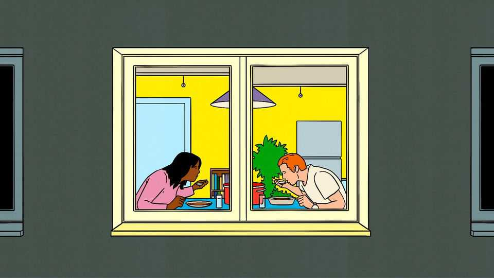

Briefing | Shrinking without sinking
A contracting population need not be a catastrophe
The economics of a shrinking world
September 11th 2025

According to Elon Musk, the world’s richest man and the father of at least a dozen children, the greatest potential risk to the future of civilisation is population collapse. Taking a very long-term view, he is right. If the world’s population declines indefinitely, humanity will eventually disappear. But just as population growth has not exhausted the world’s resources and caused mass starvation, as catastrophists have confidently predicted for centuries, shrinkage is not a calamity on the timescales that normal people use. A shrinking population will have profound consequences. It will turn expectations about everything from housing to greenhouse-gas emissions upside down. A contracting labour force and a dwindling number of

consumers will force a repricing of many goods, services and assets. Governments will need to rethink how they fund pensions and health care, and work out how to shrink cities and towns neatly. In many ways, the transition from the old to the new will be messy.

But messy is not the same as catastrophic. The insinuation of those who see population decline as a disaster is that human societies cannot flourish without expanding. The evidence for that is flimsy.

Population pessimists tend to focus on three potential problems. First, they point out that countries, and especially their governments, have some fixed costs—notably government debt. If the number of people declines, the cost per person rises. Second, they note that shrinking societies are also old ones, and that the cost of caring for the elderly becomes unaffordable because it is spread across an ever diminishing number of workers. Finally, they worry that smaller populations generate fewer good ideas and thus will have lower productivity growth, putting an obvious solution to the first two problems out of reach. But none of these problems is as thorny as it seems.

Take debt. All other things being equal, fewer people does indeed mean less economic growth. Less growth, in turn, tends to mean lower tax receipts and so can make government debt harder to sustain. But there is another variable to consider: interest rates. Keeping debts stable as a share of gdp depends not just on the size of the economy but on the cost of borrowing. In effect, the scale of the debt problem caused by a shrinking population would depend on the saving and spending patterns in the smaller, older society, which in turn would determine the interest rate.

One theory is that governments will coddle the old with handouts, initiating a grey-haired spending binge. That would send interest rates soaring, and debt-to-gdp ratios with them. But many economists are more sanguine. People around the world tend to save for their dotage because they do not trust governments to look after them. The imf reckons the ageing societies of the future will do the same. Older workers will save more for their retirement. A relative scarcity of investment chances in a shrinking economy will force them to accept lower returns, so interest rates will decline. That would let governments service their debts more easily.

In other ways, too, an elderly population is not quite as heavy a burden as it may at first seem. There is no question that as populations contract the share of people who are of working age will shrink and the proportion who are old and in need of care will rise. In fact, that is already happening: in most middle- and high-income countries, the share of working-age adults is close to its peak or has begun to fall. That will suppress output per head.

Happily, however, there are ways of coping. The critical factor, economically speaking, is not the number of people, but the number of people in work. That is not simply a function of the working-age population, but also of the participation rate—the proportion of working-age people in or seeking work. In all rich countries, at least, the number of people in work is much smaller than the working-age population. Roughly 9m of Britain’s 43m working-age adults were neither in work nor in full-time education in 2024, for example.

Raising the participation rate could compensate for a big contraction of the working-age population. What is more, economies tend to cope surprisingly well with fluctuations in the participation rate, which suggests they could also endure a shrinking population. Between 1990 and 2024 the out-of-work population in Britain has increased by 15%. In contrast, the Office for National Statistics reckons that by 2100 the working-age population will have contracted by just 7% from its peak.

Another way to cope is for retirement ages to rise. Again, this is already happening. A recent study by Goldman Sachs found that the typical worker in a rich country is now toiling four years longer than he or she did in 2000. Older workers, remarkably, are also becoming more productive. The average 70-year-old in 2022 had the same cognitive abilities as a 53-year-old in 2000.

Young people impose burdens on society, too. Youth typically lasts longer than in previous decades, as protracted educations delay young people from joining the workforce until their 20s. That has made them mightily expensive for governments in the rich world. The British state spends more each year on the average person below 25, mostly on education and health care, than it does on health care and pensions for a typical old person.

Fewer people will lessen the pain of lower growth. Investment will indeed be depressed in economies with shrinking populations, as there is little need for new capital formation. But such places nonetheless benefit from “capital deepening” as the capital stock per person rises, which should push up productivity. In a paper published last year, David Weil, an economist at Brown University, modelled the wider economic effects of consistently low or high fertility rates. Consumption per person differed little, regardless of whether the population was growing or shrinking. Even taking into account the upkeep of the young and the old, living standards flourished in both scenarios.

Then there is the question of how shrinking populations would affect innovation. That is critical, since ideas drive productivity, and greater productivity is the most obvious way to compensate for fewer workers. Larger populations tend to generate more research and set up more businesses. The slowing growth of America’s labour force accounts for around a third of the recent fall in the creation of new businesses there, economists reckon. Over time such trends are bound to leave markets more concentrated and economies less efficient.

Yet the world seems a long way from exhausting its capacity for innovation. Israel, the country that employs a greater share of the workforce in research and development than any other, still devotes only 1% of workers to it. That suggests that, even with a shrinking pool of labour, a sizeable proportion could still focus on research. In developing countries such as Pakistan, where fewer than one in 10,000 people works in technology or research, the main obstacle to innovation is not the number of people, but the poor education system and business environment that prevent them fulfilling their economic potential.

Furthermore, technology could make new ideas easier to find. Research so far has captured artificial intelligence’s use in helping humans perform only routine tasks, such as handling data. But some think ai could do more. In 2020 Charles Jones and Nick Bloom, both economists at Stanford, documented how researchers were making fewer discoveries than in the past. The speed of innovation, they found, was slowing. Now Mr Jones thinks that ai could aid the search for frontier ideas. Ever optimistic, some ai firms reckon that by 2028 the models will be overseeing their own development.

Such breakthroughs open tantalising possibilities for the world economy over the next 75 years. Against them, the question of whether there are a few million extra academics churning out research slowly seems insignificant. Mr Jones may be proved wrong. But it seems likely that ai will help to determine whether the world has enough ideas in the next decades.

The world’s population is not falling fast enough to kill innovation or bankrupt governments. Mr Musk, along with other worriers, thinks the only way to avoid disaster is to reverse the trend by encouraging billions of births. But if policies to trigger a baby boom exist, governments have yet to find them. And they would produce a population bursting with young

people, which is no less of a fiscal headache than a perpetually greying society.

What can governments do to prepare for the great shrink? Much will be done for them. Over the next years, as societies age, there will be more pensioners voting and consuming. Fertility fell for much of the 19th and 20th centuries as the Industrial Revolution raised Western living standards. Then, the need to provide for oldies led to innovations like state pensions and modern retirement homes. The same forces should push governments and entrepreneurs to find solutions for ageing societies.

But as schools close, cities become less friendly places for young feet and politicians concentrate on the old, the young may be left behind. The real danger is not economic disaster. Rather, it is that, in the process of ageing, the world could become a worse place to have children. In 2024, according to the UN, roughly as many people have more children than they would like as have fewer. But without many parent peers, and with little state support, fewer couples may choose to procreate, creating a cycle of falling fertility and unfulfilled desires to have children.

Rather than worry about an economic catastrophe that need not happen, or trying in vain to raise the birth rate, governments need to prepare for old societies and the new lives still to be born into them.■

This article was downloaded by zlibrary from https://www.economist.com//briefing/2025/09/11/a-contracting-population-need-not- be-a-catastrophe

United States

Charlie Kirk challenged liberals until the day he was murdered The ICE raid at Hyundai was a massive own goal The pitfalls of being a non-profit that is beholden to government San Francisco’s recall fever The sinister brilliance of Donald Trump’s security theatre A budget battle offers Democrats a chance to show some backbone Who’s afraid of the Democratic Socialists?