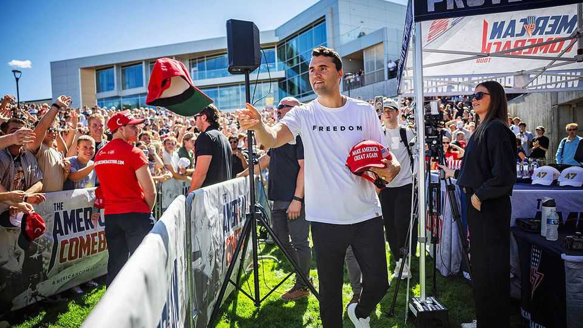

United States | Beyond debate
Charlie Kirk challenged liberals until the day he was murdered
The activist embodied a fiery style of conservatism and energised young voters
September 11th 2025

Charlie Kirk always contended that it was better to challenge bad ideas, as he saw them, than to swallow them. His professional life was devoted to this belief. At the age of 18 he dropped out of university to launch what would become America’s most prominent conservative youth organisation, Turning Point USA (TPUSA). On September 10th Mr Kirk was shot dead at a college campus in Utah doing precisely what had brought him fame, purpose and, to MAGA supporters, great acclaim: debating liberals. Police have yet to arrest or name a suspect. On social media President Donald Trump called Mr Kirk “legendary”, adding that “no one understood”

young Americans like he did. The murder follows a spate of politically motivated attacks in recent years including, of course, two attempts on the president’s life last year.

Mr Kirk accomplished much in his 31 years. In the early days of TPUSA, Republican donors whom he tapped for cash must have been taken aback. Here was a gangly teenager who barely knew how to knot a necktie. Yet soon they were writing cheques, charmed by his bulldog tenacity and fierce commitment to the cause of free markets and small government. They bet on the right horse. Mr Kirk proved a formidable organiser; today TPUSA is a juggernaut. By 2023 the total revenue of TPUSA and its lobbying arm was $92.4m, according to the New York Times. It has chapters at 850 colleges and hosts buzzy events featuring big names from the political right, Mr Trump included.

Mr Kirk’s influence also stemmed from his reputation as a tribune of the right, someone who was unafraid to defend conservatism against an imagined horde of blinkered libtards. Among TikTok users under 30 who voted for Mr Trump in 2024, Mr Kirk was the most trusted individual on the platform, a survey by TikTok found. He may have helped Mr Trump retake the presidency. In last year’s election Kamala Harris’s margin of victory among young voters was 12 points lower than Joe Biden’s in 2020, a bigger swing than for any other age group. Mr Trump reportedly credited Mr Kirk for contributing to his improved showing among young voters.

Mr Kirk could easily have used his influence as a springboard to elected office. Certainly he demonstrated an aptitude for shaping the Republican Party. TPUSA spent tens of millions of dollars on a get-out-the vote campaign last year and Mr Kirk helped force out the chair of the Republican National Committee. After Mr Trump was re-elected, Mr Kirk helped vet prospective appointees to the cabinet. He had become a power-broker.

Yet Mr Kirk always maintained that he was not interested in running for office. He had something more consequential in mind. He believed that “wokism” threatened to destroy the country. America would be saved not at the ballot box but in the crucibles where culture is forged, like college campuses. A devout Christian, he wanted to carry on travelling from campus to campus, ripping the blinkers off liberal students’ eyes, educating them

about the evils of critical race theory and gender ideology and urging them to start families and reclaim America for Jesus Christ.

Mr Kirk was bellicose and fiery on the stump, reflecting an age defined by partisan rancour. Americans’ growing mistrust of and even hatred for their political opponents has been accompanied by a disturbing increase in assaults, near-misses and threats in recent years. These have included an arson attack targeting Josh Shapiro, the Democratic governor of Pennsylvania; a thwarted plot to kidnap Gretchen Whitmer, the Democratic governor of Michigan; and another to kill Brett Kavanaugh, a Supreme Court justice. In 2022 a man broke into the home of Nancy Pelosi, the then speaker of the House of Representatives, and bludgeoned her husband with a hammer. In June a state representative from Minnesota and her husband were murdered at home. Mr Trump was lucky to survive being shot at an open-air campaign rally in Pennsylvania.

Americans overwhelmingly reject political violence. Surveys suggest that less than a tenth endorse it and that support is roughly the same on the left and right. But in a country awash with guns, it only takes one person to commit a heinous, attention-grabbing act. “People who are looking for a purpose, who want to claim a historical mission, are moved by a public conversation that says ‘you’ll get attention, you’ll be lauded if you hurt someone in a public way’,” notes Rachel Kleinfeld of the Carnegie Endowment for International Peace, a think-tank. This applies equally to attacks against politicians as to the murder of a health-care executive last year.

Two factors tend to influence support for political violence. When elites condemn it, citizens listen: people have a follow-the-leader instinct, says Robb Willer, a sociologist at Stanford University. A second factor is partisans’ perception of what the other side thinks. Both Democrats and Republicans hold exaggerated ideas about how much their rivals tolerate violence when in fact both sides mostly abhor it. This fuels misperceptions all around.

Approval of political violence is not high in absolute terms, but it is still too high, says Mr Willer. Fixing that comes through engagement. Mr Kirk acknowledged this himself. Once a woman frostily asked him why he had

come to her campus. He replied firmly, “When people stop talking, that’s when you get violence.” ■

Stay on top of American politics with The US in brief, our daily newsletter with fast analysis of the most important political news, and Checks and Balance, a weekly note from our Lexington columnist that examines the state of American democracy and the issues that matter to voters.

This article was downloaded by zlibrary from https://www.economist.com//united-states/2025/09/11/charlie-kirk-challenged- liberals-until-the-day-he-was-murdered