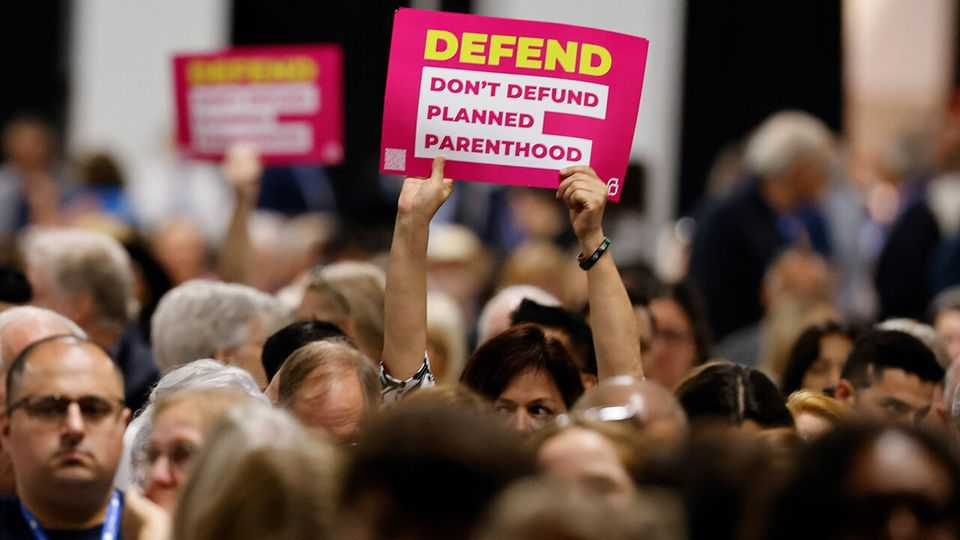

United States | Swab tests
The pitfalls of being a non-profit that is beholden to government
Planned Parenthood and the consequences of defunding it
September 11th 2025

While Republicans in Washington have stalled on trying to ban abortion nationally, they are having success in cutting funding to America’s largest abortion provider. The pressure campaign against Planned Parenthood offers a case study of how non-profits dependent on federal money and out of step with MAGA priorities can be as vulnerable as universities to financial upheaval. Congress, the Supreme Court and the federal bureaucracy have all taken actions that have blocked federal funds, Planned Parenthood’s largest source of revenue. It is an “assault coming from all sides and all branches of government”, says Alexis McGill Johnson, the organisation’s head; it

amounts to “a backdoor abortion ban, while also denying services” like contraception, STI testing and cancer screenings. She says that a third of Planned Parenthood clinics are at risk of closure if it is permanently cut off from federal funds.

Planned Parenthood has a distinct role in American health care. One in three women and one in ten men have sought care at a Planned Parenthood clinic. There is no other similar organisation that has such a breadth. Planned Parenthood reports that in 2024 it provided more than 9m services, including 5m STI tests (for comparison, the safety-net programme which provides reproductive care, known as Title x, offered 4.6m STI tests in 2023).

The organisation’s management is decentralised: local affiliates are responsible for the day-to-day running of networks of clinics. Though federal law blocks Planned Parenthood from using government funds for abortion care, its largest source of financing is Medicaid, a government health programme for the poor, because of the other kinds of treatment it provides. That has made it vulnerable. Conservatives have long yearned to defund the organisation. Mike Pence, then an Indiana congressman, first introduced an amendment in Congress to do so in 2007. Those dreams are finally becoming reality.

Planned Parenthood faces three funding challenges. The first comes from the One Big Beautiful Bill (BBB) Act, the Republican megalaw. It establishes a one-year ban on federal Medicaid payments to abortion providers which received more than $800,000 in 2023. Although not all Planned Parenthood clinics provide abortions, they could be blocked from Medicaid even if they are just part of a network that does. This would be “a devastating blow”, says Alina Salganicoff of KFF, a non-partisan health-research organisation. For now enforcement is on hold while Planned Parenthood sues.

The second challenge arose from a Supreme Court ruling in June in Medina v Planned Parenthood South Atlantic. The court decided that states can block certain providers from their Medicaid programmes, clearing the way for state-level bans. Whereas the BBB’s provision hits Planned Parenthood affiliates in states where abortion is legal, Medina’s impact will be felt in states that have long been hostile to the procedure and are seeking to block the provider further. At least 14 states have already tried to block Planned

Parenthood from state Medicaid programmes in the past decade. And whereas the defunding provision in the BBB is set to expire after a year, state bans are likely to last much longer.

The third blow has come from the Trump administration’s decision to pause payments under Title X. It is currently withholding funds from just under a fifth of all Title X grantees, including 144 Planned Parenthood clinics.

All this upends Planned Parenthood’s funding model. The organisation estimates that because of the BBB, 200 of its clinics are at risk of closure. And because the federal government pays 90% of the cost of family- planning services, as state budgets are squeezed by other federal cuts, “it becomes much more difficult, even in a state like California, to try to kind of fill that gap,” says Ms Salganicoff. Planned Parenthood has already announced the closure of over 30 clinics this year.

Where will this lead? When Texas blocked Planned Parenthood from a state family-planning programme in 2013, fewer people got contraception and there was an increase in the share of births covered by Medicaid. Though public hospitals and other safety-net clinics will meet some of the demand, they will struggle to scale up quickly enough to catch all Planned Parenthood’s patients. “There will be people who fall through cracks,” warns Ms McGill Johnson. An uptick in births is one reason that the Congressional Budget Office, a non-partisan scorekeeper, expects the defunding of Planned Parenthood to end up costing the federal government $52m. ■

Stay on top of American politics with The US in brief, our daily newsletter with fast analysis of the most important political news, and Checks and Balance, a weekly note from our Lexington columnist that examines the state of American democracy and the issues that matter to voters.

This article was downloaded by zlibrary from https://www.economist.com//united-states/2025/09/11/the-pitfalls-of-being-a-non- profit-that-is-beholden-to-government