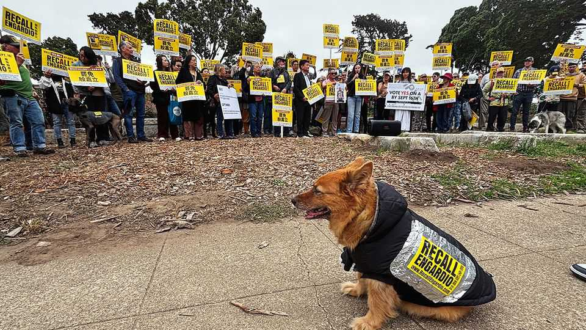

United States | Silly season
San Francisco’s recall fever
How much democracy is too much?
September 11th 2025

THE RESIDENTS of San Francisco’s Sunset District are angry. At a rally in early September, locals called Joel Engardio, their county supervisor, “a wuss”, “a dictator” and “a liar”. More than one person compared him to President Donald Trump. They hope to boot him from office in a recall election on September 16th. Even their pets were protesting. Kayla, a doddering 12-year-old dog wearing a yellow “Recall Engardio” sticker on her jacket, ambled towards the front of the crowd, squatted, and pushed out a turd. What did Mr Engardio do to earn the ire of so many two- and four- legged constituents? He supported turning part of a coastal highway into a park.

Sunset residents are furious that the road’s closure will force traffic through their neighbourhood (though the veracity of this is hotly debated), that cyclists will speed through the new park and—more than anything else— that their opinions have been unfairly overlooked. The parable of Mr Engardio is California politics in miniature. This one municipal recall election is emblematic of the state’s over-reliance on direct democracy and the tirelessness of those campaigners who resent California’s recent pro- building YIMBY turn.

When most of America’s western states were writing their constitutions, around the turn of the 20th century, people-power was all the rage. Progressive reformers in California championed ballot initiatives, referendums and recalls as a check on the almighty power of the Southern Pacific Railroad. But more than 100 years later these tools of direct democracy, meant to curb corruption, are often used by politicians to deflect blame or to try to weaken their political opponents.

High-profile recalls mostly failed to qualify for the ballot until 2003, when the ousting of Gray Davis resulted in the election of Arnold Schwarzenegger as governor. After that, recalls started to become part of normal politics, notes Raphael Sonenshein, an expert on local governance in California. An attempt to recall Gavin Newsom, the state’s current governor, in 2021 was purely partisan—and probably helped raise his profile. In 2022 San Franciscans fired three school-board members and their district attorney. In Oakland, across the bay, voters last year ousted their mayor and the county’s top prosecutor. “Recalls are in the air” like “a behavioural contagion”, says Jason McDaniel, a political-science professor at San Francisco State University.

Mr Engardio’s personal embrace of direct democracy has backfired. He supported the recalls in 2022 and, along with several colleagues, put the question of whether to close part of the highway on the ballot in 2024. A majority of San Franciscans supported the idea—but his own district did not. While knocking on doors around the Sunset he often tells voters that he felt the best way to decide the highway problem fairly was with more democracy. The same principle may lose him his job.

Opposition to the new park is part of a larger battle locals are waging against change. It is not just more democracy they want, but participatory democracy: more meetings, more input, more veto points for new development. Residents are wary of a proposal to increase housing density on the west side, where single-family homes proliferate. “Upzoning” is a dirty word.

Mr Engardio, a moderate Democrat, is part of city hall’s upstart YIMBY coalition. “There’s a lot of fear around height and density,” he tells a crowd at a ribbon-cutting for a new block of flats. “This building might help people see that it’s not that scary—that apartment buildings don’t ruin a neighbourhood.” Lisa Arjes, a leader of the recall effort, calls Mr Engardio’s support of newcomers to the district “politically motivated gentrification”.

One house Mr Engardio visits during his daily rounds belongs to Jake Woodfin, a pastor who answers the door barefoot with a friendly “Wassup!” He says putting the highway matter before voters on the city-wide ballot felt like “a betrayal”, but understands that San Francisco politics can too often resemble a knife fight. On some issues, he offers, “you’re cooked in this city no matter what.”■

Stay on top of American politics with The US in brief, our daily newsletter with fast analysis of the most important political news, and Checks and Balance, a weekly note from our Lexington columnist that examines the state of American democracy and the issues that matter to voters.

This article was downloaded by zlibrary from [https://www.economist.com//united-states/2025/09/11/san-franciscos-recall-fever](https://www.economist.com//united-states/2025/09/11/san-franciscos-recall-fever)