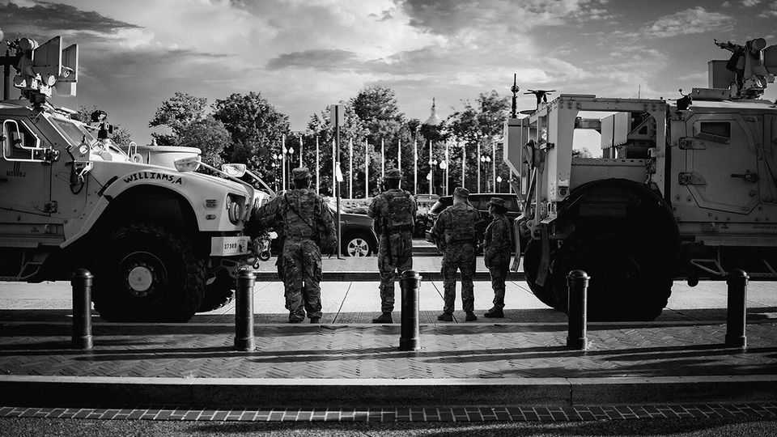

United States | Lights, camera, truncheon
The sinister brilliance of Donald Trump’s security theatre
How the president presents himself as America’s protector
September 11th 2025

Alligator alcatraz may or may not survive legal challenge. In August a court ruled that Donald Trump’s giant migrant cage in a Florida swamp violated environmental rules and would have to close. On September 4th another court reprieved it. Regardless of what happens to the grim detention centre, its name will live on. A video of Mr Trump visiting it remains on the White House website. The Florida Republican Party sells “Alligator Alcatraz” shirts and beer coolers. Memes circulate of alligators in ice (Immigration and Customs Enforcement) caps performing “ice, ice, Baby”, a rap parody. The underlying message resonates loudly: if you come to America illegally, expect cruelty.

Mr Trump is a master of security theatre. Whether or not he is making America safer, he is skilled at appearing to. He starts by exaggerating the dangers. The immigrants he deports are “the worst of the worst”, he claims. The cities to which he wants to deploy the National Guard are hellholes: “Chicago is the worst and most dangerous city in the World, by far.” The 11 alleged drug gangsters from Venezuela he blew to pieces on September 2nd were “terrorists” waging war on America.

Having inflated the peril, he orders camera-friendly actions to avert it. The soldiers he has sent to Washington stand where visitors are sure to see them. ice agents are to be given pickup trucks with his name on them in gold letters. The Pentagon released a clip of the boat of Venezuelan alleged gangbangers disappearing in a ball of fire.  On September 5th his newly retitled “secretary of war”, Pete Hegseth, said America’s armed forces should aspire to “maximum lethality, not tepid legality”.

Mr Trump’s security theatre has several aims. First, to reassure his supporters that he is defending America. Second, to deter wrongdoers. The prospect of a missile amidships is supposed to make drug smugglers think twice. As for masked ice agents rounding up illicit migrants, Tom Homan, the White House border czar, told The Economist: “We’ve got to send that message throughout the world…there’s a right way and wrong way to come to this country.” This has contributed to the sharp fall in border apprehensions this year.

The third aim of Mr Trump’s security theatre is to assist him in his frenetic, multifarious battle with the courts over the limits of presidential power. Much of what he does, or threatens to do, appears to be illegal. Drug smugglers do not face the death penalty in court. Yet Mr Trump claims the authority to execute alleged ones without trial.

His rationale is that drug gangs are terrorists and that some of them, such as Venezuela’s Tren de Aragua, are “invading” the United States at the behest of the Venezuelan government. Thus, as commander-in-chief, he can have them killed on the high seas. Or, if they are on American soil, he can detain them under the Alien Enemies Act of 1798 and send them without due process to a prison in El Salvador. Several courts have found this argument

far-fetched. But the administration keeps repeating it. Meanwhile, the legal system cannot move as fast as Mr Trump does.

To satisfy different audiences, the administration needs careful scriptwriters. For example, the State Department says there are “no credible reports of significant human-rights abuses” in El Salvador. This could be helpful in court; it supports the White House’s legal argument that it is fine to hand over gang suspects to the Salvadoran justice system.

But in order to deter future illegal immigrants, the administration also wants to make clear that Salvadoran prisons are horrible. So the secretary of homeland security, Kristi Noem, had herself filmed in front of a grotesquely overcrowded pen of half-naked inmates at a megaprison to which her boss sent roughly 280 immigrants in March and April. “If you come to our country illegally, this is one of the consequences you could face,” she warned, sporting a $50,000 Rolex.

Security theatre, like the ordinary sort, involves deception. The breathless script insists that the people being rounded up by ice are dangerous criminals. Dull statistics suggest that most are not. Convicted criminals were only 34% of those arrested in July, down from 57% in December. Less than 10% of those detained in June had been convicted of a violent or property offence, estimates the Cato Institute, a libertarian think-tank.

A law called the Laken Riley Act says ice has to prioritise deporting criminals, but that cuts against the goal of deporting as many illicit immigrants as possible. The Washington Examiner, a conservative newspaper, reported that Stephen Miller, Mr Trump’s deputy chief of staff, “eviscerated” ice staff for going after criminals when they could be rounding up day labourers outside Home Depot. (The White House denied the report.)

Another aim of security theatre is to make Democrats look as bad as possible. When Democratic governors refuse to let Mr Trump dispatch the National Guard to fight crime in their cities and states, the White House accuses them of siding with criminals. Mr Miller accuses Democratic mayors of “rejoicing” in a “constant bloodbath” of street crime.

Politics also explains why immigration enforcement looks different in red and blue states. Republican areas tend to co-operate with ice, allowing them to show up at jails and quietly take away anyone who was picked up for any offence and has no papers. Most ice arrests in Republican states happen like this. Democratic jurisdictions are less obliging, so ice agents make most of their arrests in public places.

One that unfolded in Los Angeles in July was notably spectacular. National Guards and Border Patrol agents swarmed across MacArthur Park in Humvees and on horseback. Even the ponies wore face shields. The park is a gathering spot for newcomers from Latin America: the Trump administration said the raid targeted illegal immigrants, especially members of ms-13, a Salvadoran gang. But the Department of Homeland Security has not said if anyone was arrested. The Supreme Court has affirmed the right of ICE to perform such sweeps. City leaders called it a stunt. “If you want to film in la you should apply for a film permit like everybody else,” quipped Marqueece Harris-Dawson, the city-council president.

Pollsters find lukewarm reviews for Mr Trump’s shows. More Americans think his mass-deportation programme has gone “too far” (49%) than “not far enough” (21%) or “about right” (24%), an Economist/YouGov poll finds. More oppose sending troops to cities than support it: 46% to 40%. Some Democrats draw parallels between Mr Trump and autocratic regimes that exaggerate threats, call their enemies “terrorists” and seek to normalise the use of military force in domestic affairs. Others take him less seriously. A helicopter reporter for Fox 11, a local news station, sneezed while live- streaming the raid on MacArthur Park from the air. “Sorry about that,” he said, “I’m allergic to nonsense.” ■

Stay on top of American politics with The US in brief, our daily newsletter with fast analysis of the most important political news, and Checks and Balance, a weekly note from our Lexington columnist that examines the state of American democracy and the issues that matter to voters.

This article was downloaded by zlibrary from https://www.economist.com//united-states/2025/09/07/the-sinister-brilliance-of- donald-trumps-security-theatre