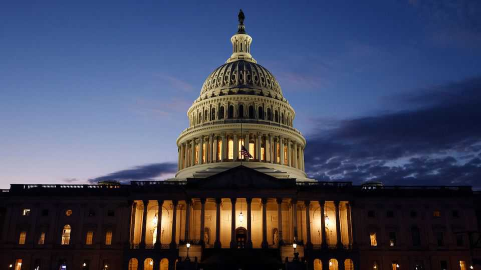

United States | Schumer’s dilemma
A budget battle offers Democrats a chance to show some backbone
They need a clearer strategy first
September 11th 2025

THE CLIFFHANGER is familiar. Funding for the federal government expires on September 30th: welcome to shutdown season. In theory, the president proposes a budget, Congress negotiates and legislation is signed into law ahead of the new fiscal year, which begins on October 1st. But this is Washington and so, with just three weeks to do a deal, prediction markets place the odds of a shutdown at around 50%. Although Republicans hold majorities in both chambers of Congress, they need at least seven Democratic votes in the Senate to pass spending legislation, even if it is just a temporary stopgap bill. Democratic leverage is slim—and the expectations of Democratic voters hard to meet. Few want to

compromise as President Donald Trump, abetted by Republican lawmakers, has dismantled government agencies and withheld billions of dollars in appropriations. Democrats are still smarting from their last budget bout in March, when Chuck Schumer, the Democratic leader in the Senate, and nine other colleagues, broke ranks to back a stopgap spending bill. The decision sparked vituperative backlash within the party and calls for Mr Schumer to resign. “What happened in the spring was a disaster,” sighs a senior Democratic aide. “There’s a real desire not to repeat that.”

The challenge now facing Mr Schumer is three-fold. First, to show that Democrats still have some fight left in them. Second, to settle on a demand going into negotiations with Republicans. And third, should talks fail, having a clear message as to why Democrats have shut the government down. Back in March Mr Schumer worried that a shutdown would hand Elon Musk, who was slicing through the government, the opportunity to do more damage. Buoyed by the president’s sinking popularity and Mr Musk’s departure in May, Mr Schumer is showing more mettle than six months ago, warning Republicans they should not expect Democrats to “act as business as usual”. Along with Hakeem Jeffries, the minority leader in the House, he has threatened a shutdown should Republicans try to push for a stopgap spending bill without making any bipartisan concessions. But for all the fighting talk, Democrats seem as unprepared for a government shutdown as they did in March.

Consider their political demands. Some Democratic lawmakers insist that any budget bill must include assurances that Mr Trump cannot simply claw back funding approved by Congress. The president’s decision last month to rescind some $5bn in foreign aid had lawmakers, including many Republicans, in conniptions. But even if enough Republican legislators were corralled into agreeing to spending safeguards, there is no guarantee Mr Trump would follow the rules. Besides, making a big show of bringing the government down over arcane procedures like recissions is a political dud, warns Gabe Horwitz of Third Way, a centrist think-tank. “Most voters don’t understand it, there’s no political salience.”

Democratic lawmakers have begun to coalesce around making a demand on health care. Americans trust Democrats on the issue more than Republicans. Mr Trump’s “One Big Beautiful Bill” includes deep cuts to health care and

could eventually see 10.9m people lose their health insurance, according to the Congressional Budget Office, a non-partisan fiscal scorekeeper. Mr Jeffries said he would not support a bill that “rips health care away” from Americans. Many Senate Democrats, such as Elizabeth Warren of Massachusetts, plan to use the funding deadline to press for reversals to those cuts. In other words, they want Republicans to gut part of their own president’s signature legislation. That is a non-starter. However, Republican Congressional leaders have opened the door to a smaller compromise that would extend some subsidies in the Affordable Care Act, which are due to expire at the end of this year, until after the midterms in 2026. That could be enough to mollify some Democrats while not alienating too many Republican legislators.

Betting on compromise and agreement is usually unwise. So the likeliest outcome is a short-term funding extension (a “continuing resolution”) which keeps spending levels constant, in order to give lawmakers more time to agree to a full-year budget. That suits Republicans better than Democrats, because a continuing resolution effectively cuts spending because of inflation.

If all else fails, would Mr Schumer really shut the government down? The desire to fight Mr Trump, to resist, could be a trap. Republicans would blame the Democrats for “selling out American citizens’ needs in service of the party’s progressive and elitist base”, warns George Pollack of Signum Global Advisors, a political consultancy. Yet voters’ views of both parties are so rigid that the feedback mechanism for politicians is weaker than it should be. A coin toss seems about right. ■

Stay on top of American politics with The US in brief, our daily newsletter with fast analysis of the most important political news, and Checks and Balance, a weekly note from our Lexington columnist that examines the state of American democracy and the issues that matter to voters.

This article was downloaded by zlibrary from https://www.economist.com//united-states/2025/09/08/a-budget-battle-offers- democrats-a-chance-to-show-some-backbone