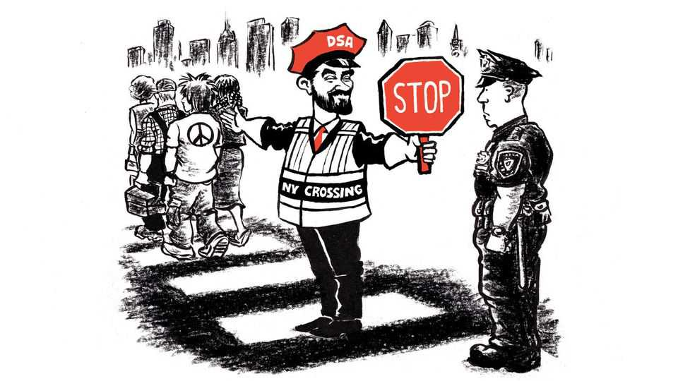

United States | Lexington
Who’s afraid of the Democratic Socialists?
They may prove to be the left’s populist alternative to Trumpism
September 11th 2025

In the campaign to be mayor of New York City, opponents of Zohran Mamdani, the Democratic nominee and front-runner, are bashing him for also belonging to another party, the Democratic Socialists of America. Does he agree with the DSA’s call to close jails? To cut the police budget to zero? To stop arresting people for misdemeanours? As Mr Mamdani tries to edge centreward without repudiating the Democratic Socialists, he is telling reporters his platform is different from that of the DSA. What he is not saying, oddly, is that even the DSA no longer officially holds those positions. Last month it replaced its old platform—the fevered to-do list of a Utopian with OCD and a PhD in jargon—with a compact statement of still radical, but less radical, proposals, neither so grandiose nor so

weirdly particular. Gone are sovereignty for Hawaii and public ownership of media and lithium-ion-battery production, along with any summons to “decommodify survival”. Gone even are demands to end the “fictions of whiteness” and the “enforcement of heteronormativity”. In their place the new platform supplies a vision for “thriving working-class communities” and “an economy for the working class” by calling for Medicare for all and taxing the rich. Freeing Palestine is still in there, naturally, as is a call to “demilitarise”, not defund, the police. The thing is in plain English, and it brightens its brief text with sprightly icons.

The problem appears to be one of collective action: the socialists have not got around to updating their website by replacing the old platform with the new one. “We have a very small staff,” explains Megan Romer, the co-chair of the DSA. “We just literally haven’t dealt with it yet.” She says the new programme is meant to be a more accessible tool for organising, something pamphlet-sized she can hand “to my Aunt Linda and she won’t keep asking me what the heck I’m doing with my life”.

The party is spreading its sails in anticipation of a following breeze from the probable election of Mr Mamdani, which would for the first time put a Democratic Socialist in charge of America’s largest city, Earth’s capital of finance. Though growing, the DSA’s membership is still tiny, at about 78,000. But its addressable audience, as the marketers say, is huge: a poll by Gallup published this month found that two-thirds of Democrats had a positive image of socialism, while less than half had a positive image of capitalism. A survey published in August by the Associated Press found only one in five Democrats viewed their party positively; closer to one in three volunteered adjectives like “weak” and “ineffective”.

Though often told, the tale of how a billionaire luxury developer absconded with the majority of working-class voters, from the party that brought them Social Security and Medicare, remains astounding. Republicans once attacked those programmes as socialism, but Mr Trump claims to be their guardian (notwithstanding cuts to Medicare in his signature budget legislation). When it comes to intervening in the economy, Mr Mamdani, with his pledge of a few city-run grocery stores, is a piker compared with Mr Trump. The president has asserted public authority over such companies as US Steel and Intel and, with his capricious tariffs and off-with-their-heads

regulation of disfavoured industries such as wind power, embarked on central planning never before seen from a Republican president. His rightist populism has led to a new form of American state capitalism.

Socialism is emerging as the populist alternative on the left. Rising generations do not remember the Soviet Union. Indeed, like “MAGA” and unlike “Democrat”, the term “socialism” carries a subversive appeal. “Anyone who calls himself a socialist in America—and this has usually been true in American history, but is especially true now—knows that they’re going to invite the opprobrium of elites,” says Michael Kazin, a historian at Georgetown University. “And so it’s a way of showing you’re an outsider, but you want to stand for a very different kind of system which can dethrone the elites in the name of the common people.”

All this invites a question: what are Americans talking about when they talk about “socialism”? It varies. As advocated by Bernie Sanders, a senator from Vermont, and Alexandria Ocasio-Cortez, a congresswoman from New York, it resembles European social democracy, more bent on expanding the welfare state than awarding workers the means of production. Mr Mamdani’s meaning has yet to come into focus. In his keynote speech to the DSA convention in 2023, he cited the pursuit of Palestinians’ rights, not those of American workers, as bringing him to the party: “The struggle for Palestinian liberation was at the core of my politics and continues to be.” He also said, because this is how American socialists, or private-college alumni, or both, evidently talk, “If socialism is our theory and DSA is our practice, then a committee is where they meet, or, as they say on Twitter, it is praxis.”

But Mr Mamdani is evolving fast as a politician. He clearly grasps that, as mayor, he will be judged on the praxis of cleaning streets rather than liberating Palestine. He has cited the precedent of the “sewer socialists” who successfully governed the city of Milwaukee a century ago. In a town-hall meeting with Mr Sanders in Brooklyn on September 6th, he said he knows he must reckon with “the inefficiencies, the failures, of the public sector” to demonstrate that leftists can be trusted in executive office. “We need to deliver excellence,” he said.

Yet it is also right to call him to account for his membership of the DSA. It excludes just one class of worker: not landlords, not hedge-fund

gazillionaires, but police officers. How, as a mayor leading thousands of officers he might call upon to risk their lives, could he be part of a club that won’t have them as members? ■

Subscribers to The Economist can sign up to our Opinion newsletter, which brings together the best of our leaders, columns, guest essays and reader correspondence.

This article was downloaded by zlibrary from https://www.economist.com//united-states/2025/09/11/whos-afraid-of-the-democratic- socialists

The Americas

Making the Americas grate again What Javier Milei’s first defeat means for his future Jair Bolsonaro has been convicted for plotting a coup