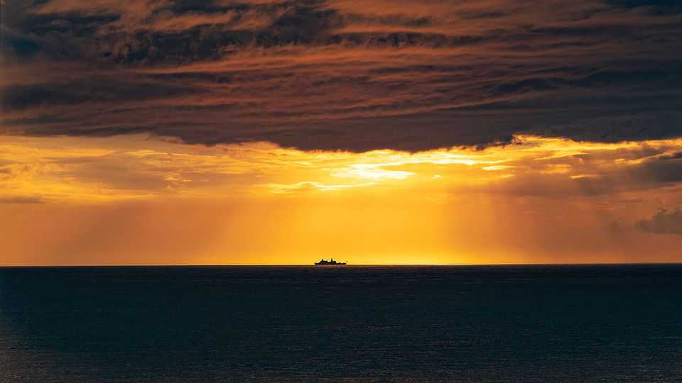
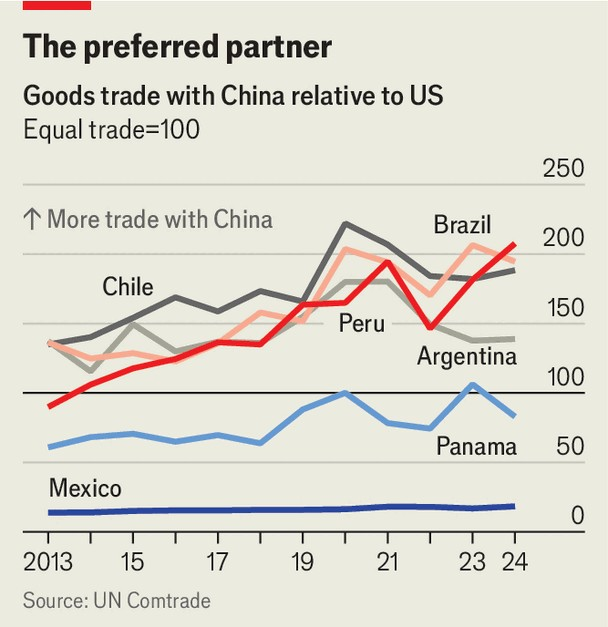

The Americas | Monroe 2.0
Making the Americas grate again
Sanctions, tariffs and missiles push the region closer to China
September 11th 2025

Not since the invasion of Panama in 1989 has the United States acted so aggressively in Latin America. On September 2nd American armed forces destroyed a speedboat in the southern Caribbean; Donald Trump said it was running drugs to the United States from Venezuela. Eleven people on board were killed. Hours later, as he left Florida for a visit to Mexico and Ecuador, Marco Rubio, his secretary of state, declared that Mr Trump would use the “full might of the United States to take on and eradicate these drug cartels”. On September 8th, from the deck of a warship at anchor off Puerto Rico, Pete Hegseth, the recently renamed secretary of war, told marines that they were on the “front lines” of a critical counter-narcotics mission.

The next day, after being asked about the president’s response to the imminent conviction of Jair Bolsonaro, Brazil’s hard-right former president, the White House press secretary, Karoline Leavitt, said Mr Trump was “unafraid” to use the “military might of the United States of America to protect free speech around the world”.

Mr Trump’s second-term policy towards Latin America is coming into focus. It has three main goals: ending the flow of drugs and illegal migration into the United States, curbing China’s influence across the region, and intervening in domestic politics to prop up his friends and batter his enemies. This new posture is reminiscent of the 19th-century Monroe doctrine, under which the United States saw any foreign intervention in the Americas as a threat to its security. In the updated, 21st-century version, Mr Trump freely uses coercive tactics—tariffs, sanctions and military muscle— to hurt those who prevent him from achieving his goals in the region.

To reduce illegal immigration, Mr Trump has bullied countries into slowing the northbound movement of people, and accepting deportees from the United States. To halt the flow of illegal drugs he has designated a number of gangs operating across Latin America as foreign-terrorist organisations, giving the United States an array of new options to pursue them. He has slapped Mexico with tariffs, and threatened to expand them, if it does not stop drug-smuggling across its northern border. He is expected soon to declare that Colombia has “failed demonstrably” to curb drug-trafficking; tariffs or sanctions could follow. Military intervention of the kind now unfolding in the Caribbean has been mooted for months, including threats to strike gangs within Mexico.

Even before he took office, Mr Trump was putting pressure on the government of Panama over what he sees as excessive Chinese involvement in the operation of the Panama Canal, a shipping lane which is particularly vital to the United States. He has used the threat of tariffs to push Mexico to impose tariffs of its own on Chinese imports. Governments across the hemisphere are being told to shun Chinese infrastructure projects and warned that China is a threat to “regional peace”.

Mr Trump’s political interventions have mostly come in the form of support for autocrats and right-wing populists. Nayib Bukele, El Salvador’s

authoritarian president, is Mr Trump’s “great friend”, and the only Latin American leader to have been received in the Oval Office in Mr Trump’s second term. Mr Bukele pleases him by locking up deportees from the United States in El Salvador’s prisons.

In Brazil, the trial of Mr Bolsonaro has drawn special attention from Mr Trump. He has called it a “witch hunt”, and placed his highest rate of tariffs on Brazil in an effort to force its government to subvert the courts. The administration’s treatment of Nicolás Maduro’s regime in Venezuela is also high-pressure, in part because it is nominally socialist. The White House calls the country a “narco-terror cartel” and hints that it too could be hit with strikes.

Many of these actions, particularly against drug gangs and migrants, stem from Mr Trump’s domestic agenda. Others are due to the manoeuvring of Mr Trump’s advisers, who are constantly attempting to package their goals in ways that will appeal to him. Among the most active is Mr Rubio, a long- time advocate of a hard line on Venezuela and a hawk on China. But this approach to policymaking breeds division. One analyst in Washington notes that Mr Rubio’s State Department is against clobbering drug gangs inside Mexico, while the Pentagon is in favour and the White House undecided.

Some countries are too bound to the United States to offer much resistance. Mexico, for instance, which sends 80% of its exports to its northern neighbour, would be damaged so severely by an expansion of tariffs that it has gone out of its way to please Mr Trump. As well as putting tariffs on Chinese goods, the country has sent 10,000 troops to the northern border to secure it against drugs and migrants, and launched more operations against drug gangs. Tiny Panama buckled under American pressure, and pushed the Hong Kong-based conglomerate which operates the ports at either end of the canal to sell up.

Farther south, calculations differ. Nearly every South American country trades more with China than with the United States, a gap which has yawned over the past 20 years (see chart). As a result, Brazil can shrug off the tariffs. Chile is forging links with India and Japan to avoid over-reliance on either great power. Even Javier Milei, Argentina’s Trump-loving president, renewed a credit line with China despite objections from the United States.

Mr Trump’s aggressive, nationalistic approach risks backfiring. The threat of being blown up may prompt some gangsters to stop running drugs to the United States temporarily, but unless Mr Trump also takes steps to reduce demand at home, prices will rise, creating an incentive to find new ways in. Mr Trump’s attempts to have Mr Bolsonaro’s trial quashed have strengthened the hand of Luiz Inácio Lula da Silva, Brazil’s left-wing president, who will probably run for re-election next year.

But the most serious effect of Mr Trump’s actions is to push Latin America towards China. In Brazil, China is now more popular than the United States. Across much of the continent, China is seen as more respectful of sovereignty. Mr Trump insists on countries cutting ties with China but offers little in return. What China offers, in contrast, is impressive; last year President Xi Jinping opened a Chinese-built mega-port in Peru. Mr Trump’s policy may dissuade people from coming to his own country. He may even

kill some gangsters. But if it pushes America’s neighbours into the arms of the world’s other great power, the new doctrine’s costs will vastly outweigh its benefits. ■

Sign up to El Boletín, our subscriber-only newsletter on Latin America, to understand the forces shaping a fascinating and complex region.

This article was downloaded by zlibrary from [https://www.economist.com//the-americas/2025/09/11/making-the-americas-grate-again](https://www.economist.com//the-americas/2025/09/11/making-the-americas-grate-again)