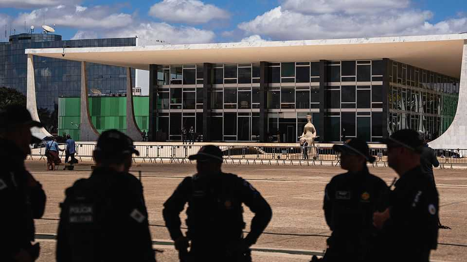

The Americas | Justice in Brazil
Jair Bolsonaro has been convicted for plotting a coup
Brazil’s former president faces up to four decades in prison
September 11th 2025

Editor’s note (September 11th): This article has been updated. Four years ago Jair Bolsonaro, then Brazil’s president, made a vow. Speaking to evangelical leaders, the former army captain said his 2022 re- election campaign could end only in jail, death or victory. “And you can be sure the first option doesn’t exist,” he said. He was wrong. On September 11th Brazil’s Supreme Federal Court (STF) voted to convict Mr Bolsonaro for committing a coup d’état. The hard-right politician is due to be sentenced on September 12th, alongside several former ministers and military officials. He faces up to 43 years in prison.

The conviction is epochal. Brazil has suffered numerous coups since its independence in 1822. The most recent ushered in a military dictatorship that ruled from 1964 to 1985 and killed hundreds of people. Mr Bolsonaro is a vocal fan of that regime. After failing to disrupt the 2022 election by casting doubt on electronic voting machines, his associates devised a plan to kill the winner, Luiz Inácio Lula da Silva, known as Lula, his vice-president, and Alexandre de Moraes, the STF’s most prominent judge. The coup attempt fell apart when it failed to get enough support from the army’s brass.

During the trial Mr Bolsonaro and his subordinates adopted a technical defence against overwhelming evidence. They accepted the individual actions they were accused of, but claimed they did not amount to a coup. Mr Bolsonaro’s lawyer said his client discussed only legal “alternatives” to handing over power and that no conversations amounted to sedition.

That did not move the judges. “Brazil almost returned to a dictatorship” because Mr Bolsonaro “doesn’t know how to lose elections”, said Mr Moraes as he voted to convict. “Does anyone think that [losing access to] a credit card or Mickey Mouse will change the judgment?” asked Justice Flávio Dino, as he also voted to convict, referring to the the financial sanctions and travel bans Donald Trump imposed on some STF judges in an attempt to stop the conviction. “Brazilian democracy was not shaken,” said Justice Cármen Lúcia, as she cast the vote which finalised the conviction.

Mr Bolsonaro’s one lifeline was Justice Luiz Fux, who voted to acquit him of all charges. The dissent facilitates an appeal to the full 11-judge bench. That would drag out proceedings, but probably not change the outcome. Bolsonaristas say it creates a path to nullify the trial via a mechanism like the one Lula used to leave prison in 2021. The severity of the charges against Mr Bolsonaro and the weight of evidence make that something of a long shot. ■

Sign up to El Boletín, our subscriber-only newsletter on Latin America, to understand the forces shaping a fascinating and complex region.

This article was downloaded by zlibrary from https://www.economist.com//the-americas/2025/09/11/jair-bolsonaro-has-been- convicted-for-plotting-a-coup

Asia

Japan’s new leadership struggle is far from business as usual Huge demonstrations bring down Nepal’s government A giant “knife-fight” in the Pacific The world’s most powerful volunteers