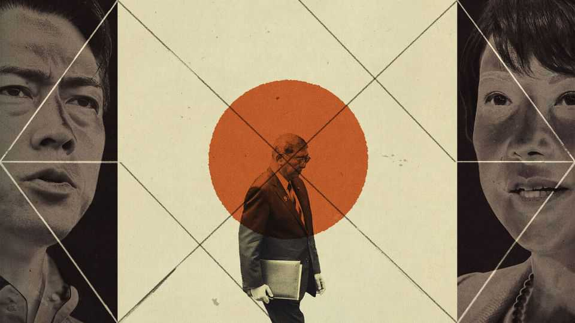

Asia | The prime minister quits
Japan’s new leadership struggle is far from business as usual
The exit of Ishiba comes amid political and trade turmoil
September 11th 2025

IT TOOK ISHIBA SHIGERU 15 years and several attempts to become Japan’s prime minister. It took him less than one year to lose the job. On September 7th Mr Ishiba said he was stepping down as president of the ruling Liberal Democratic Party (LDP), which in turn means he will no longer lead the country. He will remain in office until the party elects a replacement on October 4th. Leadership changes in Japan rarely herald big changes in direction. But the coming contest looks set to be unusually consequential. The LDP is increasingly harried by upstart opposition groups. The party itself is racked by a bitter struggle between a hard-right faction and centrist ones.

Furthermore, the race is taking place at a momentous juncture for the country. On September 4th Donald Trump signed an executive order enacting a trade bargain his administration reached this summer with Japan, reshaping economic relations. And Japan’s immediate neighbourhood is growing ever more dangerous: China is piling pressure on Japan and drawing closer to Russia and North Korea.

Mr Ishiba’s resignation has not come out of the blue. Shortly after becoming prime minister last October, he called a snap election that saw the LDP and its coalition partner lose their majority in the lower house, leaving the LDP running a minority government for the first time in its history. On July 20th the LDP lost its majority in the upper chamber as well.

Mr Ishiba argued that the party’s woes preceded his rise. He managed to hang on for more than a month after the upper-chamber election, thanks in part to a flurry of diplomatic events in August. But he could not avoid the reckoning for ever. On September 2nd the LDP released a withering report on the party’s performance in the polls in July. Party elders began to call for a fresh leadership election; so too did some members of Mr Ishiba’s own cabinet. The LDP was due to meet on September 8th to decide whether to arrange a snap leadership vote. Mr Ishiba pre-empted this by choosing to resign ahead of time.

He is right to say the LDP’s problems run deep. In recent years a series of scandals relating to campaign and fundraising practices has eroded the public’s trust in the party. It has struggled to respond to rising living costs. And it has been slow to make use of social media, at a time when new populist parties have proved adept at reaching voters online. If the LDP “is perceived as unchanging, there will be no tomorrow for the party”, Mr Ishiba said in his resignation speech.

The upcoming leadership election will be a fork in the road for the LDP, which has ruled Japan with only two brief interruptions since its founding in 1955. Some in the party now believe it should lean hard to the right in order to win back supporters who are deserting it for small, nationalist groups that stir up anger towards Japan’s growing population of foreign workers. Others want to see reform led from the party’s centre, strengthening its identity as a “big tent” for a wide swathe of the public.

These two camps have prospective champions. Takaichi Sanae, a former internal-affairs minister who has become the standard-bearer for the right wing, narrowly lost to Mr Ishiba in last year’s contest. Many of her core supporters in the Diet have lost their seats in the past two elections. But she dominated last year’s vote among the party’s more than 1m dues-paying members (whose preferences, as well as those of LDP lawmakers, will help determine who wins the coming race). If elected, she would become Japan’s first female prime minister.

By contrast, Koizumi Shinjiro, the charismatic son of a popular former prime minister, is reform-minded. At 44 years old, his election would mark the rise of a younger generation of LDP leaders. Thrust into the role of agriculture minister this year, he burnished his reformist credentials by helping to stem a crisis over rice prices.

Others are entering the fray. Party grandees, including Hayashi Yoshimasa, the chief cabinet secretary, and Motegi Toshimitsu, a former foreign minister, have indicated they will run. They represent the status quo; they can pitch themselves as steady hands. Kobayashi Takayuki, a former economic-security minister, may position himself in the middle ground between the two front-runners, offering a blend of conservatism and (relative) youth at 50.

The implications of this choice could be huge—for Japan and for its role in the world. The new leader will have to handle an American government that is making big demands of its allies. They will have to implement the trade deal that Mr Ishiba concluded on his way out of the door. Mr Ishiba’s negotiators managed to get Mr Trump to reduce the tariffs for all Japanese imports, crucially including automobiles, to 15%. But there is still much that is unclear about a huge and hazily defined new $550bn fund for making investments into America that, according to the White House, Japan will somehow finance. The administration claims that America will be able to decide how it is spent.

Japan’s neighbours will be watching the leadership contest closely, too. A right-winger such as Ms Takaichi would raise the temperature with China and with South Korea, which has been trying to improve relations with Japan. Then again, Mr Koizumi has also been a frequent visitor to the

controversial Yasukuni Shrine, which honours Japan’s war dead. That makes many in Beijing and Seoul uncomfortable.

In the years ahead Japan will have to find more money for defence and social policies. But opposition parties have been calling for cuts to the consumption tax to help households struggling with living costs. Mr Ishiba was a fiscal hawk; his successor may not be. So markets are jittery. In early September, as Mr Ishiba’s resignation started to look increasingly inevitable, yields on long-term Japanese government bonds hit their highest levels in decades.

The new leader will have to navigate all this while also securing the LDP’s faltering grip on power. Once in office, he or she could choose to call new lower-house elections in the hope of getting a boost—though that could backfire, leaving the party in an even weaker position. Another idea is to beef up the LDP’s coalition by bringing in a new party.

Whoever wins the race will need to gather some support from opposition lawmakers just to be confirmed as Japan’s prime minister. That will be an early jolt on the bumpy road that stretches ahead. ■

This article was downloaded by zlibrary from https://www.economist.com//asia/2025/09/07/japans-new-leadership-struggle-is-far- from-business-as-usual