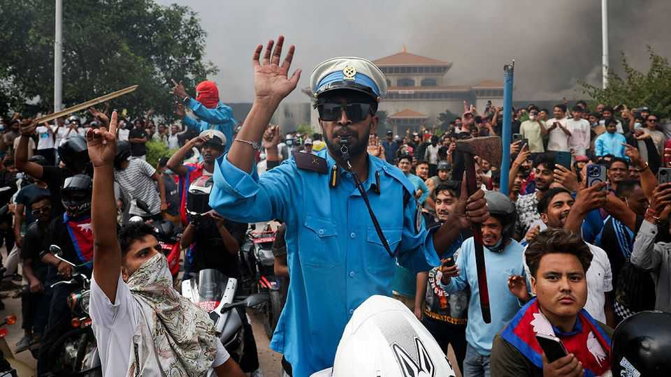

Asia | People power in Asia
Huge demonstrations bring down Nepal’s government
The upheaval brings much uncertainty
September 11th 2025

NEPAL HAS churned through 14 governments since it junked its monarchy in 2008. Yet the chaos that unfolded this month in Kathmandu and other cities was unprecedented. On September 8th at least 19 youngsters taking part in demonstrations against government corruption were killed, apparently by security forces; the following day the prime minister, Khadga Prasad Sharma Oli, resigned. His departure did not immediately satisfy protesters who were outraged at the killings. A day of destruction followed. Mobs ransacked and set fire to Nepal’s parliament, government offices and the homes of politicians. A former prime minister’s wife is reported to have been badly burned in a blaze. Politicians were beaten up in the streets;

prisons were attacked, leading to the escape of thousands of inmates. Calm began to return when the army said it was stepping in to restore order. It declared a curfew until September 12th, but signalled that it could last longer.

All this marked a swift and violent escalation of protests that had started gaining momentum only a few days before. The most immediate spark for the upheaval was the banning on September 4th of 26 social-media sites, including Facebook, WhatsApp and Instagram. The government said these companies had failed to register with the authorities, as required by new regulations.

But that draconian blackout (since reversed) was only one of many grievances held by the mostly young Nepalis who took to the streets on September 8th to protest. GDP per person ($1,447 in 2024) is the lowest in the neighbourhood. Jobs are in short supply—more than a fifth of youngsters are unemployed—and corruption is endemic. Many youngsters feel compelled to seek work abroad: remittances make up more than a quarter of the country’s GDP.

The country’s political class is small, chummy and entitled. (When Mr Oli became prime minister in 2024, he had already served three previous stints in the country’s top job.) In the weeks before the crisis young Nepalis had been flooding social media with posts highlighting the comfortable lives of politicians, civil servants and, in particular, their globe-trotting offspring. That made the social-media switch-off feel even more like a muzzling. And when protesters were fired upon, the fury was unbridled.

Participants in this protest movement—which has come to be dubbed the “Gen Z” movement, in reference to their age—have tried to distance themselves from the riots and looting that soon erupted. At least some blame Maoist infiltrators. On September 10th representatives from the movement held talks with military leaders. They have been calling for a caretaker government that would exclude most career politicians.

One name floated to lead such a government is Sushila Karki, a former chief justice who was seen among protesters in the capital. As The Economist went to press there was not yet word on whether this proposal would be

accepted. The country’s big political parties are demanding to be included in the negotiations. And at least some Nepalis have seen the unrest as an opportunity to call for the return of the monarchy.

The turmoil will have regional ramifications. India, Nepal’s neighbour and its biggest trading partner, has long pushed it around. Yet in recent years its influence has been challenged by China, which has poured money into Nepal through its belt-and-road infrastructure initiative and which keeps a watchful eye on the Tibetan community there. Mr Oli had been seen as sympathetic to China. But India is doubtless very worried about the instability on its doorstep. In response to the crisis, India’s prime minister, Narendra Modi, convened his security cabinet and ordered the closure of the land border with Nepal.

In recent years popular revolts have rocked several South Asian countries. Last year a student-led movement toppled Sheikh Hasina’s regime in Bangladesh, leading to the installation of an interim government that talks of holding fresh elections in 2026. Three years ago an uprising in Sri Lanka forced out President Gotabaya Rajapaksa and his brother Mahinda, the prime minister. In the past Nepal has missed many chances to reset its dismal politics. The country’s 30m people must hope their leaders grab this fresh opportunity with both hands. ■

This article was downloaded by zlibrary from https://www.economist.com//asia/2025/09/09/huge-demonstrations-bring-down-nepals- government