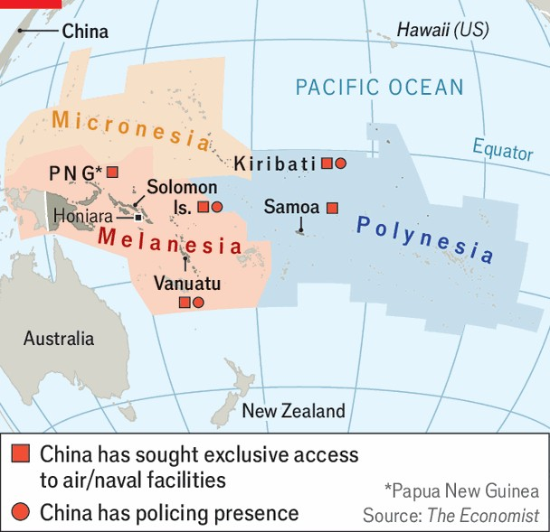

Asia | Fire and water
A giant “knife-fight” in the Pacific
America, Australia and China battle for influence among the island states
September 11th 2025

IN 1942 Guadalcanal saw hand-to-hand combat between American marines and Japanese soldiers. On September 10th the island hosted another geopolitical tussle—when leaders of Pacific-island countries as well as Australia and New Zealand met in Honiara, the capital of the Solomon Islands, for their annual summit. China was expressly not invited, but its diplomats were on the ground in Honiara anyway, seeking to influence Pacific-island leaders. Its pushy diplomacy is part of a regional contest that Australian officials liken to a “knife fight”. China is seeking diplomatic, economic and military beachheads across the Pacific. And the region’s traditional patrons— America, Australia, and New Zealand—are fighting back.

China is already the dominant economic partner for many small Pacific countries. American officials say China would like to station military forces in the Pacific, too. Chinese navy ships and air-force planes have been visiting the region more often, ostensibly to deliver aid. And China is said to have sought privileged access to ports or airfields in at least five Pacific countries. Having a permanent military presence in the region would make it easier for China to boss small Pacific countries around. And if conflict breaks out over Taiwan, say, it would complicate American and Australian war plans.

American, Australian and New Zealand officials say that China would already have a base in the region but for their efforts to block one. Yet China’s access to commercial facilities such as ports that could prove useful in a conflict is of nearly equal concern, says Mihai Sora of the Lowy Institute, a think-tank in Sydney. These sites “have all of the building blocks, even if there’s not a plaque out front that says, ‘This is a Chinese military base’”.

Since 2019 Chinese state-owned firms have been looking to lease a deepwater harbour in the Solomon Islands. Some of these harbours sit next to airstrips built by American sailors in the second world war. In one case, a Chinese firm told local officials that a proposed port would be used by the Chinese navy. Efforts to secure similar facilities have been knocked back in Kiribati, Samoa and Papua New Guinea.

Another area of Chinese influence is policing. Only three Pacific-island countries have armed forces, so joint initiatives between police forces are the main way these places can co-operate with outsiders on security. China has its own police on the ground in three Pacific countries, including Kiribati, the closest Pacific island chain to Hawaii, and Vanuatu, the closest to Australia (they are supposed to be training local police, among other tasks). In 2023 China struck an agreement to boost security for the Pacific Games, held in the Solomon Islands that year. The athletes left when the games wrapped up, but Chinese cops are still there.

Not all Pacific-island countries are equally vulnerable to Chinese influence. Geographers divide the region into three zones (see map). Micronesia has historical and political ties to America; Polynesia tends to look to New Zealand as the regional power; Melanesia has its closest relations with Australia.

It is the Melanesian countries, many of them dominated by a “big man” style of patronage politics, which have proved most open to Chinese overtures. And within that grouping it is the Solomon Islands in particular where China has made the greatest inroads. Chinese firms are ubiquitous there; locals call one, CCECC, “China China Everything China China”. Many Solomon Islanders claim to dislike the Chinese presence. But politicians and officials jump to China’s defence when its dealings in the country come under scrutiny.

Australia has been working hard to block Chinese progress in the Solomons. It has more than matched Chinese aid to the country. But the contest is finely balanced. In Honiara, a one-road town, you can find both Australian and Chinese billboards boasting of generous co-operation.

Lately China has been trying to use its leverage over the Solomons to achieve a bigger goal—to sow discord within the Pacific Islands Forum

(PIF), the region’s main intergovernmental organisation. That institution, which counts 18 Pacific countries as members, has long helped promote trade and resolve disputes. But China sees it as an obstacle to its ambitions. Whereas Australia and New Zealand are full members of the PIF, China may attend its meetings only as an observer. It worries about the bloc coming to agreements that make its goals more difficult to achieve.

This year China asked the Solomons to prevent Taiwan from attending the Pacific leaders’ summit that it hosted (Taiwan, like China, is usually allowed to attend as an observer). That had the potential to cause a big schism between the three Pacific-island countries that continue to recognise Taiwan and the rest of the bloc. Analysts say this was not just another Chinese effort to freeze Taiwan out of international affairs; it was a concerted attempt to pry Pacific islands apart. Squabbling in the bloc increases the chance that China can set up its own rival diplomatic institution, which would exclude Australia, New Zealand and the islands that recognise Taiwan. China already invites that set of leaders and foreign ministers to a meeting each year.

In the end the Solomons came up with a compromise. Unable to defy China, it chose instead to ban all non-member observers from the meeting— including China, America and the EU. This made lots of people unhappy. But it has prevented Taiwan-supporting countries from boycotting the big event—a rupture that might have had lasting consequences for the region.

This is just one skirmish. There will be many more to come. As Penny Wong, Australia’s foreign minister, has said, China is now engaged in “a permanent contest” for influence over the Pacific. At airfields, ports and police academies around the region, expect Chinese officials to keep on pushing their luck. ■

Stay on top of our defence and international security coverage with The War Room, our weekly subscriber-only newsletter.

This article was downloaded by zlibrary from [https://www.economist.com//asia/2025/09/09/a-giant-knife-fight-in-the-pacific](https://www.economist.com//asia/2025/09/09/a-giant-knife-fight-in-the-pacific)