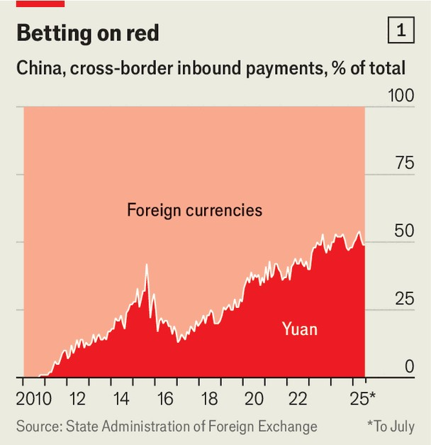
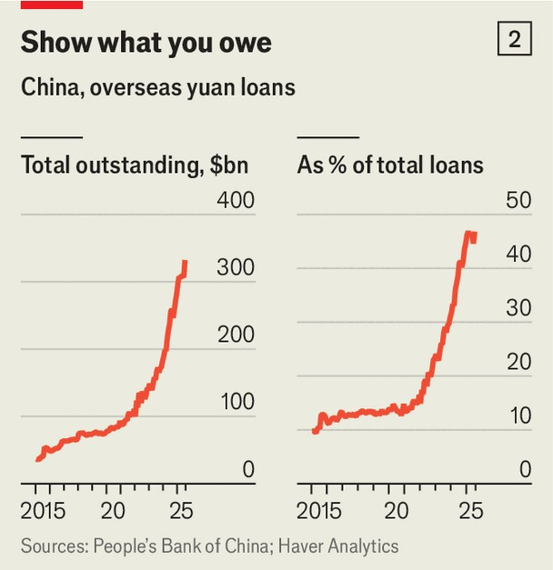

China | From greenback to redback
China is ditching the dollar, fast
Officials believe that the yuan has finally come of age
September 11th 2025

CHINA’S LEADERS sense an epic opportunity. President Donald Trump’s erratic trade policy, gaping fiscal deficits and threats to the independence of America’s Federal Reserve risk badly hurting the dollar. It has slumped 7% on a trade-weighted basis since January, and had its worst start to a year since 1973. By contrast, China’s tightly controlled currency, the yuan, has reached its highest level since Mr Trump was re-elected in November. Foreign investors are piling in. So are many governments looking for dollar alternatives. Such keen interest is not new. Neither is China’s desire to internationalise the yuan. The country’s first such push began in 2009 and saw it loosen some capital controls. That ended painfully back in 2015, when a

stockmarket rout and currency devaluation saw money rush for the exits. A capital clampdown followed and ended the yuan’s nascent rise. This time around, officials are eager to ensure that progress is lasting and that they retain a tighter grip over capital flows.

China’s leaders think a globally accepted yuan can insulate their exporters from movements in the dollar’s value and blunt the threat of America’s financial sanctions. Some officials hope that foreign firms and investors will overlook the state’s rigid control and, perhaps, even come to see it as an asset. In recent years they have made surprising gains. The yuan’s share of invoices and overseas lending has grown and there has been an impressive buildout of non-dollar financial infrastructure to match. But officials seem to recognise that foreigners now need greater incentives to use the yuan and to invest in yuan assets.

So what has China achieved so far? By any measure, the yuan lacks cachet. Though China is responsible for nearly a fifth of global economic activity, its tender is used in only 4% of international payments by value (compared with 50% for the dollar). Yuan assets make up just 2% of global central-bank currency reserves (compared with 58% for dollar assets). A lot of this mismatch can be blamed on China’s controls on money flowing in and out of the country. Many economists think that internationalising the yuan is impossible while they remain in place.

But even after America became the world’s largest economy, it still took decades for the dollar to achieve dominance. By that timescale, China is making surprisingly rapid progress. Its modest share of international payments has doubled since 2022. That is mostly thanks to changes at home. Increasing the yuan’s share in China’s own trade was an important step. Over 30% of China’s trade in goods and services is now done in its own currency (compared with 14% in 2019). It settles more than 50% of its total cross-border receipts (including financial flows) in yuan, up from less than 1% in 2010 (see chart 1).

What policymakers ultimately want, reckons Dinny McMahon of Trivium China, a Beijing-based consultancy, is to create a stable circulation of yuan in and out of the country. That should boost the use of offshore yuan and improve foreigners’ ease of access to the currency. In May regulators told big banks that no less than 40% of trade-facilitation lending should be done in yuan. To increase circulation, officials want to encourage trade partners to accept China’s currency as payment. A major lure is offering them yuan liabilities. A study released in May by economists from the Federal Reserve found that after sanctions were imposed on Russia in 2022, Chinese banks switched nearly all of their new overseas lending out of dollars and into yuan (previously only 15% of loans were made in yuan), thereby tripling the stock of outstanding yuan debt (see chart 2).

The government is pursuing the same strategy with its own balance-sheet. In the time since it began its internationalisation push, China has extended 4.5trn yuan ($630bn) in swap lines to 32 central banks, creating a global financial safety net that rivals the scale of the IMF’s. Only a fraction of such lines has actually been drawn on. The idea is to guarantee countries’ access to yuan in a crisis, giving them the confidence to borrow and buy in the currency.

While all this has been going on, China has also sorted its own financial plumbing. Now it can transact with others without touching the dollar system through a variety of means. These include the digital yuan and non- bank digital payments (such as through QR codes on apps popular in Asia). Most important is the invention of CIPS, which bears similarities to SWIFT, the West’s bank-messaging system. Since Chinese banks can and do transact outside SWIFT, the yuan’s role in international payments is probably being undercounted, says Josh Lipsky of the Atlantic Council, an American think- tank.

More than 1,700 banks have signed up to CIPS across the globe, up by a third since before the war in Ukraine. Transaction volumes rose faster than ever in 2024, up by 43% to 175trn yuan ($24trn). Clearing banks to settle yuan payments (almost all of which are operated by Chinese institutions) have been set up in 33 markets. Some joined this year, including banks in Turkey and Mauritius. China began working with the United Arab Emirates in June in order to expand the CIPS network into north Africa and the Middle East.

Last year several billion dollars were said to have been transacted over a digital-currency network called mBridge, built by China with other central banks. An American official speaking in January said that although such payments were still economically insignificant, they had “already surpassed a threshold of geopolitical consequence”. Chinese regulators have directed banks to increase their use of mBridge. The appeal is obvious. In August a firm in Xinjiang, a region where entities are under sanction for using forced labour, used mBridge to pay its foreign shareholders.

What now? China’s government, which has turned inwards for self- sufficiency in critical areas, must expand access for foreigners to its financial markets. The number of financial contracts open to foreigners to trade on onshore markets has more than doubled this year; outbound quotas for domestic investors have expanded.

The coming months could prove crucial. Waning trust in the dollar and a supportive macroeconomic environment should boost China’s efforts. A lift in the stockmarket has given foreigners a financial incentive to hold yuan assets. Interest-rate cuts and deflation have pushed borrowing costs in the

offshore market to below 2%, the lowest level since 2013. Firms, including foreign ones, are on track to issue a record amount of so-called “dim sum” yuan bonds this year.

China’s next safe move is opening up its onshore capital markets to its pals. In July Hungary issued about 5bn yuan in so-called “panda bonds”, the largest single sovereign issuance to date. On September 8th the Financial Times reported that Russian energy firms had been given the go-ahead to issue yuan-denominated paper. Kenya may soon swap the dollar debts it owes to China into yuan. Meanwhile, Brazil is mulling a new issuance and Pakistani officials have been in Beijing to pitch potential creditors.

Despite the buzz, officials are taking a long view. In a big speech in June China’s central-bank governor, Pan Gongsheng, declared that the global financial system was becoming “multipolar” and that in future the dollar would be forced to compete with other currencies, such as the yuan. Such competition, China hopes, means the country will have to do less to reduce its dollar dependence, and can resist liberalising capital flows and the exchange rate. The yuan may yet be a global currency with Chinese characteristics. ■

Subscribers can sign up to Drum Tower, our new weekly newsletter, to understand what the world makes of China—and what China makes of the world.

This article was downloaded by zlibrary from [https://www.economist.com//china/2025/09/10/china-is-ditching-the-dollar-fast](https://www.economist.com//china/2025/09/10/china-is-ditching-the-dollar-fast)