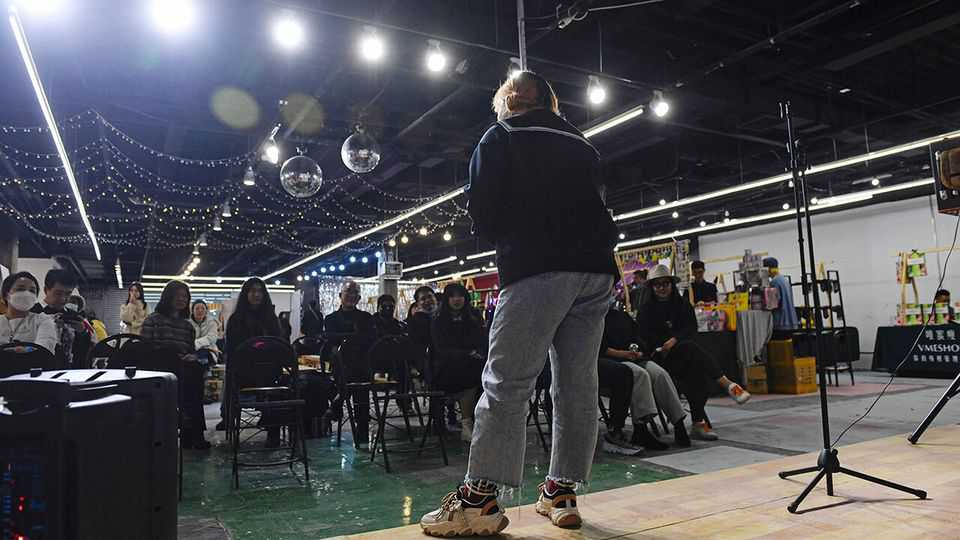

China | Chinese comedy
Director Fang is laughing all the way to the bank
Women love the new stand-up star. Sticklers less so
September 11th 2025

THE CROWD contained more than 1,000 people: a mix of locals from Linyi, a city in the eastern province of Shandong, and those who, like The Economist, couldn’t snag a seat in their own cities. In Beijing, Fang’s shows sold out in seconds. She is one of China’s most popular, and most unusual, comedians. The 50-year-old comes from a village close to central Linyi. Coy about her given name, she is nicknamed Fang zhuren, Director Fang. She rose to acclaim this summer after appearing on a top comedy show. Ms Fang riffs on women’s issues, and in particular the breakdown of her difficult marriage. “If you can’t overcome the mountain of prejudice, then mock it! And earn money while mocking it,” advises Ms Fang.

A Western import, China’s stand-up scene first started in Shenzhen, across from Hong Kong, in 2009 and took off in the late 2010s as online-comedy shows surged in popularity. A crackdown came in 2023. But the industry has roared back. In the first half of this year, stand-up comedy saw a 54% year- on-year increase in the number of performances and a 135% boost in ticket sales, becoming the second-largest genre behind plays, according to the China Association of Performing Arts (CAPA).

Female comedians in China sometimes face a sexist backlash for ribbing men. Jokes made by Yang Li, another stand-up star, have seen her dropped as the face of big companies in recent years. Even so, women now account for 39% of performers in the two most popular stand-up TV shows, nearly double the share of five years ago. And crucially, women made up 66% of the audience at live performances in the first half of this year, CAPA data show.

Female comedians are now zuiti—voicing feelings on behalf of many of the women who watch them—says Dan Chen of the University of Richmond in America. They tackle everything from menstrual shame to sexual harassment. Not everyone laughs. “Why has stand-up comedy, intended to be a stress-relief valve, become a catalyst for provoking or even intensifying gender antagonism?” asked Zhejiang province’s propaganda department in July. Although stand-up can encourage public discussion around gender equality, it wrote, some comedians have “strayed from the essence of humour” and should avoid “exploiting gender tensions to gain attention”.

For many women attending Ms Fang’s show in Linyi, it’s actually less about squashing men and more about lifting women. Chen Xingtong, a local, says she was drawn to Ms Fang’s story. “If a 50-year-old can stand up, why can’t we?” she asks. ■

Subscribers can sign up to Drum Tower, our new weekly newsletter, to understand what the world makes of China—and what China makes of the world.

This article was downloaded by zlibrary from https://www.economist.com//china/2025/09/11/director-fang-is-laughing-all-the-way- to-the-bank

Middle East & Africa

America can’t or won’t protect its friends in the Gulf What it takes to evacuate an injured child from Gaza A high-risk mega-dam in Ethiopia Ebola returns to Congo Africa’s deadly ferries