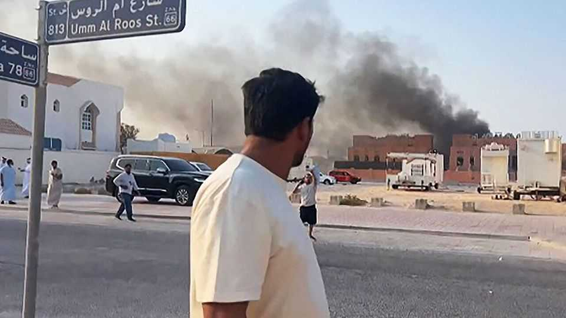
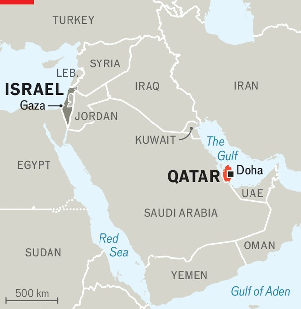

Middle East & Africa | All tactics, no strategy
America can’t or won’t protect its friends in the Gulf
Israel’s strike on Qatar has embarrassed Donald Trump and angered the region
September 11th 2025

In may this year Donald Trump stood in a hangar on the outskirts of Doha, the Qatari capital, and made a promise. Behind him as he spoke was a phalanx of American troops. To his left was an MQ-9 Reaper drone; to his right, an F-15 fighter jet. The martial imagery was meant to reinforce the president’s words to allies. “I will never hesitate to wield American power, if it’s necessary, to defend the United States of America or our partners,” he said. “And this is one of our great partners right here.”

On September 9th an American ally used American-made jets to bomb that great partner. The Israeli air force struck a villa in Doha where leaders of Hamas, the Palestinian militant group, were thought to be meeting. It seems to have been unsuccessful: though five lower-ranking members of Hamas were killed, the leaders are said to have survived (though they have not been seen since in public).

It was not just a tactical failure. The strike will probably jeopardise current ceasefire talks in Gaza. It will also reinforce two emerging fears held by many leading lights in the Gulf: that an unbridled Israel is now a regional hegemon, and that America can no longer guarantee their safety.

Since October 7th 2023, when Hamas killed or kidnapped around 1,400 Israelis, the Israeli government has vowed to hunt down the group’s leaders. Yet until now it refrained from targeting them in Qatar. The tiny emirate hosts the political bureau of Hamas but also the regional headquarters of America’s central command.

The plan to strike Qatar was opposed by Mossad, Israel’s foreign- intelligence service, and by its generals. Both argued it would disrupt Mr Trump’s latest attempt to revive ceasefire talks and endanger the hostages still held in Gaza. Binyamin Netanyahu ordered it anyway, partly due to

criticism of his government after a shooting attack left six civilians dead in Jerusalem on September 8th.

That makes Qatar the sixth country Israel has bombed since the massacre. Elsewhere it could argue it was acting against real threats. Militias in Iraq, Lebanon, Palestine, Syria and Yemen have all attacked it since October 7th; so has Iran, which sponsors many of Israel’s regional foes. It can make no such claims on Qatar. The raid on it was not pre-emptively aimed at an imminent threat, nor even a preventive one meant to steal a march on some future danger. It was an act of revenge on the territory of a sovereign state.

On September 10th Muhammad bin Zayed, the president of the United Arab Emirates (UAE), flew to Doha to meet the emir. The Saudi crown prince was expected to visit the next day. It was a public show of support from neighbouring countries which, not long ago, had severed diplomatic and economic ties with Qatar.

The emirate has long been the black sheep of the Gulf Co-operation Council (GCC), a club of six petro-monarchies. Its support for Islamist groups such as Hamas infuriated its neighbours. So did its patronage of Al Jazeera, the Arabic satellite-news channel, which was once a freewheeling and critical outlet (though today it functions more as a mouthpiece for Islamists). Such policies led four Arab states to impose a travel-and-trade embargo on Qatar in 2017 (they lifted it in 2021).

Yet their disagreements with Qatar pale in comparison with fears about their own sovereignty and security. The GCC has thrived on its reputation for calm, but Saudi Arabia and the UAE have been attacked by Iran and its allies since 2019. Both were disappointed in the response from America, their longtime protector. As for Qatar, it has now been bombed twice this year; the first time was in June by Iran, retaliating for American strikes on its nuclear facilities.

That helps explain why the Trump administration seems so embarrassed. Karoline Leavitt, the White House press secretary, read out a carefully worded statement after the strike that implied America only learned of it once it was under way (and from its own army, not from Israel). Mr Trump later posted a similar message on social media and added a promise that

Marco Rubio, his secretary of state, would work to finalise a defence pact with Qatar. He also vowed that Qatar would not be targeted again (though Mr Netanyahu subsequently hinted otherwise).

Israeli officials offer a different story: that Mr Trump might have been surprised by the timing, but he knew about the plan—and if he did not give a green light, he did not flash a red one either. Sources in Washington tell conflicting tales but agree that Mr Trump is furious: “Embarrassing,” says a former Pentagon official.

Their counterparts in Israel, too, were incandescent at the operation and its results. “It was a colossal failure. They expected to get Trump to go along with this, but that was a massive miscalculation,” says a former spy chief.

In recent years America has tried to convince Gulf states that they could find security by allying with Israel. The UAE and Bahrain both recognised it in 2020. Saudi Arabia was close to signing its own normalisation agreement before October 7th. American officials have urged Gulf monarchs to join Israel in a regional air-defence partnership.

All of that became a hard sell after October 7th. The Gaza war has made Israel deeply unpopular in the Arab world, and Gulf rulers grew nervous that Israel’s ever-expanding conflict with Iran and its allies would eventually drag them in (as it did with Qatar in June). The strike on Doha will only cement that belief: far from being cornerstones of regional stability, America and Israel now look like the opposite. ■

Sign up to the Middle East Dispatch, a weekly newsletter that keeps you in the loop on a fascinating, complex and consequential part of the world.

This article was downloaded by zlibrary from https://www.economist.com//middle-east-and-africa/2025/09/10/america-cant-or-wont- protect-its-friends-in-the-gulf