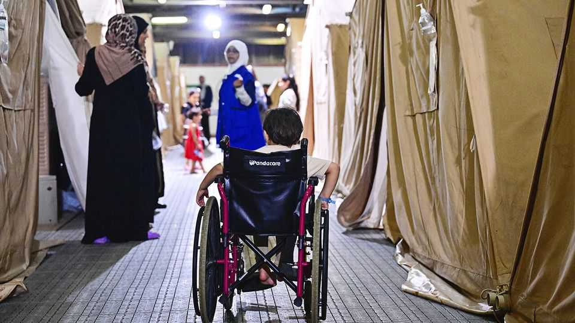

Middle East & Africa | A long wait for help
What it takes to evacuate an injured child from Gaza
Logistics, permissions and geopolitics all slow down the process
September 11th 2025

Last month Laura Loomer, a far-right activist in America, posted several videos on social media of injured Gazan children arriving at American airports. Some were in wheelchairs or had lost limbs. Others perched on suitcases, beaming as welcoming crowds ululated and waved Palestinian flags. Ms Loomer, who is close to Donald Trump, accused the children and their companions of being “Islamic invaders”. Within a few days America’s State Department announced it was halting visas from Gaza; since then, visas for all Palestinians have been blocked. In fact, Western participation in accepting the injured from Gaza has been minuscule. Out of 2,663 patients evacuated since July 2024, more than 60%

have gone to Egypt. Another 30% have gone to Jordan and the United Arab Emirates. Only 28 have gone to America and three to Britain: a fraction of nearly 16,000 patients the UN reckons need medical treatment abroad. Nearly half are children unable to travel alone. That means 4,176 companions have been evacuated with them, mostly mothers or female caretakers. Israel rarely issues permits to fathers.

It is a gruelling process. Before the war, Gazans needing treatment outside the strip would apply for 24-hour permits from the Israeli military authority that controls Palestinian movement. About 2,000 Gazans would leave every month, according to Physicians for Human Rights-Israel, an Israeli activist group, mostly for Israel or the West Bank. After Israel shut that path after October 7th, 2023, for a while Gazans seeking treatment could go to Egypt via the crossing at Rafah. Around 1,500 went every month, according to Médecins Sans Frontières (MSF), a medical-aid group. When Israel took over Rafah in May 2024, that path was closed too, except during a two- month ceasefire earlier this year.

Now those seeking evacuation go through another crossing, at Kerem Shalom, into southern Israel, and then go via an airport or Jordan to third countries. They must get passports, security clearance and travel permits from Palestinian, Israeli, transit and receiving countries’ authorities. Since the ceasefire was broken in March, an average of 89 patients a month have been allowed to leave. At this rate it would take nearly 15 years to evacuate all those on the waiting list, says Dr Hani Isleem of MSF. Meanwhile, 19 of 200 patients on MSF’s evacuation list have died since April last year, including 12 children. Gaza’s health ministry says it has counted 740 deaths, including 137 children, of those on their waiting list since July last year.

In recent months the Israeli military authority has flipped from rejecting to approving most exit requests, according to MSF. Now the main challenge is finding countries to accept the evacuees. Neighbouring countries are medically strained; others face a backlash over Gazans using public resources. Abeer Alaa Saad, a 30-year-old mother who left Gaza for Egypt during the ceasefire, has been living on donations for six months in a hospital room shared with five other women and their children. She has no right to work, but has been waiting for evacuation to America with her seven-year-old son who lost both legs in a bombing raid and was scheduled

to get prosthetic limbs. They had planned to return to Gaza after treatment, she says, to reunite with her husband and two other children. Now they are stuck in limbo.

HEAL Palestine, an American charity that sponsored Ms Alaa Saad and the children in Ms Loomer’s videos, says it pays for all its evacuees’ treatments or finds hospitals willing to treat them for free. The evacuees also sign papers promising to return home. While host countries worry about Gazans overstaying after treatment, Gazans fear Israel is now allowing evacuations because it will then block returns. Israel says it has always encouraged and facilitated evacuations, subject to requests from receiving countries.

The medical evacuations are “a drop in the ocean”, says Liz Allcock of Medical Aid for Palestinians, another charity. What is needed is for Israel to stop blocking aid and bombing medical facilities so that Gazans can resume their own treatment. ■

Sign up to the Middle East Dispatch, a weekly newsletter that keeps you in the loop on a fascinating, complex and consequential part of the world.

This article was downloaded by zlibrary from https://www.economist.com//middle-east-and-africa/2025/09/11/what-it-takes-to- evacuate-an-injured-child-from-gaza