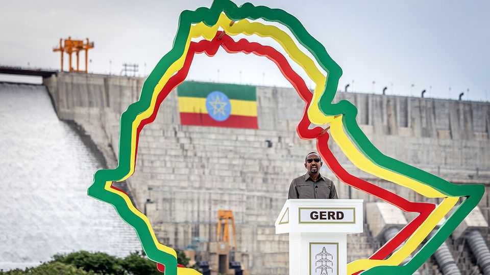
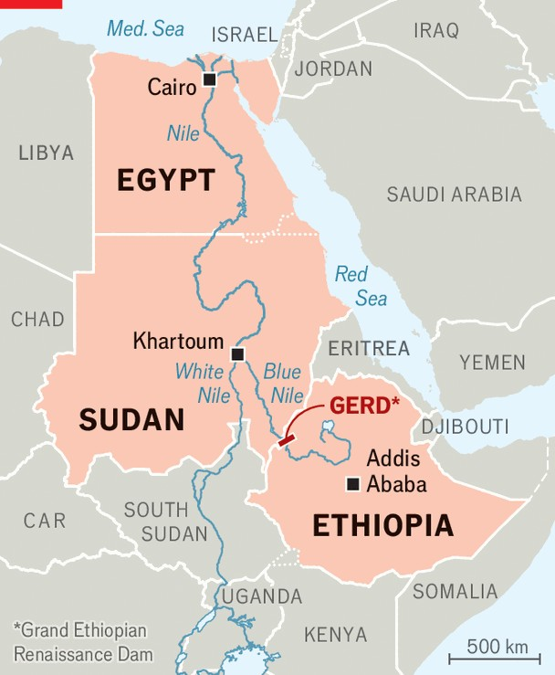

Middle East & Africa | Hydropower
A high-risk mega-dam in Ethiopia
It could power the region or plunge it into conflict
September 11th 2025

Standing on the rim of the reservoir of the Grand Ethiopian Renaissance Dam (GERD) on the Blue Nile, Abiy Ahmed, Ethiopia’s prime minister, called it “the greatest achievement in the history of the black race”. Yet farther downstream the official opening on September 9th of Africa’s largest hydropower project was not met with celebrations. “Any misguided assumptions that Cairo might turn a blind eye to its existential interests in the Nile are mere delusions,” Egypt’s government said in a statement addressed to the UN Security Council. It vowed to take all necessary measures “to defend the existential interests of its people”.

In theory, the GERD, whose 13 turbines can produce more than 5,000 megawatts of electricity, could be a boon not just for Ethiopia, but also for its neighbours. Yet it has long caused rancour between Ethiopia and downstream Egypt and, to a lesser extent, Sudan (see map). Years of negotiations have failed to produce an agreement on how they will share the water from the Nile, particularly in times of drought. The long-running tussle is yet another threat to stability in the Horn of Africa.

For Ethiopia, the GERD is a triumph. First conceived by Emperor Haile Selassie more than half a century ago but built over the past 15 years, it is perhaps the only issue uniting a country rife with ethnic divisions. After international institutions refused to stump up the cash, Meles Zenawi, a former prime minister, called on ordinary Ethiopians to finance the project themselves. Nearly every citizen became a stakeholder, through low- denomination bonds. Though contributions were not always voluntary, the collective effort produced an enduring sense of pride. From exile, some of Mr Abiy’s most vehement critics hailed the dam as a national triumph.

Currently, just over 22% of Ethiopia’s 122m people are connected to the grid. The GERD could supply millions more with power, both at home and through power deals with neighbouring countries. Ethiopia is already earning some $100m a year from selling electricity to Sudan, Kenya and

Djibouti, according to the national power company. Mr Abiy claims the dam will eventually generate $1bn a year in revenue. Yet the country still lacks transmission. At the current pace of expansion, just 27% of households will have grid connections by 2030, far off the national target of 96%. For now, most surplus power is consumed by crypto-mining firms that have built their own power lines.

The GERD’s geopolitics are worrying. Both Egypt and Sudan depend on access to the Nile for most of their water supply. Egypt is already water- stretched, partly because it uses much of its water for agriculture and its irrigation systems are old and leaky. It worries the GERD could be used to choke off its supply.

Sudan, which has been locked in a civil war for more than two years, is hoping to increase its agricultural output. The GERD could help with flood management and irrigation and improve its electricity supply. Even so, in recent years the country has tended to side with Egypt, which is a major backer of the national army in Sudan’s civil war, in opposing the dam.

Experts disagree on how serious a threat the dam poses to Egypt. One recent study suggests that Ethiopia would rarely be able to withhold enough water to cause serious harm. Things may look different if there is a prolonged drought, but it should have been possible to reach agreement on how to share the water.

However, Egypt and Ethiopia have found the dam a useful tool to stoke nationalist fervour. Ethiopian politicians have portrayed Egypt as a colonial power threatening its sovereignty. Abdel-Fattah al-Sisi, Egypt’s president, has described the dam as “a matter of life and death”, but has at times seemed to relish the feud. Sudan used to be more well-disposed towards the dam. But it is now hesitant to alienate Egypt by being seen to compromise with Ethiopia. The last round of negotiations broke down in 2023.

Since then, Egypt has stepped up efforts to support the Ethiopian government’s foes. It is said to have begun sending weapons to the Fano, an Ethiopian rebel movement that is fighting Mr Abiy, and has strengthened ties with Eritrea, Ethiopia’s neighbour and enemy.

The support for Eritrea is particularly dangerous because it could feed into another water-related feud. Many fear Mr Abiy is planning a military offensive to recapture parts of Eritrea’s coastline on the Red Sea, over which Ethiopia lost control when Eritrea seceded from it in 1993. The worry is that, if war breaks out, Egypt could back Eritrea. That would help fuel another regional imbroglio, much like the one that is destroying Sudan.■

Sign up to the Analysing Africa, a weekly newsletter that keeps you in the loop about the world’s youngest—and least understood—continent.

This article was downloaded by zlibrary from https://www.economist.com//middle-east-and-africa/2025/09/08/a-high-risk-mega-dam- in-ethiopia