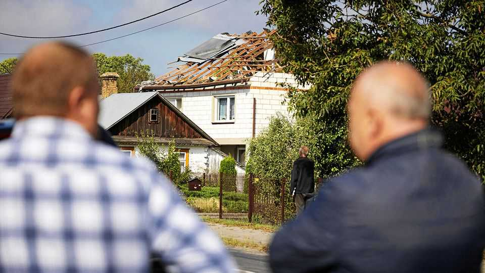

Europe | Europe on a knife-edge
Putin’s dangerous drone probe is a moment of truth for NATO
Poland’s prime minister warns of “open conflict” with Russia
September 11th 2025

IT was THE most serious incursion into NATO territory since the foundation of the alliance in 1949. Nineteen Russian drones breached Poland’s airspace between 11.30pm on September 9th and 6.30am the next morning. Polish fighter jets, along with Dutch F-35s deployed to Poland earlier this month, shot down some of them. Others crashed. One fell 300km deep into Polish territory. Within hours Poland’s government invoked NATO’s Article 4, triggering immediate consultation with allies. The Polish army denounced it as an “act of aggression”. Donald Tusk, the country’s prime minister, noted that it was the first time Russian drones had been shot down over NATO territory. Poland, he said, was at its “closest to open conflict since the second world war”.

Russian drones and missiles have frequently breached NATO airspace in the past. Indeed, Ukrainian officials have complained that their allies have chosen to turn a blind eye to previous incursions. In late August a Shahed drone crashed in a cornfield in eastern Poland, some 120km from Warsaw. A Russian Kh-101 missile briefly appeared over Poland in early 2024. Russian drones apparently aimed for Ukrainian ports on the Dniester river have, Ukrainians insist, been intercepted and even landed across the river in Romania. Finland recently accused Russia of violating its airspace with military aircraft twice, in May and June, with Estonia making a similar accusation earlier this month.

But the scale of the latest incursion far surpasses Russia’s previous violations. The drone barrage forced Polish airports to close. Karol Nawrocki, the president, called it “an unprecedented moment in the history of NATO and Poland.” In a speech to parliament, Mr Tusk called for the “full mobilisation” of NATO members, and reprimanded those prone to criticise European countries rather than Russia over the war in Ukraine.

More may be to come. Starting on September 12th, Russia will hold its Zapad (“west”) military exercises in Belarus, just across the border from Poland. On paper, 13,000 soldiers will be involved. The real number is expected to be considerably higher, as it was during the last Zapad exercise

in late 2021, which amassed some 200,000 troops. Russia attacked Ukraine five months later.

Poland has been taking no chances. On September 9th Mr Tusk announced that the country would close its border with Belarus ahead of the exercises. Russian drones began to appear over the country’s skies hours later. Many of them entered Poland directly from Belarus. In a statement, Belarus claimed the drones “had veered off course” because of the use of electronic warfare equipment by Russia and Ukraine.

Russia, too, says the event was unintentional. The country’s defence ministry said the drone incursions were inadvertent during an attack on Ukraine, and that it had not targeted any sites in Poland. The ministry said it was “prepared to engage in consultations on this subject with the Polish defence ministry”.

Analysts dispute that explanation. “It’s hard to believe as many as 19 drones could have gotten out of control,” says Marek Swierczynski, a security expert at Polityka Insight, a think-tank in Warsaw. “We can consider this a deliberate incursion.” A senior Western military official with detailed knowledge of the incidents says that the incursions appeared to be intentional. Russia may be probing Polish air defences for holes, a mission for which drones are routinely employed in Ukraine.

Poland’s government has responded much more decisively than in the past, but it has stopped well short of invoking Article 5, NATO’s collective- defence clause. That requires an “armed attack”, a threshold that is not formally defined but was deemed to be breached on September 11th 2001, the only time the founding treaty’s crucial article has ever been employed. Poland appears to be keeping its powder dry, in anticipation of further and even broader Russian aggression. “We’re leaving ourselves some room for manoeuvre,” says Mr Swierczynski, “for later on.” Article 4 has only been invoked seven times before, most recently in 2022 after Russia’s full-scale invasion of Ukraine.

For its part, Russia seems to be testing the willingness of Poland’s NATO allies to react collectively to a vivid provocation. Vladimir Putin has long aimed to break the solidarity of the alliance by demonstrating that its

members are unwilling to honour the guarantees enshrined in their charter. The alliance’s leaders are conscious of the risk. Mark Rutte, NATO’s secretary-general, demanded Russia “stop violating allied airspace” and warned that “we will defend every inch of NATO territory.” Mr Tusk said he had spoken with the leaders of Finland, Denmark, Norway, Sweden and the Baltic states, countries which, he said, “see the Russian threat clearly.”

Mr Rutte called the incursions reckless and dangerous, but said that allied intelligence services were still analysing them to determine whether they were intentional. Mr Putin will be watching to see whether any serious consequences ensue. Donald Trump for a moment suggested that they might. “What’s with Russia violating Poland’s airspace with drones?” he posted on Truth Social. “Here we go!” But no further statement followed, let alone any action. A failure by NATO to react to an unprecedented violation of a member’s airspace will bring Mr Putin a step closer towards his goal of dividing the Atlantic alliance. ■

To stay on top of the biggest European stories, sign up to Café Europa, our weekly subscriber-only newsletter.

This article was downloaded by zlibrary from https://www.economist.com//europe/2025/09/10/putins-dangerous-drone-probe-is-a- moment-of-truth-for-nato