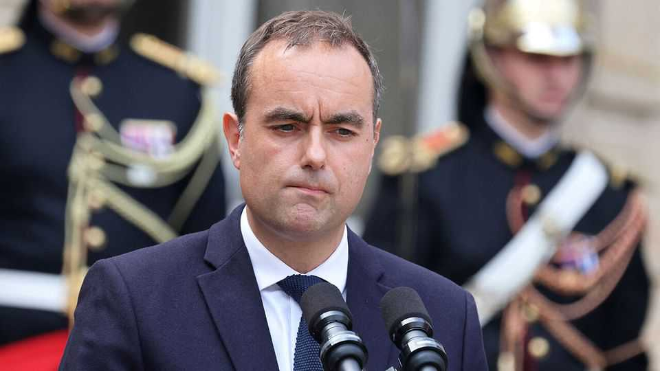

Europe | Last-chance saloon in Paris
France gets a new prime minister
President Emmanuel Macron’s latest pick, Sébastien Lecornu, may need to compromise to survive
September 11th 2025

French politics took an absurdist turn this week, after parliament voted on September 8th to bring down a government for the second time in nine months. This time the victim was the centrist François Bayrou, whose minority government collapsed after a crushing defeat at a vote of confidence over his unpopular deficit-cutting budget. Last December parliament also toppled his predecessor, the centre-right Michel Barnier, also over the budget. Undeterred, President Emmanuel Macron on September 9th named a close ally, the defence minister Sébastien Lecornu, as his next pick —his fifth prime minister since 2022. Mr Lecornu’s task is to try to break the cycle of parliamentary deadlock that has thwarted almost all government business, and turned domestic politics into a sorry repetitive spectacle.

Mr Macron has told his new prime minister to consult widely among France’s political parties before forming a government. He wants him to put together a budget for 2026 that can, this time, secure parliamentary approval in advance. Upon taking office on September 10th Mr Lecornu vowed to be “more serious” about working with the opposition, and promised “ruptures” of substance as well as style.

A fierce loyalist, the 39-year-old Mr Lecornu (pictured) is an unusual figure in Mr Macron’s inner circle. The son of an aerospace technician and a medical secretary from rural Normandy, he is not a technocrat, nor has he had the elite education favoured by France’s establishment. A former Republican, he was not a founding member of Mr Macron’s original centrist venture. Asked to describe his politics, someone who knows Mr Lecornu well calls him a “Gaullist”, a term that tends to mean a belief in a strong and independent state.

Yet Mr Lecornu has earned the trust of the president, served in every one of his governments since 2017, and become a valuable source of political insight. Mr Lecornu “is obsessed by politics”, comments another source, who says the pair periodically share views over a late-night whisky. Mr Lecornu talks to those whose views he does not share, including not only the Socialists but the hard-right Marine Le Pen. A reservist in the gendarmerie, which reports to the defence ministry, he has been a respected defence minister, not least for having protected the military budget.

The best hope is that such skills can help him achieve what Mr Macron’s two previous prime ministers failed to do: find common ground among not only the centrists and the centre-right but the centre-left, too. In a lower house split into three hostile blocs, this means, at a minimum, peeling the Socialists away from their left-wing opposition grouping.

The price for securing even a non-aggression pact with their party would involve big concessions. One could be over the scale of the planned fiscal consolidation. Mr Bayrou wanted €44bn ($51bn) of budget savings to curb the deficit to 4.6% of GDP in 2026. Olivier Faure, the Socialist leader, wants half as much. Another could be over a wealth tax on the super-rich, something Mr Macron has so far resisted. Mr Faure argues for a 2% minimum annual tax on fortunes over €100m. Such a plan would undermine

Mr Macron’s record of supporting wealth creation and business. But, asks a centrist deputy, “does the president have a choice?” He may well decide that things have changed, and that stability now matters more.

The trouble is that, even if Mr Lecornu proves to be a more skilful negotiator, he will still face the same divided and recalcitrant parliament. By themselves the Socialists hold only 66 seats in the 577-seat assembly; he needs to win round a dozen other members too, while keeping the centre- right Republicans party onside. Meanwhile both the extremes are delighting in the disorder. On the hard left, Jean-Luc Mélenchon is enraged by Mr Faure’s willingness to talk, and wants Mr Macron to resign. On the hard right, Ms Le Pen said that by appointing Mr Lecornu the president had “fired the last bullet of Macronism”. She wants fresh elections, which she thinks will take her party and its friends into government.

France is facing a period of triple trouble: as well as political uncertainty, it is contending with market edginess and popular restlessness. France’s borrowing costs are already higher than those of Greece. On September 10th an amorphous movement under the banner “Bloquons tout” (Let’s block everything) tried to bring the country to a standstill. It failed, though sporadic blockages affected some parts of Paris and other cities, and over 500 people were arrested. A day of strikes is planned for September 18th.

When Mr Macron launched a broad centrist movement in 2016, his core idea was to bring together moderate politicians of all stripes to build a bulwark against the extremes. That project now looks more fragile than ever. Mr Lecornu may have one last chance to make it work. ■

To stay on top of the biggest European stories, sign up to Café Europa, our weekly subscriber-only newsletter.

This article was downloaded by zlibrary from [https://www.economist.com//europe/2025/09/11/france-gets-a-new-prime-minister](https://www.economist.com//europe/2025/09/11/france-gets-a-new-prime-minister)