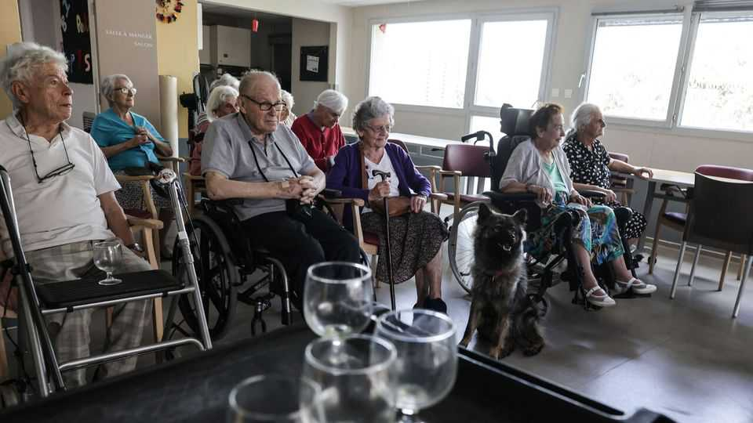
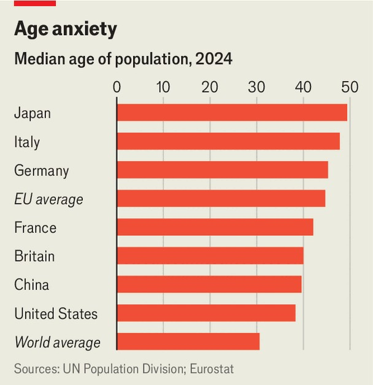

Europe | Old money
A crisis in long-term care of Europe’s elderly
The costs of neglect are huge
September 11th 2025

IN A pretty six-storey building in Bad Laer, a small town in Lower Saxony, Jina Reye spends seven hours a day washing dirty hands, spooning food into mouths and soothing tempers. Ms Reye is not dealing with tricky toddlers. She looks after people with advanced dementia, who she says “go back to being like a child”. Some are reluctant to follow instructions; others respond aggressively. There is roughly one staff member for every two patients, but Ms Reye says that is not enough.

Europe’s population is ageing rapidly. The median age for the continent is 43, compared with the global median of 31. By 2050 6% of the EU’s people will be older than 85, more than double the current share. Western European countries like Germany are better off than most. It is in southern and eastern Europe that the population is oldest and young people are leaving fastest. In Italy, Europe’s oldest country, the median age is 49; in 2021 alone 2.8% of its university graduates aged between 25 and 34 emigrated. In Greece, Lithuania and Latvia, similarly “old” countries, the working-age population will decrease by 20% from 2023 to 2050, according to Bruegel, a think-tank in Brussels.

The need for long-term care (LTC) services, a term for the support given to those unable to carry out daily activities by themselves (such as the elderly or the disabled), will balloon as a result. In Germany, 79% of LTC services already go to those aged over 65. The EU’s research centre estimates that the number of people over 50 with LTC needs will increase from 19.7m in 2020 to 27.1m by 2050.

Although public spending on health care is high in most European countries, the share spent on LTC varies. In 2022 Sweden, the Netherlands and Norway spent more than a quarter of their health budgets on LTC. In contrast, few southern and eastern European countries spend more than 10%.

Labour supply is dwindling. LTC workers make up 7% of the total workforce in Sweden, but less than 1% in Romania, Cyprus and Greece. In Bulgaria services are almost non-existent. Zornitsa Karagyozova of Alzheimer Bulgaria, a civil-society association, notes that there have been no official statistics on dementia diagnoses for ten years. Medical degrees in university do not even offer specialisations in gerontology, she says.

Care workers find themselves underpaid, overburdened and spread thin. “We want to do more preventive work in the future,” insists Martina Horvat, the national co-ordinator for community nurses in Slovenia. But since the covid pandemic, blood testing, wound care and catheter-changing responsibilities have been transferred from physicians to her nurses, making it even harder to provide preventive care.

Politicians often reckon that spending more on care for the aged will blow up their already-stressed budgets. But there are also considerable costs to not doing so. Informal carers need to reduce their working hours or quit their jobs entirely, and their work at home does not contribute to state pensions or private savings. Jonathan Cylus, a researcher at the European Observatory on Health Systems and Policies, argues that insufficient spending now will create more problems down the line: “By not investing now, you’re basically penalising another generation.”

Spending more generously on preventive care would also keep elderly citizens active in the economy for longer. The “ageing in place”’ approach, increasingly adopted in Nordic and western European countries, aims to keep older people in their homes for longer. LTC workers can do the housekeeping, cooking and laundry while prompting patients to be independent where they can. Daily activities like shopping, child care or volunteering keep them active in the economy and society. Mobility exercises are less expensive than trips to the hospital.

Some countries are already biting the bullet when it comes to LTC spending. In July Slovenia implemented a mandatory LTC contribution which takes 1% of salaries (or net pensions for those no longer working), or 2% of earnings for the self-employed. Italy made changes to its benefits programme in January. Those above 80 years old who have serious illnesses and are unable to provide for themselves will receive a total monthly

allowance of €1,380 ($1,600) to cover LTC expenses. The aim of these allowances is to reduce the use of residential care homes and ease the burden on public systems.

Europe offers an early warning sign for the rest of the world. Over the next three decades, as life expectancy rises, the number of older people in Latin America and the Caribbean will more than double, and in Africa it is expected to more than treble. Public health-care spending in both regions is low compared to Europe’s, and very few countries have started thinking about LTC. If they want to blunt the fiscal strain of ageing, they should start investing early.

For Europe, the shift towards an LTC system that can keep up with demand will be a mad scramble. But it is essential as the voting population ages. Other countries should not wait too long. Old age will creep up on all of them eventually. ■

To stay on top of the biggest European stories, sign up to Café Europa, our weekly subscriber-only newsletter.

This article was downloaded by zlibrary from https://www.economist.com//europe/2025/09/11/a-crisis-in-long-term-care-of-europes- elderly