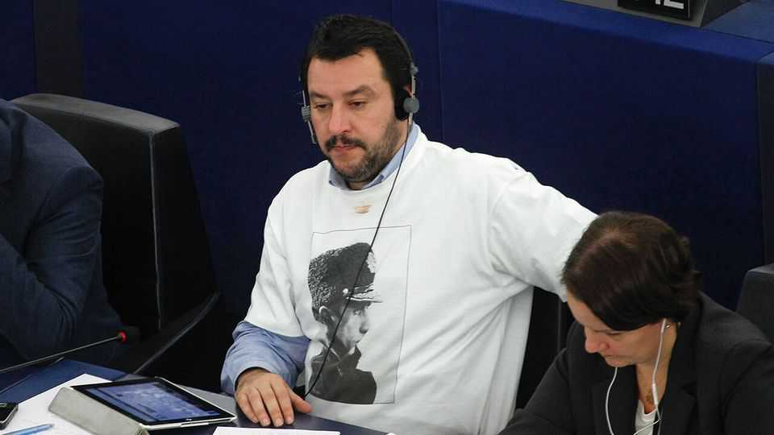

Europe | Sweet and sour on Vladimir Putin
Italy’s coalition sends mixed messages on Ukraine and Russia
Italian voters are ambivalent, so the government is too
September 11th 2025

Matteo Salvini, Italy’s populist deputy prime minister, is again beating the drum for Vladimir Putin. At a meeting of the European Parliament in Strasbourg in 2015, the leader of the hard-right League party famously wore a T-shirt emblazoned with the Russian president’s face. He also once said he would like to have Mr Putin as Italy’s prime minister “tomorrow”. But on joining Giorgia Meloni’s avowedly pro-Ukrainian coalition government in 2022, eight months after the invasion, Mr Salvini had to tone down the hero- worship. However, since Donald Trump’s return to power the League has been exploiting public fatigue with the war. With a string of regional elections

scheduled over the next three months, the party is looking for ways to differentiate itself from Ms Meloni’s Brothers of Italy (FdI). Should it fail, it risks electoral collapse. Polls put support for the League at around 9%, with Ms Meloni’s FdI at 29%.

Many on the Italian right have long admired Mr Putin’s anti-gay policies and professed belief in the traditional family. With Mr Trump back in the White House, Mr Salvini now seems emboldened. He says Ukraine cannot win the war, and calls on Volodymyr Zelensky to negotiate with Mr Putin without “getting touchy”. Last month he sparked a diplomatic spat with France by opposing the deployment of European troops in Ukraine. “You go there if you want. Put your helmet on, your jacket, your rifle and you go to Ukraine,” he told reporters, mockingly referring to President Emmanuel Macron.

Mr Trump’s return to office and his periodic criticism of Mr Zelensky have given Mr Salvini licence to be more outspoken, says Daniele Albertazzi, a political scientist at the University of Surrey. “Public opinion in Italy is much more sceptical of NATO’s role in the world,” he notes. “A lot of people in Italy don’t believe it is all Russia’s fault and many voters don’t like the idea of Italian involvement which could lead to conflict with Russia.”

Seven of Italy’s 20 regions are expected to hold elections by year’s end. A recent survey by Youtrend, an Italian pollster, found that six in ten League supporters oppose giving Ukraine a security guarantee, compared with only a third of Ms Meloni’s voters. Mr Salvini is also fending off pressure from his rival and deputy party leader, Roberto Vannacci, an outspoken former general who said last year that “between Putin and Zelensky, I choose Putin.”

In a move seen as a concession to Mr Salvini, Ms Meloni last month nominated Stefano Beltrame, his former diplomatic adviser, as ambassador to Moscow. Mr Salvini’s efforts to stake out a contrasting position on Russia mean tension in the coalition is likely to continue. But he will probably stick to provocative yet symbolic statements, rather than threaten the unity of the coalition.

Indeed, the League denies that any shift towards Moscow has occurred. “We have not become more pro-Russian, but we appreciate Trump’s efforts to reach a peace agreement,” says a party spokesperson. The party has always voted in favour of measures supporting Ukraine, and the coalition is not at risk. The League, he says, is simply “against military engagement by our soldiers”. ■

To stay on top of the biggest European stories, sign up to Café Europa, our weekly subscriber-only newsletter.

This article was downloaded by zlibrary from https://www.economist.com//europe/2025/09/11/italys-coalition-sends-mixed-messages- on-ukraine-and-russia