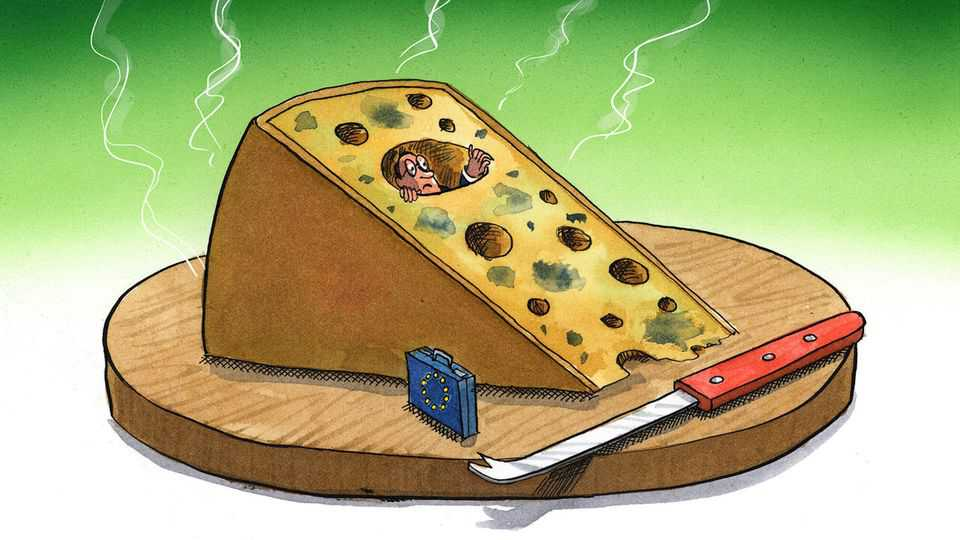

Europe | Charlemagne
Europe has an urgency deficit
The continent has gone soft in the heat of crisis
September 11th 2025

Deficits are like cheeses: both come in many varieties, are something of a European speciality, and become problematic if left to fester too long. A deficit in government spending, the hardy perennial of European politics, has a proven ability to topple governments from Athens to Paris at a single whiff. A demographic deficit in most European countries brings into question the long-term viability of its welfare system—a problem as hard as an aged comté to scrape away. There are sectoral trade deficits, for example in manufactured goods with China or tech services with America, both of which make for geopolitical dependencies that leave European politicians bluer in the face than a vein of gorgonzola mould. Critics of the European Union’s institutions highlight the democratic deficit, whereby citizens across

the continent have little idea what Eurocrats who are meant to be representing their interests in Brussels are churning on their behalf.

But these days one deficit trumps them all: the urgency deficit. Europe is a continent in peril. Its economy is souring; its geopolitical position crumbling like aged feta. Ideas for how to solve this are plentiful, yet the ardent will to enact them seems eerily absent. The gap between the diagnosis of the continent’s problems and the production of solutions has become a continental chasm. Can Europe find a whey forward? The continent’s languid mindset was once a tolerable foible, the inevitable upshot of dozens of countries building an ever-closer union, one issue at a time. In the age of a revanchist Russia lobbing drones into EU territory and a flaky America imposing lopsided trade deals, it feels like an unaffordable luxury. Europe’s geopolitical rivals move—if not always in the right direction—at the speed of presidential edicts and proclamations. In contrast, while the world burns, Europe’s urgency melts away like a reblochon on a hot day.

Take the continent’s economic growth, currently as soft as a ripe camembert. September 9th marked the first anniversary of the release of Mario Draghi’s report on EU competitiveness, commissioned by the bloc as a blueprint to escape a two-decade economic morass. The verdict from the former president of the European Central Bank was suitably damning. Alas, a year later little of what it recommended in its 400 door-stopping pages has been enacted. A much-publicised bonfire of EU red tape strangling businesses is itself partly caught up in the red tape needed to get it through the bloc’s legislative process. Hopes for a rapid expansion of the single market to areas like banking are pondered endlessly, yet appear as unattainable as ever. Mr Draghi’s vision presupposes a much larger EU budget, perhaps to be funded by debt that is jointly issued by its 27 member states. Yet when a proposal for even a moderately bigger budget was put forward by the European Commission in July, Germany shot it down within hours. Europe is left with a grating sense of déjà vu.

Perhaps even more alarming than Europe’s economy is its security. naTO members agreed in June that they would allocate 3.5% of GDP to core defence spending—but gave themselves a leisurely decade to get there (with Spain proudly announcing it probably never would). Boosting local arms- makers was once an urgent priority for the EU. The “European Defence

Industry Programme” was devised to resolve a decades-old problem of duplication and inefficiency in procurement. Announced with much fanfare in March 2024, the plan remains mired in negotiations between EU member states and the European Parliament. After six weeks of a well-earned summer holiday, negotiators for both sides are back at it; optimists hope they will finish by the end of the year. Until then, the bold ploy that would help rearm Europe is being churned endlessly, producing plenty of froth but no butter.

A follow-up scheme whereby EU member states could use a €150bn ($176bn) joint credit line for financing weapons purchases was unveiled by the commission in March. Member states have indicated they are keen. Alas, the European Parliament is taking legal action to have it blocked on procedural grounds, even though it says it supports the measure. European governments first mooted the possibility of putting boots on the ground in Ukraine over a year ago. A “coalition of the willing” has been in talks for over six months to flesh out the details as part of a peace deal with Russia. But the plan has more holes in it than a slab of emmental: it remains unclear how many countries would be willing to join the effort, let alone how many troops they would send.

How did Europe become the continent where urgency goes to die? Messy politics is part of it. Charles de Gaulle moaned about the difficulty of governing a country with 246 kinds of cheese. Europe has thousands. Worse, what is considered a delicacy in one is dismissed as indigestible in another. Moving forward on any major EU policy, from imposing sanctions on Russia to deepening the single market, requires the agreement of governments often stuck in the morass of domestic politics. Any idea of boldly reforming the bloc in the past year was put on hold while Germany picked a new chancellor and Poland a president. Now it is the curdled political situation in France that is the most pungent problem.

Bemoaning the EU’s cumbersome ways might seem as useful as crying over spilt milk. Nonetheless the president of the commission, Ursula von der Leyen, in her annual state-of-the-union speech this week pleaded that the state of the world today requires a renewed sense of urgency from European citizens and politicians—again. “Does Europe have the stomach for this fight?” she asked. “Do we have the unity and the sense of urgency?” These

are the right questions. For if the EU continues to age like a cheese left unattended, its legacy will be like a forgotten brie—destined for the compost heap. ■

Subscribers to The Economist can sign up to our Opinion newsletter, which brings together the best of our leaders, columns, guest essays and reader correspondence.

This article was downloaded by zlibrary from [https://www.economist.com//europe/2025/09/11/europe-has-an-urgency-deficit](https://www.economist.com//europe/2025/09/11/europe-has-an-urgency-deficit)

Britain

The new battle for Britain Labour has become the party of Britain’s rich A British island infested with wallaby invaders The BBC’s best programme loses its star Fixing Britain’s broken property-tax system will take courage Rebellious tube drivers have less bargaining power than before A reshuffle and a raucous conference show the misery of power