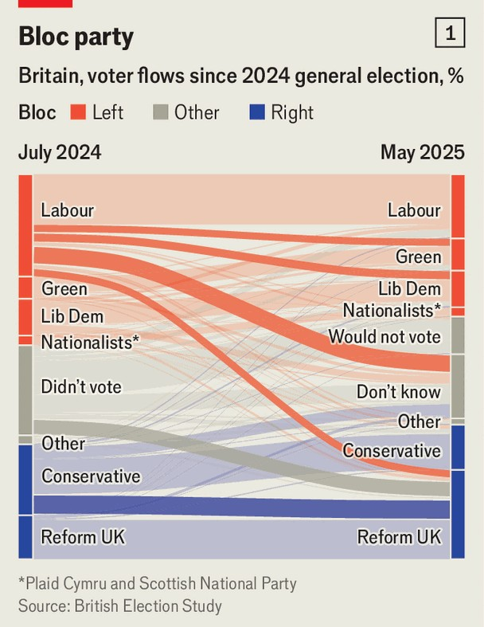
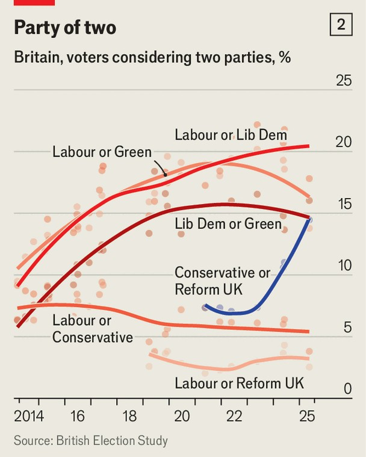
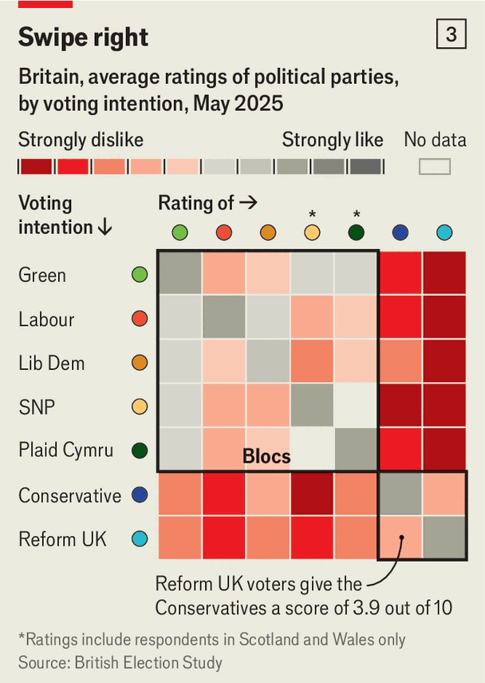

Britain | Electoral science
The new battle for Britain
Once elections were fought between left and right. Now the main fight is within these camps
September 11th 2025

Stevenage, a commuter town north of London, exemplified an era of British politics dominated by two parties. Its mix of rural lanes, smart suburbs and scruffy estates make it a microcosm of England, and an electoral bellwether. Since 1974, whichever party won this parliamentary constituency also won the keys to Downing Street. And victory, the old model dictated, lay in a tranche of voters swinging between the Conservatives and Labour like a pendulum. In 2024 Labour Together, a partisan think-tank, coined “Stevenage Woman” for a genus of practically minded suburbanites who disdain “grand abstractions and vague promises”.

But the old model is disappearing. New rules are asserting themselves. The Brexit years have reshaped the British electorate. In place of two old parties, new ones jostle for dominance. And where once elections were fought on a fault line running between the forces of left and right, now they are decided by contests playing out within both camps. This new order is perilous for the old parties and has profound consequences for any would-be government. Welcome to the new battle for Britain.

Labour won a landslide in the general election of 2024, with 411 MPs— including Kevin Bonavia, who triumphed in Stevenage. It was unusually volatile, with more than four in ten voters choosing a different party from the one they did in the election of 2019. Small parties surged; at 57%, Labour and the Tories won their lowest combined vote share since 1910. But this volatility was not random “like a pinball machine” says James Griffiths, the lead author of a recent paper drawn from the British Election Study (BES), a long-running survey. Rather, voters made ”carefully selected choices from an acceptable list of alternatives.” The findings help explain much of the turmoil in the government today, as well as how future elections may unfold.

First, the BES team found, cleavages in the electorate along demographic lines were hardened by the Brexit referendum of 2016. Young, better- educated and pro-European voters skewed to liberal parties, while older, less well-educated and eurosceptic voters favoured conservative ones. Second, in the minds of voters, those parties now sit in two ideologically distinct “party blocs”, reflecting their positions on Europe, immigration and redistribution. In one bloc are clustered the Labour Party, the Liberal Democrats, the Greens and the nationalist parties; in the other, the Conservative Party and Reform UK.

Third, critically, the volatility arose more from voters shifting within those two blocs than between them. More than 25% moved to another party within the same bloc—say, from Green to Labour, or from Conservative to Reform —between 2019 and 2024. Just around 12% shifted between blocs—say, from Tory to Labour. Stevenage is home to Britain’s first pedestrianised shopping centre, and locals say that elections have long had a consumerist, what-can-you-do-for-me flavour. These days the competition among

political brands is fiercer and, like all discerning shoppers, when voters are dissatisfied with one, they try its most similar rival.

Amid this churn, Labour’s victory lay in tactical voting, which is rewarded in Britain’s ancient first-past-the-post electoral system. Supporters of the left bloc readily supported each others’ candidates to defeat Tories in local races, according to a paper by Marta Miori and Jane Green of the BES. There was no such co-ordination on the right: in Stevenage, the Conservative vote collapsed by 27 percentage points, while Reform gained 18 points.

Since the general election this volatility has continued. Labour’s support has fallen from 34% to 21% today, according to our polling tracker, while Reform has surged from 14% to 31%. That has led some to talk of a mass exodus of Labour’s working-class voters to Nigel Farage’s ranks. Yet the pattern of 2024 persists: most of the churn is voters shifting within the blocs of left and right, according to a BES analysis published on September 3rd (see chart 1).

Of the total of Labour’s vote in 2024, 9% has gone to the Lib Dems, 8% to the Greens, and 21% to a pool of voters who are undecided, but who say they dislike the right-wing parties above all. In all only 8% have gone to Reform. Roughly speaking, for each Labour defector who has shifted to the

right bloc, you would expect that at least four are liable to remain in the left bloc. Meanwhile, the bulk of Reform’s gains have come either from deserting Tories, or from habitual non-voters.

The Economist’s deeper analysis of the data shows how entrenched and cohesive the blocs have become. First, in the past decade the share of Labour voters who say they are open to supporting another liberal party has surged while the proportion open to backing the Tories has fallen (chart 2). Second, in favourability surveys, voters tend to say they look warmly on the other parties in their bloc, and strongly dislike those in the opposing camp (chart 3). Third, when voters are presented with choices of prime minister, those supporting the left bloc overwhelmingly back Sir Keir Starmer over either Kemi Badenoch, the Tory leader, or Mr Farage; for voters on the right, the inverse is true.

Given the blocs’ emergence, the question is which party will best manage them at the next election—and which bloc’s supporters will be prepared to vote tactically to defeat their rival bloc.

Sir Keir is attempting a grand balancing act as he tries to rebuild his fractured electoral coalition. He is courting Reform defectors by promising to halt illegal migration. At the same time, Labour hopes the bigger tribe of

left-wing voters will return through a combination of improving living standards and dislike of Mr Farage. That balance was revealed in a cabinet reshuffle on September 5th: he made Shabana Mahmood, a migration hawk, home secretary, while David Lammy, an ebullient pro-European, became deputy prime minister.

In Stevenage Mr Bonavia mirrors that strategy. He hopes a record of finding practical fixes to local problems, including shorter hospital waiting lists and closing a local hotel for asylum-seekers, will hold his broad coalition together. Labour recently won a council ward by highlighting Mr Farage’s policies, which rallied left-wingers.

But in an age of party blocs, leaders who attempt to straddle the gulf may only alienate their own side, says Mr Griffiths. “This polarisation means the people in one camp have very strong opinions about people in the other,” he adds. A recent paper by Stuart Turnbull-Dugarte of the University of Southampton found that Sir Keir’s swaggering immigration speech in May which described an “island of strangers” dented Labour’s support, without touching Reform’s. Becca Watts, a Green candidate, detects a surge in support from Labour voters: “They’re like, ‘every time you switch on the news, there’s some new disappointment’.”

Liam Byrne, a Labour MP, wants a change of strategy that would tread more carefully on immigration and welfare reform. Twenty years ago he wrote a report urging Labour to focus on aspirational middle classes and ignore the complaints of “urban intellectuals”. No longer, he says: “The electorate has moved on. You’re in a very different kind of game.”

On the right, the Tories and Reform may lose again unless their voters can emulate the tactical voting that the left mastered in 2024. Yet they are in direct competition in more seats: in 97 constituencies they each won over 20%. Ms Badenoch says she’ll never do business with Mr Farage.

But Alex Clarkson, the Tory candidate in Stevenage, favours a pact— possibly giving Reform a free run locally, while the Tories focus on nearby Welwyn Hatfield. The blocs are here to stay, he says. Brexit “split everyone down the middle. The old rules kind of went.” The question is who will master the new ones.■

For more expert analysis of the biggest stories in Britain, sign up to Blighty, our weekly subscriber-only newsletter.

This article was downloaded by zlibrary from [https://www.economist.com//britain/2025/09/11/the-new-battle-for-britain](https://www.economist.com//britain/2025/09/11/the-new-battle-for-britain)