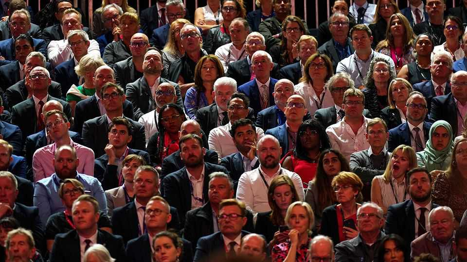
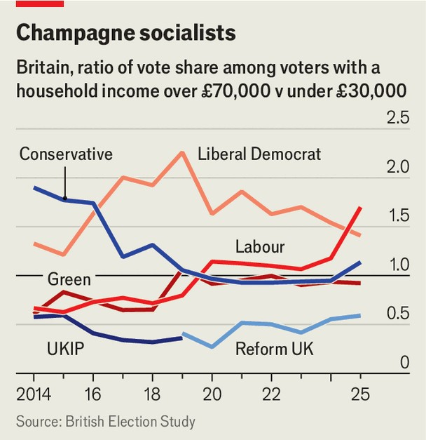
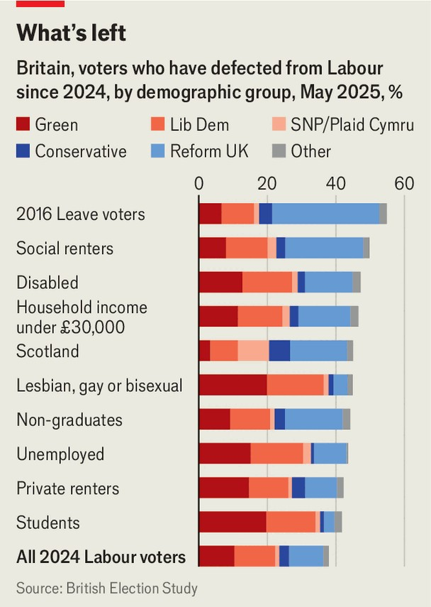

Britain | No working-men’s club
Labour has become the party of Britain’s rich
New data also reveal which voters are driving Reform UK’s surge
September 11th 2025

It still pays to have working-class credentials in the Labour Party. The father of Sir Keir Starmer, Britain’s prime minister, was a toolmaker; Sir Sadiq Khan, London’s mayor, had a father who drove a bus; and the party’s former deputy leader, Angela Rayner, grew up on a council estate. But—in politics as in life—those loudest about their humble origins might just have something to prove.

New data published by the British Election Study (BES) show that Labour’s support has collapsed among the least well-off. Researchers at the BES surveyed over 30,000 Britons between May 2nd and 22nd of this year. The sample size allows The Economist to dig into granular data which showed that only 18% of voters with a household income under £30,000 ($41,000) would vote Labour were an election held tomorrow, down from 33% at the 2024 election.

This is the first such study conducted since Nigel Farage’s hard-right Reform UK party surged into first place in polls earlier this year. It finds that his party’s support comes mostly from Tories and non-voters, who make up 42% and 33%, respectively, of Reform’s new recruits since the general election. The party is particularly popular with older voters and those who did not attend university. Less than one in 20 supporters are non-white (the lowest share of any party) and 57% are men. Converts from Labour, who occupy an outsized place in political debate, account for only one in six of Reform’s new backers.

Labour’s challenge is that it is losing voters of all kinds, in all directions (though twice as many to parties of the left as the right). The BES data show that the party’s supporters who live in social housing or did not attend university are leaving primarily for Reform. Gay voters and students are defecting primarily to the Green Party. Unemployed and disabled voters are leaving disproportionately for the Lib Dems.

Those voters who have stood by Sir Keir represent an increasingly narrow section of the electorate. The party’s vote has held up relatively better in London and among ethnic minorities. And for the first time ever, the ratio of Labour’s vote share among the richest voters (earning over £70,000) to the poorest voters (earning under £30,000) is larger than any other major party. Sir Keir likes to say he has returned the party to its working-class roots. The electorate aren’t so sure.■

For more expert analysis of the biggest stories in Britain, sign up to Blighty, our weekly subscriber-only newsletter.

This article was downloaded by zlibrary from https://www.economist.com//britain/2025/09/11/labour-has-become-the-party-of- britains-rich

