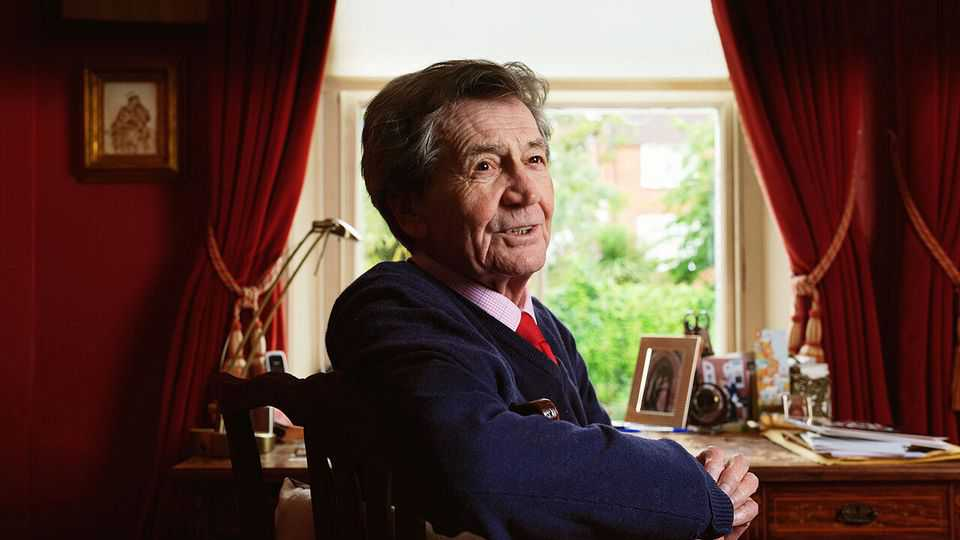

Britain | Out of time
The BBC’s best programme loses its star
Melvyn Bragg is retiring from “In Our Time”
September 11th 2025

To understand all that is now wrong with the British Broadcasting Corporation (BBC) and what was once so right with it, listen to “Slime Moulds”, first broadcast in January of this year. You might have thought that having decided to produce a programme with that title, the BBC would try to sex it up. You would be wrong. “Hello,” said the presenter. Slime mould is “a single-celled organism that scientists have struggled to categorise”. The programme went on to explain different slime moulds’ life cycle (revolting); their appearance (often like “dogs’ vomit”) and their preferred habitat (often dung). And people around the world listened. Because the hello-ing host was Melvyn Bragg and the series was “In Our Time”. In its time—it first

appeared in 1998— the series has become one of the BBC’s most well- known and downloaded programmes. There are “In Our Time” books and there is an “In Our Time” appreciation website (“the Braggoscope”). It has attracted the attention of international newspapers, which approach it with almost anthropological interest as an English oddity (“aggressively uncommercial” felt the New Yorker) and national ones (the Times ran a league table of its most-frequently appearing guests). It is adored. Or rather, it was. On September 3rd Lord Bragg announced that, after 26 years, at 85, he is retiring.

This, for the BBC, is worrying. Partly because “In Our Time” is so very good. But also because so much of the BBC is now not nearly good enough. It has amputated much of its intellectual output (the World Service recently announced a further 130 job cuts); cloaks history in crummy comedy; and winces at seriousness. Programmes like “Newscast”, a politics show, will issue a “geek alert” before interviewing such apparently recherché figures as trade experts. “In Our Time”, by contrast, unapologetically offered an entire episode on David Ricardo, a 19th-century economist.

The BBC will hire someone else to present the show. It will struggle to replace Lord Bragg, a grammar-school boy from Cumbria who left the north but kept its vowels—and his autodidactic zeal (he has also written several books). His programme, which was first commissioned for just a six-month run, reflected that. Each week, he grilled three academics on a particular topic that had to be academic, in every sense. Where other programmes strain to be topical, he was determined his would be “never knowingly relevant”.

He succeeded. Among its 1,000-episode archive are programmes on “Hildegard of Bingen”, “Feathered Dinosaurs” and, of course, “The Ontological Argument” (“Hello. In the late 11th century...”). “In Our Time” didn’t merely achieve the BBC’s early Reithian ideal to “Give the public something slightly better than it now thinks it likes”. It far exceeded it—for who would ever have thought they were interested in slime? And yet they listened and, for 45 minutes, they were. ■

For more expert analysis of the biggest stories in Britain, sign up to Blighty, our weekly subscriber-only newsletter.

This article was downloaded by zlibrary from https://www.economist.com//britain/2025/09/11/the-bbcs-best-programme-loses-its- star