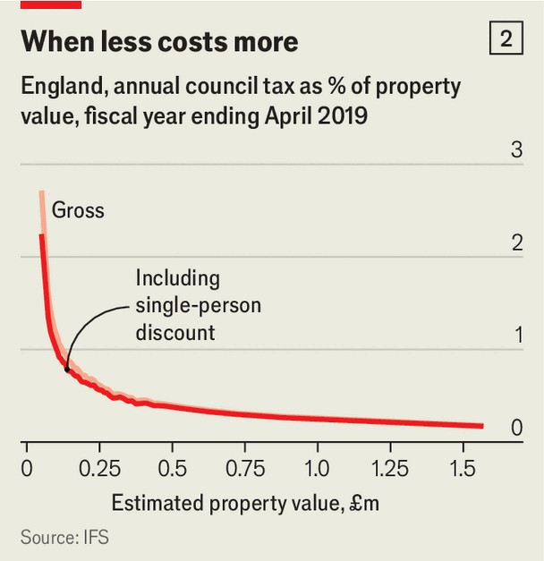

Britain | Home truths
Fixing Britain’s broken property-tax system will take courage
The Labour government is unlikely to go there
September 11th 2025

For British politicians, handling property taxes is like playing Minesweeper, the 1990s video game in which one wrong move can mean game over. Angela Rayner, Britain’s former deputy prime minister, became the latest casualty on September 5th, resigning after revelations that she underpaid stamp duty, a transaction tax, on a second home. Next up to play will be the chancellor, Rachel Reeves, as she prepares for the budget in November. This time the mines will not be ethical lapses but government policy choices. Ms Reeves must find £18bn-28bn ($24bn38bn) in annual tax rises or spending cuts to meet her fiscal rules, estimates Capital Economics, a consultancy. She is said to be considering additional property taxes,

including a capital-gains tax on people’s main homes and a nationwide proportional tax on property values, which would replace council tax.

Some of these proposals are clearly explosive—bad economics, worse politics. Others are better-disguised mines: economically desirable, long overdue, but liable to trigger outrage among some voters. For the chancellor, the politically safest approach would be to do nothing. But Britain’s property-tax system needs fixing.

Britain levies the highest property taxes of any OECD country, relative to GDP (see chart 1). This is not a problem in itself. Assuming the system is well-designed, it makes sense for a government to focus tax collection on property. Because land supply is fixed, taxing it should not reduce consumption or production (unlike taxing sales and income). Land is also immovable, meaning property taxes avoid the flight risks that wider wealth taxes bring.

Unfortunately, British property taxes are not well-designed. Rather, they distort the housing market and undertax the most valuable homes. Consider council tax, an annual levy that raised £41bn in England in 2024-25 to fund local services such as social care and bin collection. Charges vary by local

authority, with houses allocated to one of eight bands, A to H, according to their market value in 1991.

Even back then, this system favoured richer homeowners; band H homes were worth over eight times more than band A ones, but paid only three times the tax. Band H is an enormous category, running from large but middle-class homes (worth £1.5m or more in today’s values) to the royal residence in Buckingham Palace, which means that mansions are undertaxed. Since 1991 diverging house prices and the unequal financial fortunes of councils have made things worse (see chart 2). The owner of a two-bed flat in Hartlepool today pays more council tax per year (band C, £2,218) than someone with a ten-bed mansion in Westminster (band H, £2,034).

If council tax is unfair, stamp duty—paid whenever a house changes hands —is growth-sapping. Although it raised £15bn in 2024-25, at over £40,000 on a £1m home it makes moving house very expensive, resulting in fewer transactions. Because people often move to take higher-paying jobs, inhibiting such moves means less-productive workers, undermining growth.

A botched fix would worsen these problems. Take the proposal to tax capital gains, currently not charged on primary residences, on houses worth over

£1.5m. Faced with large tax bills on sale, older home owners would be even less likely to downsize. It is unclear whether the move would even raise revenue, given the potential stamp-duty losses from fewer sales.

More sensible would be to scrap council tax and the hefty stamp duty on main homes altogether, replacing them with an annual levy, calculated as a percentage of a property’s up-to-date value. In one stroke, the previous problems would disappear. Transactions would surge in stamp duty’s absence. The unfairness of council tax would be replaced by higher bills for pricier homes. Think-tanks across the political spectrum have backed this approach; places like America and Denmark have versions of such a tax.

Admittedly, when wonks unite, politicians should be wary. There are two major impediments to this reform. The first is loser’s wrath. Research by the Institute for Fiscal Studies (IFS), a think-tank, has shown that replacing council tax with a single proportional property tax would have far more winners than losers, with 10m households gaining over £200 annually. However, the richest 10% would see their bills rise by £750 per year on average. These losers would be disproportionately older and southern and would be louder than the silent winning majority.

The second problem is the difficulty of raising extra cash. Despite its many losers, the IFS proposal is revenue-neutral. Making such a change palatable would probably require introducing costly safeguards, such as deferring tax payments until houses are sold. If the chancellor actually wanted to raise money during this parliament, it would require a higher tax rate, which would create even more losers. However sound the economics, this mix of political pain and no fiscal gain is unlikely to tempt a struggling politician.

Yet even if Ms Reeves is inclined to tread cautiously as she navigates the budget minefield, she could make small changes. Introducing new council- tax bands, with higher rates for the most expensive properties, could raise hundreds of millions annually, which could be used to cut stamp duty. Such changes would be largely cosmetic, but would at least signal the government’s commitment to making the system fairer and more pro- growth. At some point though, politicians will need to find the courage to fix the system. When they do, the wonks will be waiting. ■

For more expert analysis of the biggest stories in Britain, sign up to Blighty, our weekly subscriber-only newsletter.

This article was downloaded by zlibrary from https://www.economist.com//britain/2025/09/09/fixing-britains-broken-property-tax- system-will-take-courage