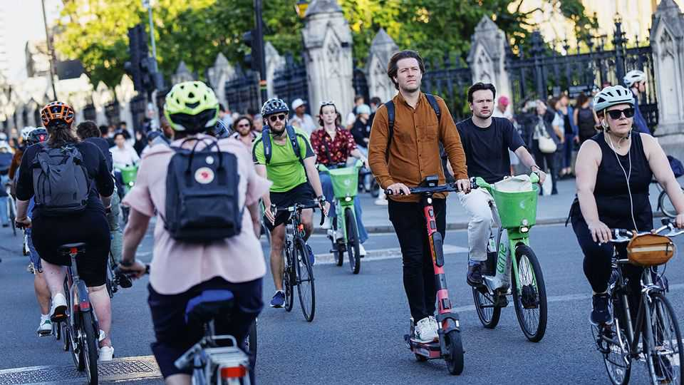

Britain | London’s strikes
Rebellious tube drivers have less bargaining power than before
Rent-seeking meets route-planning
September 11th 2025

A five-day strike by London’s tube drivers has seen the city’s streets awash with bicycles. At busy intersections riders formed elongated pelotons: many pedalled to work for the first time, others cycled to and from overground stations, which remained open. Lime, an e-bike hire firm, reported use on Monday was up by 58%. The RMT union, representing transport workers, says it wants higher pay for drivers, whose starting salary of £68,000 ($92,000) is more than twice that of teachers. But the city becoming easier to bike around may mean that a union once able to bring the capital to a standstill now has less bargaining power. ■

For more expert analysis of the biggest stories in Britain, sign up to Blighty, our weekly subscriber-only newsletter.

This article was downloaded by zlibrary from https://www.economist.com//britain/2025/09/11/rebellious-tube-drivers-have-less- bargaining-power-than-before