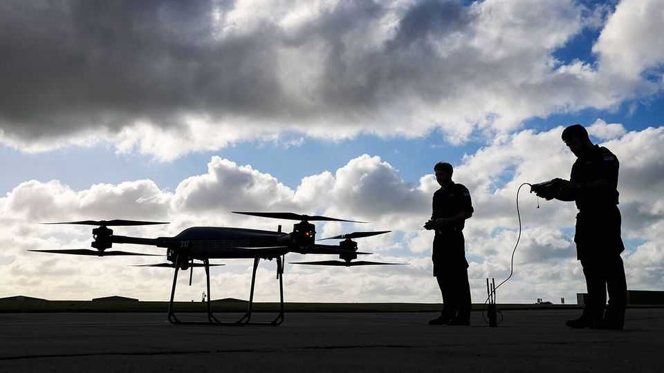
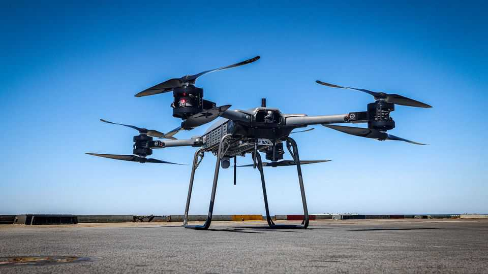
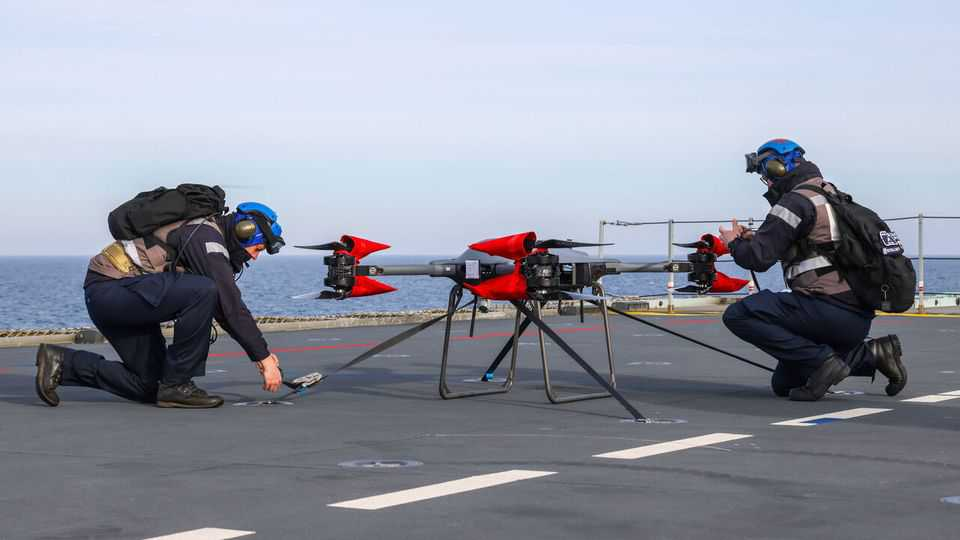
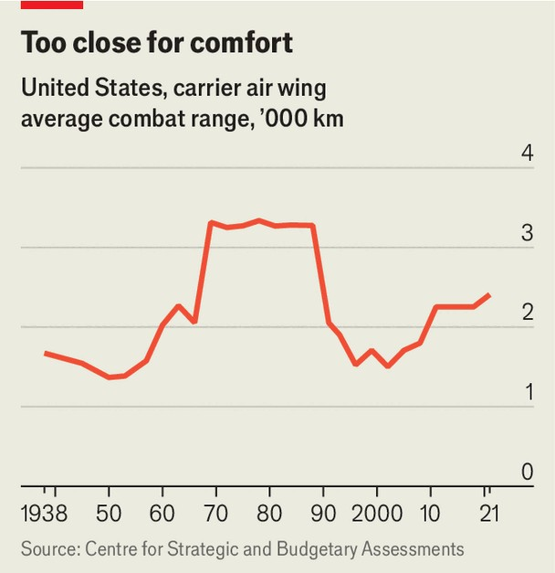
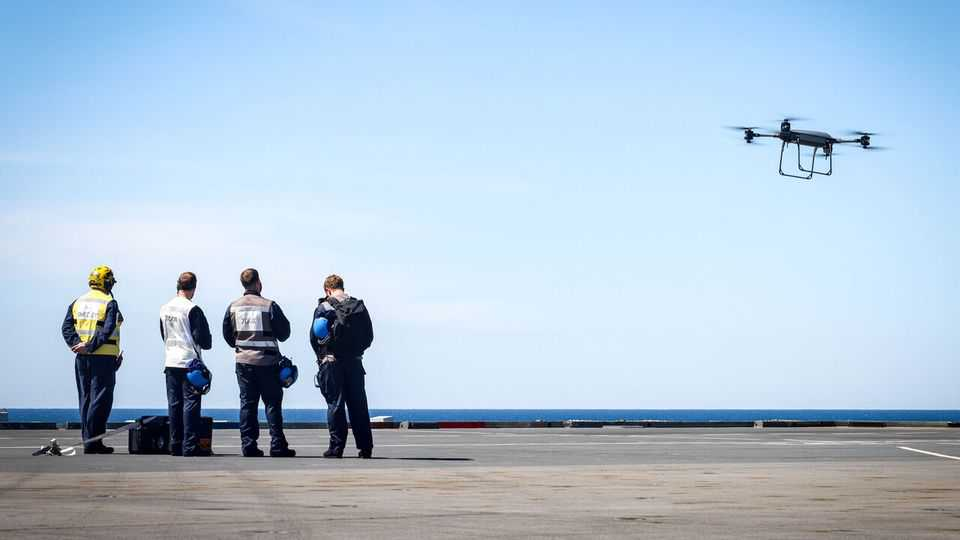

International | War in the air and sea
Top Gun—without Maverick
Drones ride into the danger zone
September 11th 2025

FOR DECADES the mighty aircraft-carrier has ruled the waves. In 1986 it burst into pop culture in the film “Top Gun”, a celebration of cocksure naval aviators. Yet because of increasingly lethal anti-ship missiles, many think its days are numbered. “The thing will be dead in the water in 20 years, for sure,” declared Mark Milley, America’s chairman of the joint chiefs of staff from 2019-23. “It’s a big piece of steel that—sorry—saw its best day at Midway.” Navies around the world disagree. Instead of junking their carriers, they are designing and building new ones—from America to China and France to India. But to keep them fit for modern war, they are reinventing the air wings that fly from them, steadily replacing crewed planes with drones that

can be developed more quickly, used more aggressively and fly farther than today’s short-range jets. That could have implications for naval tactics and the very culture of navies.

In August America’s navy said it had given contracts to four big defence firms to design large combat drones, known as loyal wingmen, that could accompany crewed jets off the decks of carriers. This month Turkey plans to deploy armed drones on the TCG Anadolu, an amphibious assault ship. In November the Mojave, a large 1,600kg-capacity drone, was flown from the ROKS Dokdo, a similar South Korean vessel. France says it plans to fly smaller drones from its own future carrier by 2038 and larger armed ones by 2040. And last year China launched the Type 076, the world’s largest class of amphibious assault ships, equipped with a catapult capable of launching large drones, some of which it flaunted at a parade on September 3rd.

One of the most ambitious services is Britain’s Royal Navy. Its new chief, General Sir Gwyn Jenkins, in his first interview in the role, told The Economist that the government had ordered him to deploy a “hybrid” air wing of drones and crewed jets within the next five years. With two exceptions—F-35 jets, which are designed to last until the 2060s, and helicopters that ferry people—the aim is to make the air wing completely uncrewed by 2040. Drones will handle airborne early warning, aerial refuelling, anti-submarine warfare and, eventually, some strike missions.

There are three main reasons to remove people from the cockpit. One is to let the drones take over grunt work, freeing up crewed aircraft for the jobs that only they can do. When your correspondent visited HMS Prince of Wales, one of Britain’s two carriers, a huge T-150 Malloy quadcopter, capable of hauling at least 65kg, sat in the corner. Weeks earlier it had flown more than a mile to a nearby destroyer delivering spare parts, a first at sea. That job might previously have absorbed hours of a crewed helicopter’s time.

Another reason for removing people is to let the drones bear more of the risk and, in wartime, the losses. “The F-35s that you see on the flight deck here are the world’s most advanced fighters. But you can’t escape that they are an expensive asset,” said General Jenkins, speaking on board HMS Prince of Wales. Drones, he argued, are “less costly to lose, easier to replace and easier to sustain”. Lower costs mean they can be bought in larger numbers. “If we want to be able to go off both carriers at the same time,” says another British admiral, alluding to the country’s lack of F-35s to equip Britain’s two aircraft-carriers, “we need uncrewed.”

Third, drones can be designed differently. “An uncrewed system doesn’t need to go through the same level of health-and-safety scrutiny,” notes General Jenkins. It is easier to upgrade software and hardware frequently when you don’t have to put the aircraft through months or years of tests and certification each time. The weight of a pilot and the systems to support them, such as ejector seats, can also be replaced with fuel, extending range —one reason why rewiring crewed planes to make them remotely piloted works less well.

The ultimate purpose of an aircraft-carrier strike group is, of course, to strike. The question is how far drones will also take over that mission. Early experiments have focused on reconnaissance, sub-hunting and logistics,

because those are easier tasks. But Mark Montgomery, a retired American rear-admiral who once commanded an American carrier strike group in Asia, urges navies to be bolder: to fly long-range “penetrating”—that is, stealthy —strike drones that could launch weapons at far greater distances than F- 35Bs, which can fly less than 1,000km from their mother ship before having to return, far less than the “Top Gun” era (see chart).

In theory, both Malloy and Proteus, another drone, could drop torpedoes, rather than just spare parts and sonobuoys. The Mojave drone tested by Britain and South Korea can carry guns and missiles. But when armed, its range is considerably reduced, in part because long-ranged weapons tend to be heavy. Air forces and navies are also developing bigger and more advanced drones known as collaborative combat aircraft (CCA) in America and autonomous collaborative platforms (ACPs) in Britain. Because they are larger and more complex, stuffed with sensors, they are far removed from the cheap drones popularised in Ukraine. America expects that its CCAs will cost $20m-30m each.

General Jenkins says that these sorts of loyal wingmen will eventually escort every F-35 at sea. They will collect intelligence, serve as decoys and carry weapons. The idea, according to people familiar with the planning, is that they can extend the range of crewed planes, pushing several hundred miles

deeper into dangerous airspace in the first phase of a conflict—perhaps targeting Russian or Chinese air-defence systems—while also serving as “missile magnets” to draw fire away from crewed jets.

That, though, raises deeper and, for navies, perhaps more unsettling questions about the relationship between ships, aircraft and firepower. “The idea of long-range, one-way effectors [weapons] operating off the carriers is part of the reality for us,” says General Jenkins. “But I go a step further and say that isn’t imaginative enough…Why put those long-range effectors on board these carriers?”

Carriers, he says, will face a growing range of threats—something evident from the Houthi strikes against shipping in the Red Sea over the past two years. For some critics, like General Milley, that is a reason to get rid of them. Proponents retort that as mobile runways that can sail anywhere, they are more survivable than airbases on land. “We still have a degree of invulnerability,” says a navy source. “We can still evade [enemy] satellite passes if we turn off sensors when they’re overhead.”

What no one disputes, though, is that ships will need to carry more air- defence missiles, as well as offensive weapons. “One answer is you just build bigger warships,” says General Jenkins. “That doesn’t seem a sensible answer to me. It’s not very affordable, and it puts literally all your eggs in one basket.” The better option, he says—one validated by data from Ukraine, which Britain has helped build and operate a drone-heavy navy—is to disperse forces over a wider area.

In the future each warship, such as a destroyer or frigate, will itself have two uncrewed escorts, says the general. Far better to spread weapons around those, rather than concentrating them on drones stuffed onto carriers. Ukraine, for example, has used the Magura V7, an uncrewed speedboat armed with a pair of Sidewinder anti-aircraft missiles, to down Russian Su- 30 jets. In that sense, the effort to build a hybrid air wing could also drive enormous changes in naval organisation and tactics, rather than just hardware.

Some navies are more comfortable with this than others. America has experimented with naval drones for many years. This year it will start flight- testing the MQ-25 Stingray, a large refuelling drone that it plans to put onto carriers from next year. That could free up F/A-18 fighter jets, which currently do much of the refuelling, for more pressing combat tasks. In theory the Stingray could later be equipped with other sensors or weapons. The capacity to bear arms is “inherently…built in the aeroplane”, according to its designers. But America’s navy has been reluctant to go down that road. The “predominant factor”, says Mr Montgomery, “is that fighter pilots are running the decision-making process”.

Alongside cultural rigidity, there is also understandable caution. If electronic jamming means that a pilot is cut off from a drone, the drone must either abort its mission or act autonomously. That might be straightforward if the task is to monitor the area or carry spare parts. It is trickier if the mission requires lethal force. What is clear is that more and more processing, whether crunching sonar data sent back by sonobuoys or identifying a potential target, will need to be done on computers on the “edge”—on board the drone itself. One result is that reusable naval drones will have to become larger and pricier, because it takes more room to contain the requisite processing power and cooling, and because powerful sensors can be miniaturised only so far.

Another result is that navies will face difficult decisions over how far to let their hybrid air wings off their remote-controlled leash. Even in a full-scale war over Taiwan, says an admiral, navies will still have to discriminate between combatants and civilians—between, say, a People’s Liberation Army warship and a hospital ship. Carrier-borne drones cannot simply be told to attack everything they see. But the same criteria that humans currently use to identify whether a target is legitimate or not—such as the shape of a vessel and its electronic emissions—could, with sufficient computing power and careful design, be applied by an algorithm, he says. “We are in the foothills of full autonomy,” he concludes.

Many air forces are sceptical that artificial intelligence will be mature enough to allow fully uncrewed combat aircraft within the next decade or two. The Anglo-Italian-Japanese project to build a sixth-generation jet, and America’s equivalent programme, now known as F-47, both envisage an “optionally crewed” plane with a traditional cockpit. Neither can take full advantage of a human-less design. General Jenkins is more bullish. “Whatever we see today, it’s twice as good next year,” he argues. “This is all achievable much sooner than we might think.” ■

This article was downloaded by zlibrary from [https://www.economist.com//international/2025/09/11/top-gun-without-maverick](https://www.economist.com//international/2025/09/11/top-gun-without-maverick)