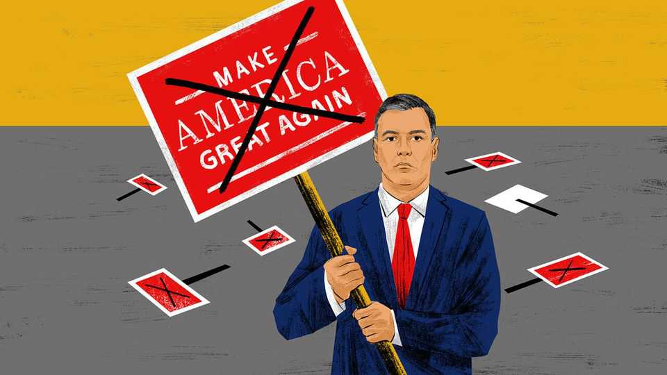

International | The Telegram
Meet the leader of Europe’s anti-Trump resistance
For Spain’s leader, Pedro Sánchez, opposing Trump is a lonely endeavour
September 11th 2025

TO APPRECIATE THE loneliness of Spain’s prime minister, Pedro Sánchez, consider this. When he was left out of a White House summit on Ukraine on August 18th, it was only Spain’s second-worst snub that day. To the added dismay of foreign-policy types in Madrid, a seat was found for the president of Finland, a country with a population less than an eighth the size of Spain’s, alongside leaders from Britain, the European Commission, France, Germany, Italy, NATO and Ukraine. Spain is an old, proud country, and the fourth-largest economy in the European Union (EU). It aspires to be a bridge between western Europe and the developing world, with ties of history and language to dozens of nations. Mr Sánchez has been a staunch defender of Ukraine since its invasion by

Russia. Yet on August 18th, analysts and diplomats in Madrid sadly concur, Spain’s presence would have harmed the European and Ukrainian cause. The reason: Mr Trump dislikes Mr Sánchez.

To be fair to Finland, its president, Alexander Stubb, earned his White House seat. Pre-empting Trumpian grumbles about feckless allies, Finland is a model of self-reliance, with well-trained armed forces to guard its 1,340km border with Russia. Also, Mr Stubb is an expert golfer with the knack of charming Mr Trump.

Mr Sánchez, the head of a Socialist-led government, has chosen to defend European values by confronting Mr Trump. He urges the EU to fight Mr Trump’s “unjustified and unfair” trade tariffs, and to consider channelling the proceeds of retaliatory tariffs to hard-hit European businesses. In January Mr Sánchez told the World Economic Forum in Davos that over-mighty American social-media platforms and tech billionaires imperil democracy. He urged the EU to enforce its own laws against online hate speech and disinformation, notably with the Digital Services Act. That was fighting talk. Mr Trump denounces EU digital laws as taxes on American firms and as vehicles for censorship.

At a NATO summit in June, Spain was alone in rejecting, outright, Mr Trump’s demands for members to spend 5% of GDP on defence. That target is for show. As other governments knew, they were really being asked to spend 3.5% on defence, plus extra money on security. Rather than play along, Mr Sánchez declared a 5% target “incompatible with our worldview”. He promised, instead, to spend 2.1% of GDP on defence, itself a big jump from Spain’s previous pitiful levels. Touring Latin America in July, Mr Sánchez gave speeches alongside such avowed Trump-sceptics as Brazil’s president, Luis Inácio Lula da Silva. The Spaniard vowed to fight an alliance of “oligarchs and the far right”, which he said was responsible for “an international movement of hatred and lies”.

Revealingly, all this activism has not enhanced the clout of Mr Sánchez in European capitals, though his positions often align with public opinion. An annual poll of Spaniards by the Royal Elcano Institute, a think-tank, this May found deep antipathy to Mr Trump, who scored below China’s ruler, Xi Jinping. A poll of 24 countries conducted between January and April this

year by the Pew Research Centre, based in Washington, found that favourable opinions of America had declined in 15 of them since 2024.

Spaniards view America with ambivalence. The left has not forgotten that in the cold war America maintained a (prickly) alliance with Spain’s military dictator, Francisco Franco. After Franco’s death in 1975, however, joining Western institutions helped secure Spain’s future as a free, modern society. That meant joining the EU but also NATO, to bind Spain’s armed forces with democratic norms. To this day, large majorities of Spaniards support both NATO membership and helping Ukraine, while expressing horror at Israeli policies in Gaza. Memories of Franco-era isolation as a pariah state help explain the attachment of Spaniards to multilateralism and international law, argues Charles Powell, the director of the Royal Elcano Institute. “Trump is the enemy of everything that Spaniards believe,” he says.

Mr Sánchez represents these views accurately. Yet his own political allies, as well as usually friendly news outlets, fret that Spain is losing clout in Brussels and other capitals. The costs of antagonising Mr Trump outweigh the benefits, murmur some people in Madrid’s foreign-policy establishment. Did he need to pick a lonely fight at the NATO summit, they ask? Even in Latin America, where Mr Trump is viewed with alarm, few are ready to join a resistance movement led by Spain, a former colonial power. Brazil aside, Latin American governments see little upside in provoking America’s wrath. What is more, the continent is swinging to the right and many of its conservative leaders distrust Mr Sánchez.

Spanish openness to the world is admirable. Mr Sánchez backs a long-stalled EU trade agreement with the Mercosur bloc of Latin American countries. Correctly, he calls it a way to show that global co-operation is still possible. The Sánchez crusade is on weakest ground when its motives look narrowly domestic and self-interested. Though his scorn for Trumpism is sincere, even friendly voices in Madrid agree that he is also veering left to shore up his coalition. To pick one example, his NATO fight reflects political weakness: his hard-left partners refuse to spend more on defence.

For Europe to defend liberal, democratic values it must become stronger, says a retired Spanish ambassador. Among other things, that means more defence spending, notably by Spain. It requires channels of communication

with Mr Trump, adds the diplomat. History shows that when Spain is too antagonistic towards America, it becomes “less relevant” for other European countries.

Spain has every right to defy Mr Trump, and to defend multilateralism. But standing up to bullies requires coalition-building, including across partisan lines. Alone, resistance is sadly futile. ■

This article was downloaded by zlibrary from https://www.economist.com//international/2025/09/09/meet-the-leader-of-europes- anti-trump-resistance

Business

Faith in God-like large language models is waning Sea Ltd, Singapore’s e-commerce king, prepares to battle TikTok From volleyball to tag, investors are piling into niche sports Can Nestlé’s third boss in little over a year turn things round? How do you pronounce Biemlfdlkk? The brands lost in translation Lachlan Murdoch, media’s newest mogul Reviewing the annual performance review In French business, boring beats sexy