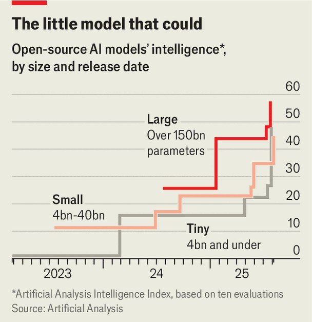

Business | Peak LLM?
Faith in God-like large language models is waning
That may be good news for AI laggards like Apple
September 11th 2025

Editor’s note (September 9th): This article has been updated. WHEN TECH folk talk about the lacklustre progress of large language models (LLMs), they often draw an analogy with smartphones. The early days of OpenAI’s ChatGPT were as revolutionary as the launch of Apple’s iPhone in 2007. But advances on the frontier of artificial intelligence (AI) have started to look like ho-hum phone upgrades rather than genuine breakthroughs. GPT-5, OpenAI’s latest model, is a case in point. It has generated a similar collective shrug to that which greeted Apple’s unveiling of the new iPhone 17 on September 9th.

The slowing pace of improvement at the bleeding edge of generative AI is one sign that LLMs are not living up to their hype. Arguably a more important indication is the rise of smaller, nimbler alternatives, which are finding favour in the corporate world. Many firms prefer bespoke models that they can tailor to their specific needs. These so-called small language models (SLMs) are cheaper than all-purpose LLMs, whose God-like intelligence can appear superfluous. As David Cox, head of research on AI models at IBM, a tech company, puts it: “Your HR chatbot doesn’t need to know advanced physics.”

Besides being as easy to run on a company’s in-house IT systems as via a cloud-service provider, SLMs may also be more useful for AI agents, which do work-related tasks alongside or instead of humans. SLMs’ slimmer size makes them particularly well suited for AI in smartphones, self-driving cars, robots and other devices where energy efficiency and speed are at a premium. If they continue to become more reliable, they could validate the decision of Apple and other device-makers not to follow the herd by investing gazillions in cloud-based LLMs.

There is no precise definition of what constitutes small versus large language models. The distinction comes down to the number of parameters they are trained on—ie, the amount of numerical settings in a model’s brain that help it make sense of data. LLMs stretch to hundreds of billions of parameters. SLMs may be trained on 40bn or fewer, down to under 1bn in the case of tiny ones.

Improvements in the training of SLMs have helped them catch up with the capabilities of LLMs. Small models are increasingly “taught” by larger ones, rather than having to crawl the web to learn for themselves. Artificial Analysis, a benchmarking firm, says that on a variety of tests, a 9bn- parameter model called Nvidia Nemotron Nano, recently launched by the AI chipmaker, outperforms a Llama model released in April by Meta, a social- media giant, which is 40 times bigger (see chart). Catch-up is becoming routine. “The smaller models of today are much more capable than the larger models of last year,” says Mohit Agrawal of Counterpoint, a tech market- research firm.

Better performance has attracted business customers. Gartner, an IT forecaster, says well-known flaws in LLMs, such as hallucinations, have bred “user fatigue”. Instead, businesses want more specialised models, fine- tuned on industry-specific data. This year, corporate demand for them is projected to grow twice as fast as it is for LLMs, though from a much lower base. Over time, Gartner expects more of these specialised models to be developed by companies in-house.

Another reason for the growing popularity of SLMs is economics. Companies have moved on from a spend-whatever-it-takes approach, employed in the early days of generative AI, to a greater focus on return on

investment. Though they may still use LLMs for many tasks, they can do simpler jobs with SLMs. As one venture-capital grandee puts it, you may need a Boeing 777 to fly from San Francisco to Beijing, but not from San Francisco to Los Angeles. “Taking the heaviest-duty models and applying them to all problems doesn’t make sense,” he says.

To illustrate the economics, IBM’s Mr Cox points to a product developed by his company, called Docling, which transforms PDF documents, such as receipts, into storable data. It runs on a “tiny” model with about 250m parameters. He calls it a useful tool, but one that would not be cost-efficient if it were run on an LLM. Small models can also run on cheaper varieties of chip. The smallest models can use central processing units (CPUs), the workhorses of general computing, rather than graphics processing units (gpus) like those that have made Nvidia the world’s most valuable company. This could be a big selling point: GPUs, Mr Cox says, are “fussy Ferraris that are always in the shop”.

SLMs may become still more attractive as businesses deploy more AI agents. A little-noticed paper published in June by Nvidia Research, the chipmaker’s investigations arm, states boldly that “small, rather than large, language models are the future of agentic AI”. It notes that currently most agents are powered by LLMs, hosted by cloud service providers. The investment pouring into AI-related cloud infrastructure suggests that the market assumes that LLMs will remain the engines of agentic AI. The paper challenges that assumption, arguing that SLMs are sufficiently powerful to handle agentic tasks, and more economical (for instance, a 7bn-parameter model can be ten to 30 times cheaper to run than a model up to 25 times bigger). It says that SLMs may lead to a “Lego-like” approach to building agents, with firms using small, specialised experts, rather than one monolithic LLM intelligence.

The paper, which raises questions about the money pouring into cloud-based agentic infrastructure, does not represent Nvidia’s strategic thinking, says Kari Briski, a senior Nvidia executive. She says business customers want models “of all shapes and sizes”. The largest models are better at handling the hardest jobs than small ones. Moreover, she says, it is important to keep pushing the frontier of LLMs because that makes them better teachers of SLMs.

Whether SLMs eventually displace LLMs or not, heterogeneity is on the rise. All-knowing LLMs will remain important for consumer apps like OpenAI’s ChatGPT. Yet even OpenAI is shifting its focus. GPT-5 has internal models of different sizes and strengths, which it uses depending on the complexity of the task.

As SLMs become more adept, they may also improve the reputation of on- device AI. Apple disappointed investors when it launched “Apple Intelligence”, its AI offering, last year, because it did not work well. Its shares slid on September 9th after the launch of the iPhone 17, partly because there was no news of progress on Apple Intelligence. But the firm’s approach of using SLMs to do some tasks on the iPhone while delegating harder jobs to the cloud could be the shape of things to come, says Counterpoint’s Mr Agrawal. Such is Apple’s clout, even if it has “missed the boat” in the early stages of the AI race, “it can always get on the next boat”, he says.

For now, most attention remains on LLMs. Though cloud giants like Microsoft and Google have built extremely small models, the belief that the status quo will persist has helped justify the fortunes they are spending on data centres to train and host the largest models. That may be short-sighted. Given the relative merits of SLMs, Apple’s take-it-slow approach may turn out to be justified in the long run.■

To stay on top of the biggest stories in business and technology, sign up to the Bottom Line, our weekly subscriber-only newsletter.

This article was downloaded by zlibrary from https://www.economist.com//business/2025/09/08/faith-in-god-like-large-language- models-is-waning