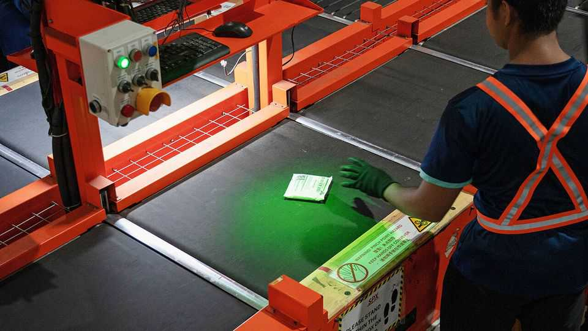
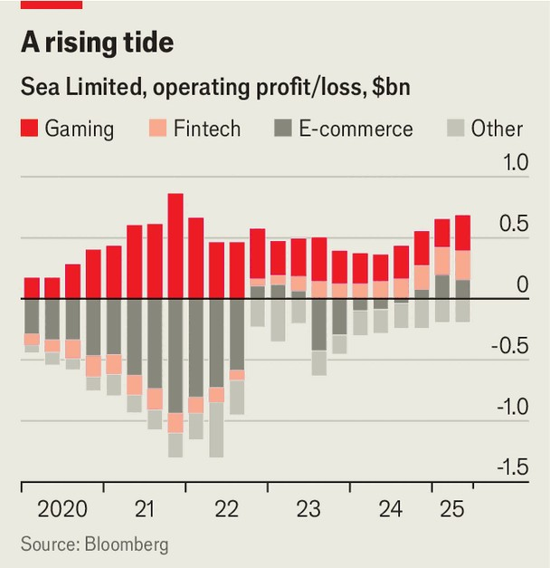

Business | Making waves
Sea Ltd, Singapore’s e-commerce king, prepares to battle TikTok
Online shopping is moving to social media
September 11th 2025

Despite having twice the market value of Ford, Singapore’s Sea Ltd is not even half as well known as the storied carmaker. Sea’s founder, Forrest Li, is publicity-shy. Yet the company’s brands are famous among South-East Asia’s 700m consumers. Ads for Sea’s e-commerce arm, Shopee, are plastered all over the Singapore metro. Every day 100m people play “Free Fire”, a “Fortnite”-like video game developed by Garena, Sea’s gaming business. Sea has also built a financial arm, Monee, which holds a $7bn portfolio of loans. The three business lines have generated impressive results. Sea is vying with DBS, a Singaporean bank, for the title of South-East Asia’s most valuable

listed firm. A 400% stock rally since the start of 2024 has propelled Sea’s market value to $114bn (still only half the level it reached in the ebullient market of 2021). Since its first profitable year, in 2023, earnings have marched higher. Last month Sea reported that its net income in the past year had exceeded $1bn for the first time.

Shopee, which has propelled Sea’s recent success, has proved remarkably competitive in a cut-throat industry. During the covid-19 pandemic Shopee went on a capital-spending binge, investing nearly $2bn in 2021 and 2022. Central to this was a logistics upgrade to its in-house delivery provider, SPX Express. Sales soared, but so did losses. In 2022 a cost-cutting drive began. Without much interruption to e-commerce growth, losses narrowed. In the latest three quarters Shopee has turned consecutive operating profits.

Investments in logistics have let Shopee offer cheaper and faster delivery than its rivals, chief among them TikTok Shop (owned by ByteDance, a Chinese tech firm) and Lazada (majority owned by Alibaba, a Chinese e- commerce giant). Localisation is more embedded in Shopee’s culture than that of the “Chinese overlords” it plays against, says a strategist at a smaller rival. As a result, Shopee has retained about half of South-East Asia’s e- commerce market. It is growing in Brazil, too.

For all Shopee’s growth, its profitability remains modest. Despite e- commerce making up three-quarters of Sea’s revenue in the year to June, it contributed a much smaller share of operating profit than Sea’s other main business lines, gaming and fintech (see chart). Shopee’s “take rate”—how much revenue is squeezed out of each dollar of merchandise sold—has stopped consistently rising. It has beaten back rivals for now, but cannot grow complacent.

The chief threat is so-called social commerce, which makes up a fifth of online shopping in South-East Asia. This is home turf for TikTok, where short-video scrollers stumble onto streams dedicated to flogging merchandise. Two-thirds of TikTok Shop’s sales flow through video or live streams. In the first half of 2025 the value of goods bought on TikTok Shop more than doubled, year on year, in South-East Asia’s five biggest economies outside Singapore, according to Momentum Works, a consultancy. Social-media-obsessed Indonesia is TikTok Shop’s biggest market.

Sea has put forward its own social-shopping offerings in the form of Shopee Live, a live-streaming e-commerce platform launched in 2019, and a partnership with YouTube announced last year. But it is up against a spry competitor which specialises in social media. Mr Li may eschew publicity, but his firm’s toughest fight will be for online eyeballs. ■

To stay on top of the biggest stories in business and technology, sign up to the Bottom Line, our weekly subscriber-only newsletter.

This article was downloaded by zlibrary from https://www.economist.com//business/2025/09/11/sea-ltd-singapores-e-commerce-king- prepares-to-battle-tiktok