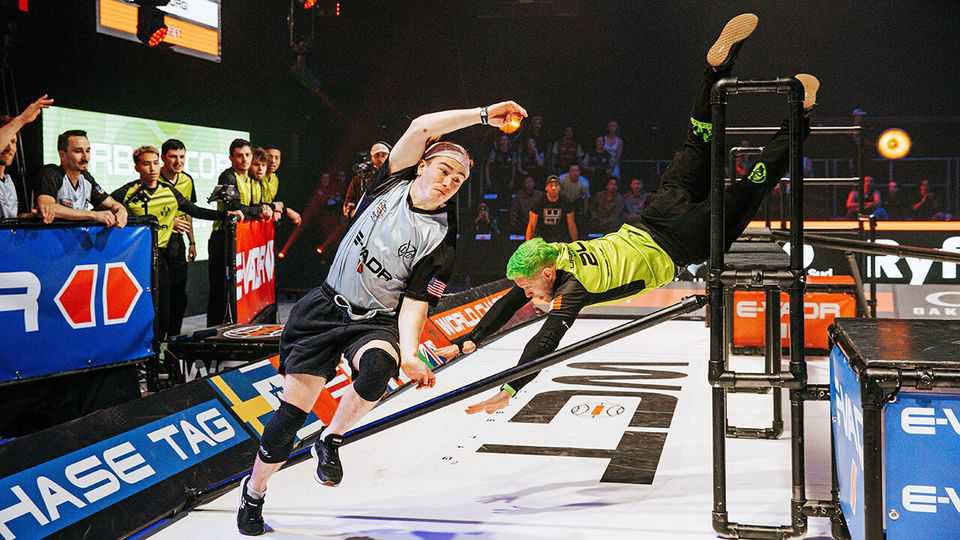

Business | Chasing returns
From volleyball to tag, investors are piling into niche sports
Streaming and festival-like spectacles are helping smaller leagues win young audiences
September 11th 2025

In an arena in London, the crowd counts down from 20. Two athletes crouch inside a maze of bars and ramps, waiting for the buzzer. One will chase, the other will try to escape. This is “World Chase Tag”, a professional league that has turned a childhood pastime into a spectacle, complete with referees, sponsors and TV deals. It has attracted millions of viewers and struck broadcast agreements with ESPN in America and Channel 4 in Britain. Tag is not the only fringe sport finding serious backing. In June ESPN took a minority stake in the Premier Lacrosse League and will broadcast its matches until 2030. CVC, a private-equity giant, has invested $300m to

create Volleyball World, a joint venture with the International Volleyball Federation that manages the sport’s commercial operations; the deal helped lift audiences of the Volleyball Nations League by 42% last year, to 2bn views..

The boom owes much to the covid-19 pandemic. When mainstream leagues shut, locked-down audiences devoured whatever competitions remained. After covid, pent-up demand for in-person entertainment swelled crowds: two years ago a volleyball match in Nebraska drew 92,000 fans, a record for women’s sport. Streaming has helped. In the broadcast era, the biggest leagues hogged scarce airtime. Nowadays, platforms like Netflix and Disney+ have unlimited schedules and global reach, giving small sports room to grow.

Meanwhile, soaring franchise values have cemented sport as an asset class. Private-equity firms accounted for 45% of sports-industry deals in 2024, with the number of deals nearly doubling from the previous year, according to Oaklin, a consultancy. Yet entry to the top tier is scarce: stakes in mega- franchises like America’s National Football League (NFL) or National Basketball Association rarely come up for sale. That pushes capital towards smaller leagues.

“Niche sports offer investors a foot in the door,” says Avery Wright of Navigate, another consultancy. By backing competitions from the ground up, investors build the credibility and experience needed for when established franchises eventually open to new capital. For funds that already own big- league assets, small leagues offer diversification and a chance to apply their expertise. Qatar Sports Investments, owner of the Paris Saint-Germain football team, bought the World Padel Tour in 2023 and has since helped build a global circuit.

Whereas established sports like tennis and golf are grappling with ageing fan bases, upstarts can design their products to suit digital natives with short attention spans. TGL, a golf league founded by Tiger Woods and Rory McIlroy that stages contests indoors, with computer simulators and a live putting green, draws audiences 12 years younger than the PGA Tour, golf’s main circuit. The King’s League, a five-a-side football tournament founded in Spain in 2022, keeps fans engaged by letting them vote for rule changes.

Many of these contests feel more like festivals than fixtures. Ugo Valensi, head of Volleyball World, says the party atmosphere at its events draws younger crowds.

The question is how to monetise all this attention. Small leagues rely on the same three revenue streams as the giants: media rights; sponsorships; and ticketing and merchandise. But the mix varies. Whereas about half the NFL’s revenue comes from broadcasters, some niche leagues charge little or nothing for media rights, preferring to maximise exposure. Social media are crucial: clips on TikTok or Instagram can quickly translate into jersey sales.

The risk is that only a handful of new leagues will capture sustained attention. In some sports the rush of capital has bred chaos. Pickleball briefly had three “official” circuits in America, a tangle that diluted attention and confused audiences. Other upstarts are struggling: last month Grand Slam Track, a new athletics league, admitted it was late in paying athletes their prize money, after not receiving promised funding. Yet the chance of backing the next Major League Soccer or Ultimate Fighting Championship offers the prospect of huge returns. For now that is enough to keep investors in the game.■

To stay on top of the biggest stories in business and technology, sign up to the Bottom Line, our weekly subscriber-only newsletter.

This article was downloaded by zlibrary from https://www.economist.com//business/2025/09/09/from-volleyball-to-tag-investors- are-piling-into-niche-sports