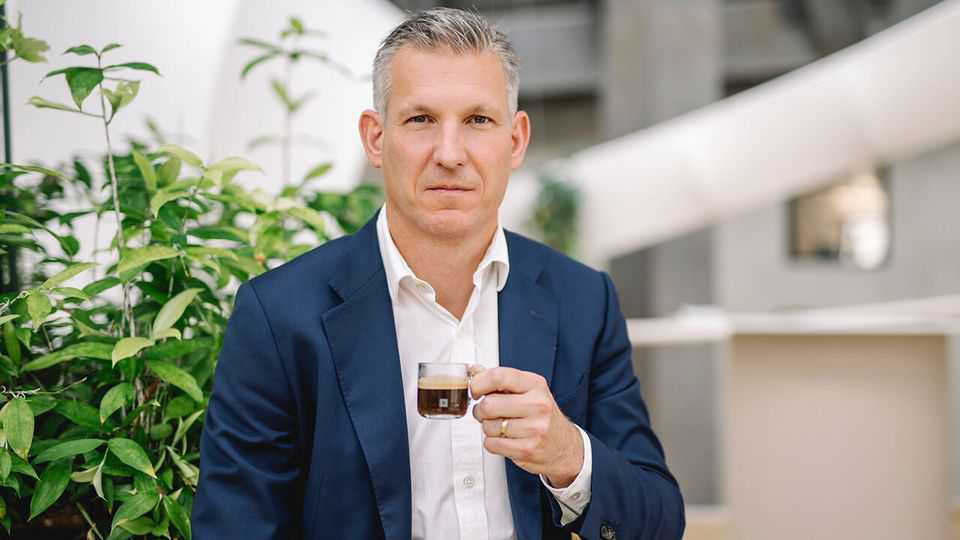

Business | A new chef
Can Nestlé’s third boss in little over a year turn things round?
Things have gone from sweet to bitter at the world’s biggest food firm
September 11th 2025

“Nestlé, the proud, Swiss tradition-steeped company, suddenly appears to be a madhouse,” laments the Neue Zürcher Zeitung, a Swiss daily. Barely a year after ousting its previous chief executive, Mark Schneider, on September 1st the board of the world’s biggest food firm sacked his successor, Laurent Freixe, for not disclosing a romantic relationship with a subordinate. The turbulence at the top is unprecedented in the 159-year history of the company.

Nestlé has for decades been a byword for a steady growth engine that is a staple of Swiss pension-fund investment. But in recent years the maker of products such as Maggi (seasoning), KitKat (chocolate), Nescafé (coffee) and Purina (pet food) has lost its way. Its share price has slumped by 31% in euro terms since February 2022, while those of its rivals Danone and Unilever have risen by 31% and 16% (see chart).

Nestlé’s hastily appointed new boss, Philipp Navratil, is a company insider who previously ran Nespresso, Nestlé’s coffee-machine business. The Swiss-Austrian is taking over at a difficult time. At 49 he is younger than his predecessors and will soon be joined by Pablo Isla, a well-regarded former boss of Inditex, a Spanish fashion giant. Mr Isla will take over as chairman in April—or perhaps earlier, as investors are clamouring to eject the current chairman, Paul Bulcke, who was instrumental in picking Mr Schneider and Mr Freixe as chief executives.

The company’s troubles began under Mr Schneider, who became chief executive in 2017. The former boss of Fresenius, a German health-care firm, thrived initially. “In the first years he created lots of value,” says Jean- Philippe Bertschy of Vontobel, a Swiss bank. Mr Schneider built up Nestlé’s health division with the takeovers of Atrium, a maker of supplements, and Nuun, a sports drink. He sold the firm’s skincare business for a good price,

and offloaded underperforming water and ice-cream businesses in America. He steered the company ably during the covid-19 pandemic. The firm’s share price hit a high in January 2022.

The downward trend began after Russia’s invasion of Ukraine the following month. Mr Schneider was confronted with the combination of steep rises in the cost of raw materials, supply-chain disruptions, rising interest rates and flagging consumer sentiment. He raised prices and cut costs, particularly on marketing. But this led to lower sales, as consumers traded down to cheaper brands. Moreover, local competition intensified in emerging markets and the price of cocoa, a key ingredient of many popular Nestlé products, kept rising.

A string of scandals didn’t help. In 2022 two children died and dozens of people were poisoned after eating a batch of its Buitoni frozen pizzas that had been contaminated with E. coli bacteria. Nestlé also came under fire for selling sugar-packed baby food in poor countries, for continuing to trade in Russia amid its war with Ukraine and for using banned mineral-water- purification methods at the production site of Perrier, its water brand.

Mr Freixe’s mission was to refocus on Nestlé’s strengths. It is the market leader in milk powder, frozen food, at-home coffee and pet food (where it shares first place with Mars, an American food giant). He ramped up marketing spending and had planned to slim down the firm’s product offerings before he was fired.

The new boss, Mr Navratil, is expected to push ahead with streamlining the portfolio of products. Potential candidates for sale are the rest of Nestlé’s troubled water business (representing 3% of total revenue), some vitamin brands, Gerber (which makes baby food), Illuma (a brand of infant milk) and some smaller confectionary brands, such as China’s Hsu Fu Chi. Restoring sales volumes and geeing up innovation are also on his to-do list. Most importantly, he must raise the morale of dejected staff and investors.

Patrik Schwendimann of Zürcher Kantonalbank, another bank, thinks the change at the top is a good Swiss compromise between the previous two bosses: Mr Schneider (who was supposed to bring in fresh air) and Mr

Freixe (who was meant to return Nestlé to its strengths). Maybe Mr Navratil could start by finding a more inspiring mantra than “Forward to basics”.■

To stay on top of the biggest stories in business and technology, sign up to the Bottom Line, our weekly subscriber-only newsletter.

This article was downloaded by zlibrary from https://www.economist.com//business/2025/09/11/can-nestles-third-boss-in-little- over-a-year-turn-things-round