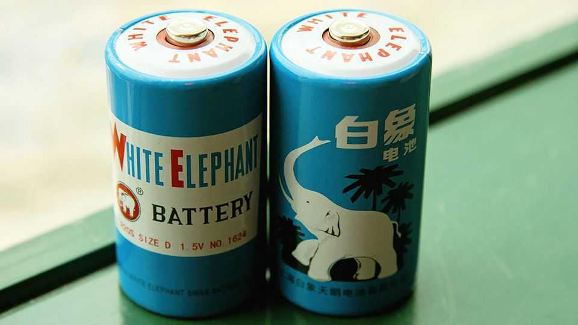

Business | Marketing missteps
How do you pronounce Biemlfdlkk? The brands lost in translation
As they race to go global, many Chinese companies are choosing new names
September 11th 2025

Biemlfdlkk is a mouthful. It is not exactly clear how to enunciate the eight- consonant jumble in the Chinese golf-apparel brand’s English name. It is even hard to write. But the company is expanding overseas, recently acquiring two foreign brands. This was probably a factor that led it to ditching the odd string of letters it had operated under for 21 years. This year it is swapping the old name for one that is a bit more intelligible: Biemlofen. Chinese brands are moving into foreign markets as never before. The way they are perceived when they arrive depends not just on the quality of their product but also on their name. A few companies are already mastering

foreign branding. Haidilao, a restaurant chain specialising in spicy soups, has started using the word Hi as a simplified name at its overseas shops. Pop Mart, the toy company that makes the sensational Labubu dolls, looks right at home in America or Europe. Shein, an online fashion firm, based its Chinese name, pronounced xi yin, on its English one (an abbreviation of SheInside).

These are the few that are getting it right. Many others struggle. Take, for example, Mixue, a cold drinks and ice-cream chain that is opening thousands of shops outside China. The company’s name translates to “honey snow”, but instead of making use of that overseas it has employed the phonetic version of its Chinese name, which is not easy to pronounce. The name will limit the brand’s growth abroad, predicts Chris Pereira of iMpact, a consulting firm, since people will not know how to say it when recommending it to friends.

Many Chinese companies chose ill-conceived foreign names decades ago and have simply stuck with them. Perhaps White Elephant, a Chinese battery brand that is becoming popular in Africa, should have stuck with its phonetic Chinese name. Chint, an electronics maker founded in 1984, chose an English name that faintly reflects its Chinese one but sounds closer to “chintzy”, American slang for cheaply made. Many firms try to turn their Chinese name into one that sounds Western, but end up with nonsense: Youngor, a fashion brand, is one example.

And yet this is often preferable to experimenting with symbolism in a foreign tongue, as demonstrated by the Chinese sunglasses brand that named itself after the world’s most famous blind person, Helen Keller. Foreign- sounding names that provide international flair at home can be less helpful in overseas markets. Adolph, a Chinese shampoo-maker, might have convinced some Chinese people that it is German, but it may find the name does not help it sell products in Germany.

Cracking the language and culture of any foreign market is tough. Western firms in China know this all too well. Peugeot, a French carmaker (owned by Stellantis, whose largest shareholder part-owns The Economist), has an unremarkable Chinese name when said in Mandarin, the national language.

But in Cantonese, a southern dialect, the name Peugeot sounds unfortunately close to “bitch”.■

To stay on top of the biggest stories in business and technology, sign up to the Bottom Line, our weekly subscriber-only newsletter.

This article was downloaded by zlibrary from https://www.economist.com//business/2025/09/11/how-do-you-pronounce-biemlfdlkk-the- brands-lost-in-translation