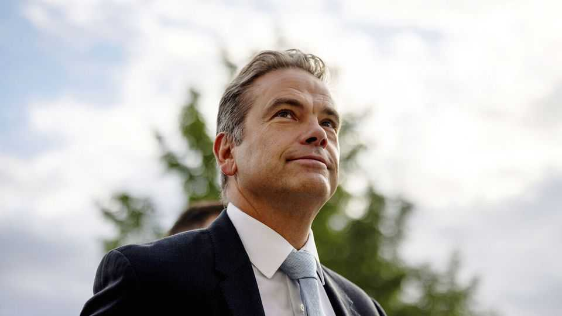

Business | The son wot won it
Lachlan Murdoch, media’s newest mogul
Fox’s decades-long succession battle is finally over
September 11th 2025

The thirty-year job interview has concluded at last. On September 8th the Murdoch family announced that it had resolved a decades-long dispute over who will control its television and newspaper empire when Rupert Murdoch, who is now 94, dies. The upshot of a complicated deal is that Lachlan Murdoch, the third-eldest of six Murdoch children, will inherit a controlling stake in Fox and News Corp, the family firms. Their combined market value is $42bn; their combined influence—with brands including Fox News, the New York Post and Wall Street Journal—is greater still. The agreement, announced on Mr Murdoch’s 54th birthday, makes him one of the world’s most powerful people for decades to come.

His ascension to the inky throne has been half a lifetime in the making. A gap-year stint at the printing presses in Sydney marked Mr Murdoch’s entry to the family firm. After graduating from Princeton University, where his dissertation was on Immanuel Kant’s ethics, he went to work for the Murdoch newspaper business in Australia. He later moved to Fox in New York. After falling out with Roger Ailes, the late, since-disgraced head of Fox News, he quit in 2005 and moved back to Australia to pursue his own investments. James, his younger brother, moved into pole position.

Ten years later Mr Murdoch returned to the fold and re-established himself as the favourite. James left, unhappy with the right-wing slant of Fox News, which took a sympathetic view of Donald Trump’s presidential candidacy in 2016. When Rupert Murdoch retired in 2023, Lachlan was named chief executive of Fox and chairman of News Corp. There remained the threat that James and the two eldest Murdoch children, Prudence and Elisabeth, might use their shares in the companies to outvote their brother after the death of their father. But under the deal agreed this week, the three rebel siblings have reportedly given up their votes in exchange for a pay-off of about $1bn each. The agreement gives Lachlan a controlling stake in both firms until 2050.

Though born in London and raised in New York, Mr Murdoch has said that he considers himself Australian. He moved to Sydney with his wife, Sarah Murdoch, a former model and presenter on one of the Murdochs’ Australian networks, and their three children in 2021, though he reportedly still sometimes works to American hours. He is more blokeish than his brother, with an interest in rugby and rock-climbing. But he is less frugal than his father. Whereas Rupert Murdoch amused Hollywood executives in the 1980s with his Walmart shirts and habit of walking the four miles from his home to the Fox lot, Lachlan recently bought himself one of the most expensive homes in California, Chartwell Mansion, a ten-acre Bel Air pile.

He appears to share his father’s political flexibility. In the 1950s Mr Murdoch Sr had a bust of Lenin in his student rooms at Oxford. His British newspapers switched their support from the Conservatives to Labour on the eve of the latter’s victory in 1997. He initially despised Donald Trump, but swung behind him when MAGA’s momentum became clear. Lachlan seems similarly pragmatic. In 2023 his family foundation gave A$1m ($660,000) to

Qtopia, a gay museum in Sydney (whose recent exhibitions include “Kylie Minogue & Queer Devotion”). In 2016 he had loo-roll printed with Mr Trump’s face in his home, according to a book by Michael Wolff, a journalist. But these days he sees Mr Trump as good for business. “Because of the election results, many advertisers have sort of rethought their positioning in this country and understand that the Fox News viewer really does represent middle America,” Mr Murdoch told investors in March.

The new boss’s detractors say that the recent success of Fox and News Corp (their combined value has appreciated by 50% in two years) reflects clever past decisions by his father, who sold Fox’s entertainment assets to Disney in 2019 at the top of the market. But Mr Murdoch junior deserves credit, too. News Corp’s bull run has been driven by its stake in REA Group, an Australian property-listing platform which he rescued from near-bankruptcy in 2001 and which is now worth over $20bn. At Fox he has pushed experiments in digital technology—never the strong suit of his father, whose main online investment was in MySpace, just before it flopped. In 2020 Fox bought Tubi, an ad-supported streaming service which has since overtaken rivals such as Paramount’s Pluto. In August it launched a paid streaming service, Fox One.

What now? With the rebel siblings bought out, Fox and News Corp will surely continue on their profitably conservative path. As long as the threat remained of a family rebellion, some analysts predicted the possible break- up of the firms. That no longer looks likely. The odds of News Corp spinning off REA, as some activist investors urge, also appear to have lengthened.

Instead, the settling of the family feud could open the door to more expansive moves. One might be to combine the two companies into one. Rupert Murdoch attempted to do this in 2022 but was opposed by shareholders, including James. Some analysts think that Lachlan may give it another go.

Another option would be for Fox to bulk up. Hollywood is ripe for consolidation, as smaller streaming services struggle to reach the scale needed for sustainable profits. John Malone of Warner Bros Discovery told the Financial Times last week that last year he had discussed with Rupert

Murdoch the possibility of merging Fox and Warner. David Ellison, another Hollywood nepobaby, has recently taken over Paramount and seems to have ambitions to grow. With the succession question answered at last, the Murdoch empire may be ready for more dealmaking.■

To stay on top of the biggest stories in business and technology, sign up to the Bottom Line, our weekly subscriber-only newsletter.

Clarification (September 10th): An earlier version of this article described Sarah Murdoch as a former Fox presenter. Mrs Murdoch was a presenter on Foxtel, which at the time was a joint venture of the Murdochs’ in Australia.

This article was downloaded by zlibrary from [https://www.economist.com//business/2025/09/09/lachlan-murdoch-medias-newest-mogul](https://www.economist.com//business/2025/09/09/lachlan-murdoch-medias-newest-mogul)