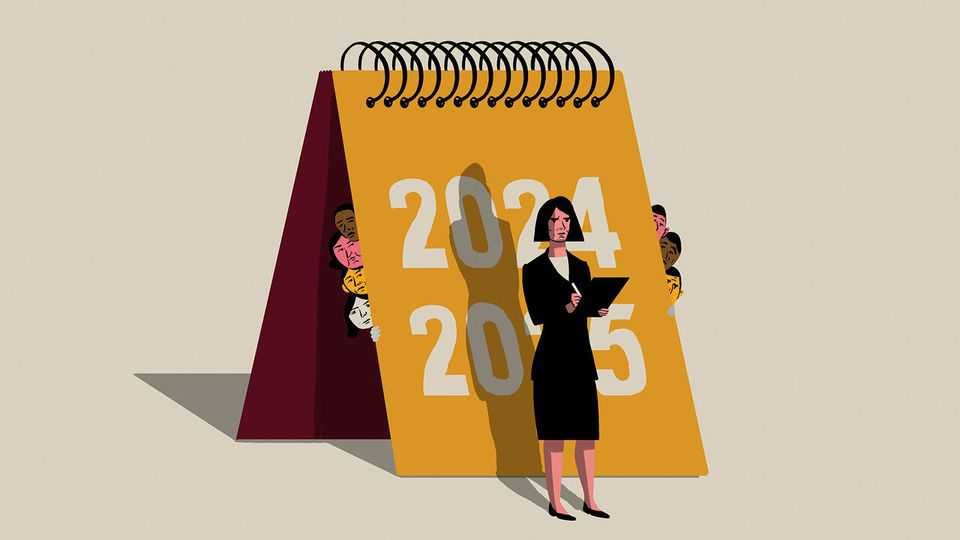

Business | Bartleby
Reviewing the annual performance review
What would happen if the tables were turned?
September 11th 2025

Name: Annual Performance Review (Ann for short) Department: All Review period: 2024-25 Overview: Ann has been with the company since 1973. Her core goal is to review the performance of everyone else in the organisation, and I’m pleased to say that she achieved this outcome for the 51st year in a row. She is part of the furniture here, even though no one really likes her and she isn’t particularly happy in the job.

Manager review: To her credit, Ann again ensured that everyone in the company had at least one formal conversation with their manager about their performance, satisfaction levels and objectives. Ann provided a forum for both parties to raise important issues. She gathered and presented information that fed directly into decisions on pay, promotions and, occasionally, something much nastier.

We do not set any metrics for determining whether Ann does her job well or adds any real value to the organisation, which is pretty ironic now I write it down. But there is an awful lot of room for improvement.

Ann spent most of her year doing absolutely nothing. As usual, people forgot about her existence entirely until she suddenly started asking for appointments again. I’m not sure what she did during the fallow period; she could not give me a straight answer. And when she is working, it’s not clear how much effort Ann is putting in: she has updated her template once in the past three decades, and that was to change the font.

I asked people who have worked with Ann for anonymised feedback about her. Some people questioned why she remained on the staff (“Companies like Netflix and Adobe decided to get rid of their performance reviews but Ann seems to have a job for life”; “She’s like my aunt Dorothy, always asking the same questions and always ignoring my answers”).

Almost everyone thought that Ann could be more proactive (“How would you like it if someone ended a conversation by saying, ‘Let’s pick this up again in a year’?”). Lots of people commented that her manner is very formal, and that it’s hard to relax around her. Several employees said that as soon as Ann was in the room, managers started saying things they had never heard before.

On the bright side, some people who had no contact with their managers at all were glad that Ann reminded their bosses of their existence (“He asked if I was sure I was in the right room, but once I mentioned Ann’s name, he became a bit friendlier”). Even employees who have frequent contact with their managers praised Ann for giving them a chance to document their performance and discuss their career ambitions. Plenty of bosses also felt

she performed a useful function (“Ann helps set tangible goals for my team”; “Without Ann, I’d never get rid of any of these losers”).

Employee review: I would like to take this opportunity to repeat all of the things I said in my last review. I like the company, and I am glad we don’t rank employees against each other. But it’s quite disheartening to be treated with such a conspicuous lack of enthusiasm by everyone. I do everything that is asked of me to the best of my ability. I may not be much fun down the pub but lots of people have told me that they want formality when it comes to decisions on pay and promotions.

A lot of the criticism I get is very unfair. If people are blindsided by what they are told by their managers, they are right to be annoyed but shouldn’t blame me. It’s not my job to be providing regular feedback. In fact, I would like to do more during the year. I have suggested increasing my working hours and becoming a quarterly performance review, but no one is interested in that idea. Indeed, lots of bosses insist on doing all their work with me in a single week; many of them just cut and paste remarks between employees to save time.

Manager’s summary: I’ve got other reviews to do now: in fact, I can see our onboarding programme waiting outside the door. I’ll pick up all of these points with Ann at a later date, and certainly in a year’s time. In the meantime, she should just carry on as before. ■

Subscribers to The Economist can sign up to our Opinion newsletter, which brings together the best of our leaders, columns, guest essays and reader correspondence.

This article was downloaded by zlibrary from https://www.economist.com//business/2025/09/11/reviewing-the-annual-performance- review