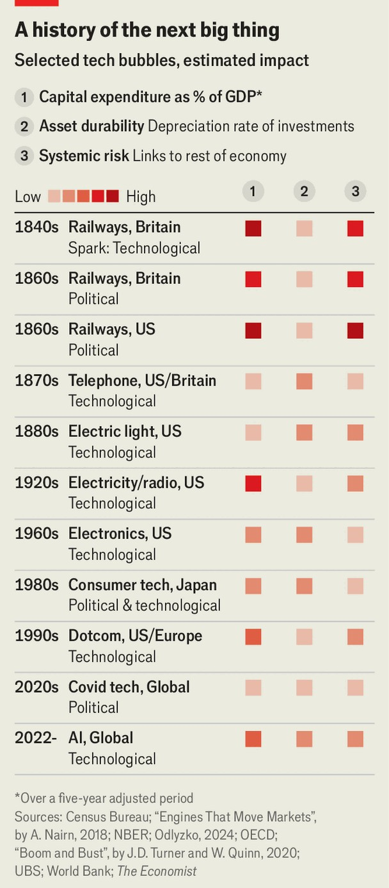
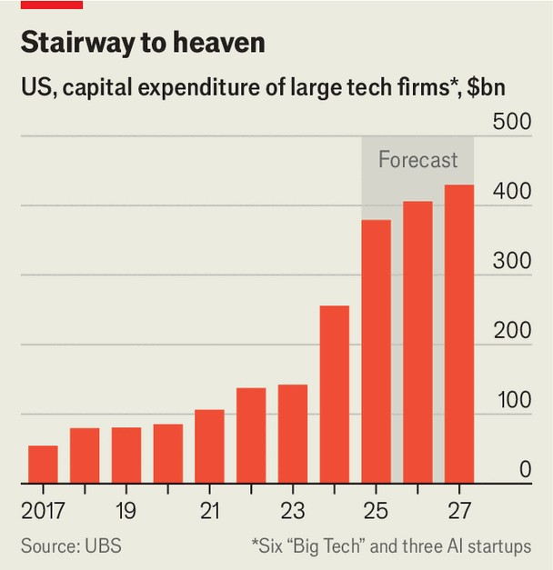
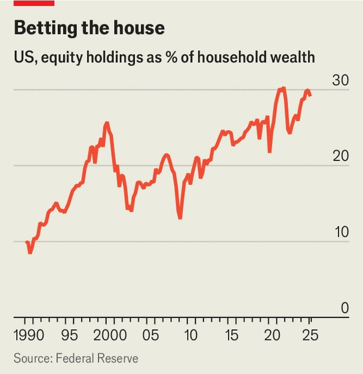

Finance & economics | Revolutionary road
What if the AI stockmarket blows up?
We find that the potential cost has risen alarmingly high
September 11th 2025
Since the release of ChatGPT in 2022, the value of America’s stockmarket has risen by $21trn. Just ten firms—including Amazon, Broadcom and Nvidia—account for 55% of the rise. All are riding high on enthusiasm for artificial intelligence, and they are not the only ones. Larry Ellison briefly became the world’s richest man, after AI enthusiasm prompted the share price of Oracle, his firm, to leap. In the first half of the year an IT investment boom accounted for all America’s GDP growth; in the year to date a third of the West’s venture-capital dollars have gone to AI firms. The market is so hot because many believe AI will transform the economy. Investors at Sequoia Capital, a VC firm, recently argued it will be “as big if not bigger than the Industrial Revolution”. In a podcast last year, Gavin Baker of Atreides Management, an asset manager, argued that AI luminaries are not just after the “tens of trillions or hundreds of trillions of value” the tech could add to their firms—they are “in a race to create a Digital God”. That belief would justify any amount of spending. Will AI really become god-like? Perhaps, but a recent report by UBS, a bank, finds that revenues to date have “been disappointing”. By our reckoning, total revenues from the tech accruing to the West’s leading AI firms are now $50bn a year. Although such revenues are growing fast, they are still a tiny fraction of the $2.9trn cumulative investment in new data centres globally that Morgan Stanley, another bank, forecasts between 2025 and 2028—a figure which excludes energy costs. AI revenues could continue to grow quickly, but only if firms continue to believe the tech is useful to them, and this is not guaranteed. A recent study by researchers at the Massachusetts Institute of Technology finds that 95% of organisations are getting “zero return” from investments in generative AI.

No wonder more people are asking if AI investment has become irrationally exuberant. “Global Crossing is reborn,” argues Praetorian Capital, a hedge fund, referring to the firm that hugely overbuilt cross-continental fibres in the dotcom era. “Valuations in the space are indeed flashing red and leave little room for cashflow disappointments,” according to another report by UBS. Torsten Slok of Apollo, a private-investment firm, has noted that AI stocks are more richly valued than dotcom stocks in 1999. Even Sam Altman, boss of OpenAI and one of AI’s most fervent evangelists, is sounding the alarm. “Are we in a phase where investors as a whole are overexcited about AI? My opinion is yes.”

This may seem like a striking admission, but Mr Altman and his ilk also argue that bubbles are normal when new technologies emerge. “Tech enthusiasm always runs ahead of tech realities,” according to Michael Parekh, a former analyst at Goldman Sachs, yet another bank. “History tells us that periods of major technological innovation are often accompanied by speculative bubbles as investors overreact to genuine advances in productivity,” reads a study published in 2008 by the Federal Reserve Bank of San Francisco. An academic study in 2018, which examined 51 innovations from between 1825 and 2000, found that 37 were accompanied by bubbles.

Most did not prevent the technologies that inflated them from sweeping the world. In Britain there were two big railway bubbles, in the 1840s and the 1860s; the country nevertheless has lots of railways. American investors went loopy over electric-light companies in the late 1800s and lost a lot of money, but today Americans still want to see at night. AI may well follow suit. Bubbles come and go, but Digital God would be eternal.

And yet a crash would still have big consequences. One lesson from history is that, when tech bubbles burst, leading firms give way to upstarts. “The biggest and most successful lighting companies all experienced a change of control when cashflow became an issue,” wrote Alasdair Nairn in “Engines That Move Markets”, which covers the late 19th century. Many firms that dominated the early days of railways, the telegraph and the telephone were also fast supplanted. Who remembers Vulcatron, from America’s electronics bubble of the 1960s, or Corning, a household name during the dotcom

boom? It will be a miracle if, in a decade or so, all the “magnificent seven” listed tech firms, and the biggest AI startups, still exist.

For society at large, the consequences of tech crashes vary enormously. The bursting of America’s electronics bubble of the 1960s barely grazed the economy; the bursting of its railway bubble in the 1870s resulted in the longest slump in American history. Our analysis of past technological bubbles finds that a number of factors matter most: what kick-starts the boom, the nature of the capital invested and who bears the losses.

Take the spark first. In their book “Boom and Bust”, William Quinn and John Turner, two economic historians, distinguish between political and technological sparks. Bubbles inflated by politicians—through changing regulations or taxes, say—cause more damage than those inflated by new technologies. Political sparks encourage investors to move as a herd. Lenient property taxes, low interest rates and financial liberalisation led to a gargantuan asset bubble in Japan in the late 1980s. For decades after it burst, Japan’s economy remained sluggish. By contrast, technological sparks do less damage: no long slump followed the dotcom mania.

The size and durability of capital investment is also important. In 1840s Britain, businessmen went truly bananas for railways. From 1844 to 1847 investment rose from 5% to 13% of British GDP. Investment fell by half when the bubble burst—and British unemployment doubled.

Then there is the manner in which capital is deployed. Much of the capex by Japanese electronics firms in the 1980s ultimately served no useful function. By contrast, bubbles can benefit society if they create enduring assets. The railway mania built the backbone of England’s rail network, even if profitability took a long time to arrive. The tens of millions of miles of fibre- optic cable laid across America during the late 1990s were far more than the internet needed at the time. But in recent years this has facilitated data- intensive services such as streaming and video calls.

The final factor determining a crash’s severity is who bears the losses. When lots of individual investors each lose a little, the economic damage is limited. This is what happened after America’s electronics and dotcom booms. Amid the British railway bust of the 1860s, by contrast, losses were concentrated among banks, which ended up with lots of bad loans. They then cut new lending, deepening the downturn.

Where might AI sit in the rogue’s gallery? To judge this, we picked ten historical bubbles and assessed them on each factor—spark, cumulative capex, capex durability and investor group. By our admittedly rough-and- ready reckoning, the potential AI bubble lags behind only the three gigantic railway busts of the 19th century.

The spark of the AI boom was technological, but politicians are adding fuel to the fire. A foundational paper titled “Attention is all you need” was published in 2017. OpenAI released ChatGPT in 2022. These developments had nothing to do with politics. Lately, however, governments have begun to support their AI champions. America’s, under Donald Trump, has promised to trim regulation and help provide the infrastructure and workers needed to achieve “global dominance”. Gulf countries’ governments are pouring trillions of dollars into AI investment.

The nature of AI capex is also worrying. For now, the splurge looks fairly modest by historical standards. According to our most generous estimate, American AI firms have invested 3-4% of annual American GDP over the past four years. British railway investment in the 1840s was 15-20% of GDP. Yet if forecasts for data-centre construction are correct, that will change. What is more, an unusually large share of capital investment is being devoted to assets that depreciate quickly. Nvidia’s cutting-edge chips will inevitably look clunky in a few years’ time. We estimate that the average American tech firm’s assets have a shelf-life of just nine years, compared with 15 for telecoms assets in the 1990s.

Last is the question of who would bear the losses from a crash. Almost half the forthcoming $2.9trn in data-centre capex, Morgan Stanley reckons, will come from giant tech firms’ cashflows. These companies can borrow a lot more to fund their investments if they wish, since they have little existing debt. They make up about a fifth of the S&P 500 index’s market value, but as borrowers account for only 2% of the investment-grade bond market. Their balance-sheets look rock-solid.

The other big investors are likely to be insurance companies, pension schemes, sovereign-wealth funds and rich families. In August PIMCO, a big bond investor, and Blue Owl, a private-credit firm, funded Meta’s $29bn data-centre expansion in Louisiana. If the value of all AI investments went

to zero such investors would suffer, but would be unlikely to bring down the financial system. Since American banks are not financing much of the AI boom themselves, their exposure to it is mostly indirect, through such non- bank lenders.

In another respect, though, America’s economy is in a historically unique position: individuals’ exposure to the stockmarket has never been so high. Ownership of stocks accounts for about 30% of the net worth of American households, compared with 26% in early 2000, at the peak of the dotcom bubble. Such ownership is concentrated among the rich, whose spending has powered economic growth of late. According to Oxford Economics, a consultancy, consumer spending rises and falls by about 14 cents for every dollar change in financial wealth. These changes, in turn, depend more than ever on a few giant firms whose prospects will be shaped by AI.

Over the past year, the promise of technological revolution has been a welcome distraction from the darker reality of America’s shaky institutions, rising trade barriers and vast government borrowing. Should Digital God fail to arrive, or is even slow to arrive, the fall will be brutal. ■

For more expert analysis of the biggest stories in economics, finance and markets, sign up to Money Talks, our weekly subscriber-only newsletter.

This article was downloaded by zlibrary from https://www.economist.com//finance-and-economics/2025/09/07/what-if-the-ai- stockmarket-blows-up