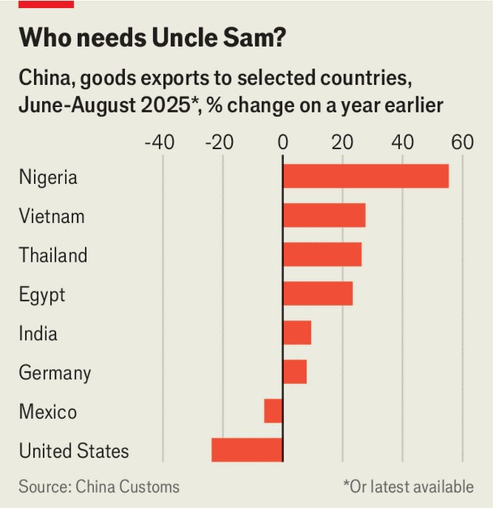

Finance & economics | Futile fortress
Chinese trade is thriving despite America’s attacks
The rest of the world is willing to be “ripped off”
September 11th 2025

Since Donald Trump returned to office, one country has borne the brunt of his fury. “We’ve been ripped off by every country in the world,” he declared in April, “but China is the…‘chief-ripper-offer’”. On September 6th the president came up with a new label: “deepest, darkest China”. He has matched words with action. Tariffs on Chinese goods, including levies placed on the country for its role in the fentanyl trade, are among America’s highest. Pacts with South-East Asian countries target goods suspected of being “transshipped” from China, and America has leaned on the EU to keep Chinese metals out of its supply chains. Much of Mr Trump’s agenda is scattershot; trying to isolate China looks like a coherent plan.

Xi Jinping, China’s leader, has retaliated with his own tariffs, and is now courting other parts of the world, including the EU, India, Malaysia and Vietnam. His boldest display came at the Shanghai Co-operation Organisation summit on September 1st, where he cast China as an alternative to America, urging members to “oppose cold war thinking...and bullying”.

What does all this mean in practice? A few months after Mr Trump’s “Liberation Day”, trade data provide a clue. According to Chinese customs figures, the latest of which were released on September 8th, over the past three months exports to America have plunged by a quarter against a year earlier. Uncle Sam’s share of China’s exports fell from 15% to 10% in August.

Yet Mr Trump’s grander ambition—to hurt China’s trade machine—has been unsuccessful. From June to August, China’s total shipments rose by 6% year on year. Sales to Africa surged by a third, exports to the Association of South-East Asian Nations (ASEAN) climbed by a fifth and shipments to Europe increased by nearly a tenth. A year ago the EU and America absorbed a similar share of China’s goods; today Europe takes over 60% more.

The world beyond America, then, is snapping up more Chinese goods than ever before. This is particularly true of the global south, where China’s Belt and Road Initiative (BRI), established in 2013, has laid firm foundations. The BRI’s pace has quickened since Mr Trump returned to the White House. In the first half of 2025, BRI activity reached a record, with over $120bn in new contracts and investment handed out in the scheme, according to the Griffith Asia Institute, a research outfit. Nearly half of the initiative’s construction contracts, which are awarded to Chinese firms, are for projects in Africa. These came to more than $30bn, five times the amount in the same period the year before.

Such deals are fuelling trade. Chinese exports to Nigeria have leapt by over half in the past three months compared with a year earlier, led by demand for equipment to build Chinese-financed railways and power generation. Egypt has also tapped BRI loans. And Chinese finance is making progress in other regards, too. Kenya plans to convert dollar-denominated Chinese loans into yuan; Egypt, Nigeria and South Africa have signed swap agreements.

All the while, China is cementing its role in supply chains. Between June and August shipments from China to Thailand and Vietnam were a quarter higher than a year earlier. The sharpest rises were in electronics and machinery, with flows to both countries up by over 40%. Some of this may be “front-loading”, or getting ahead of levies. Yet more profound changes are occurring beneath the surface. China is moving production inside ASeAN, including to Indonesia, Malaysia and Vietnam, so as to satisfy the bloc’s rules-of-origin. This may minimise transshipment, but it fixes the role of Chinese firms in trade.

The exception to this picture lies closer to America. From May to July, Mexican imports from China dropped by 6% compared with a year earlier. They may soon fall further. On September 4th Claudia Sheinbaum, Mexico’s president, announced plans for new tariffs on Chinese cars, textiles and plastics, which are meant both to shield local firms and placate Mr Trump, who has long pushed for the creation of a “Fortress North America”.

He should be aware, however, that fortresses are rarely signs of confidence. In the 15th century China’s Ming dynasty turned inwards, curbing trade and constructing the Great Wall. The retreat sapped the country’s vitality and

speeded up its decline. In building its own walls, America risks making a similar mistake today—as the trade data already suggest. ■

For more expert analysis of the biggest stories in economics, finance and markets, sign up to Money Talks, our weekly subscriber-only newsletter.

This article was downloaded by zlibrary from https://www.economist.com//finance-and-economics/2025/09/09/chinese-trade-is- thriving-despite-americas-attacks