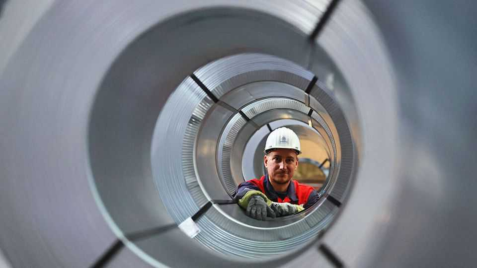
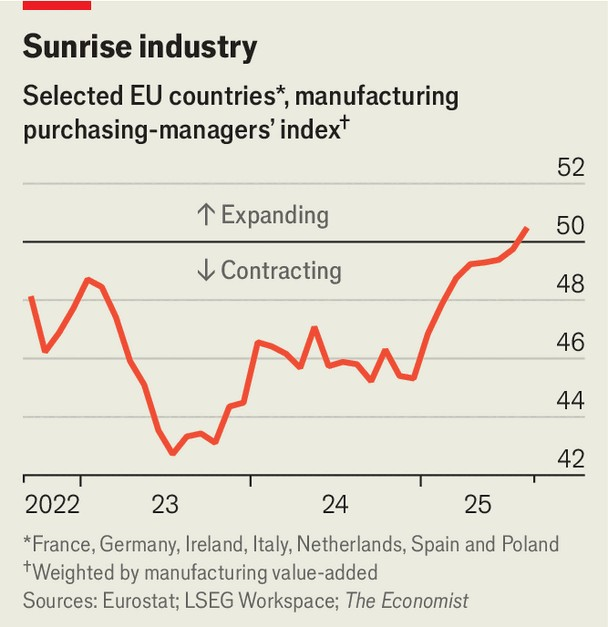

Finance & economics | Long time coming
Europe’s economy at last shows signs of a recovery
Even if there is plenty that could yet kill it
September 11th 2025

On the face of it, the European economy is in a grim situation. The IMF forecasts average growth of just 0.4% this year for the continent’s three largest economies—Germany, France and Italy—rising to barely 1% in 2026. On September 8th the French government fell, owing to disputes about how to close the country’s outsize budget deficit, prompting its benchmark bond yields to rise to the level of Italy’s for the first time since the creation of the euro in 1999. President Donald Trump is levying tariffs, the war in Ukraine continues unabated and Chinese commercial competition is becoming only more fearsome.

Thus it came as a surprise when the purchasing managers’ index for European manufacturing, a widely watched measure, reached a multi-year high in August. Similarly, Germany’s main sentiment indicator, the Ifo index, showed business expectations at their highest since the start of the war in Ukraine. For its part, Spain’s economy is going from strength to strength, growing in both manufacturing and services, according to surveys, helped by high immigration from Latin America.

One reason for the recovery, however fragile, is that inflation has been almost beaten—at 2.1% in the year to August—and interest rates have come down. The effect is visible in the poor-but-improving state of European construction. Whether consumers, another group hit by inflation, will at last start spending their recently won higher real wages remains to be seen, but their elevated savings rate means that such a move would provide another boost.

Government spending is also contributing to the improved sentiment. The EU’s fiscal frugals, led by Germany, are now ready to invest in their armed forces. Countries less keen on defence spending, including Italy and Spain, have EU recovery money left over from after the covid-19 pandemic. Although they are struggling to get it out of the door, such troubles should subside in the months to come.

Trade with America and China is becoming harder, and there is no economy large enough to replace them. But European firms are attempting to diversify and find new markets, in an effort that is starting to find some success. Germany’s machine- and equipment-makers—the country’s other big industry, aside from cars—saw exports to America and China fall by 7% and 9%, respectively, in the first half of the year. At the same time, orders from Mercosur, a Latin American trade bloc, and the Middle East increased by around 10%, albeit from a much lower base. There is also support available for fledgling companies. The European Investment Bank, an EU cash disburser, will invest €70bn ($82bn) by 2027 in tech-focused enterprises. Venture-capital investment, which had a weak second quarter after a strong start to 2025, may also recover. According to an index by Venionaire Capital, an advisory firm, sentiment among investors remains solid.

Such hope may end up fizzling out. “The sentiment data was surprisingly positive, but...the negative impulses for the European economy outweigh the positives,” argues Jens Eisenschmidt of Morgan Stanley, a bank. Mr Trump may yet come back with still harsher tariffs. France’s political crisis may worsen. Reform efforts, already underwhelming, may stall as centrist governments seek to counter the threat of the hard right. But markets and firms are adjusting to a difficult new era; after a tough few years, that will be a relief for European policymakers. ■

For more expert analysis of the biggest stories in economics, finance and markets, sign up to Money Talks, our weekly subscriber-only newsletter.

This article was downloaded by zlibrary from https://www.economist.com//finance-and-economics/2025/09/10/europes-economy-at- last-shows-signs-of-a-recovery