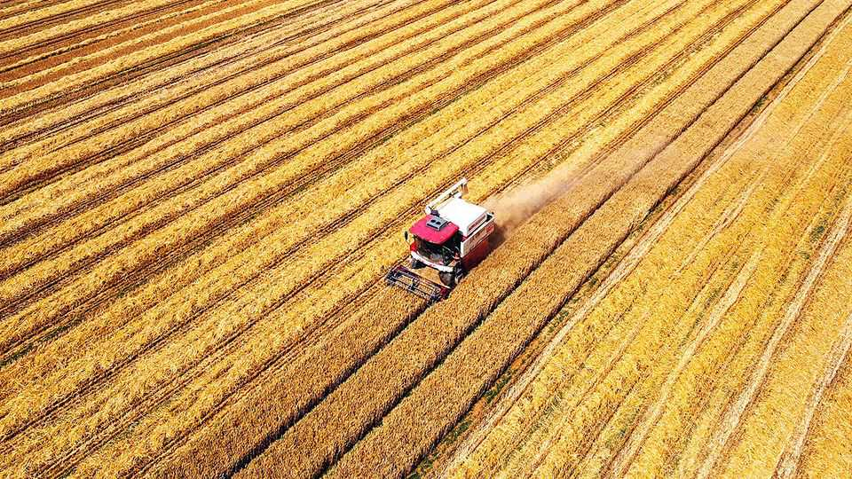
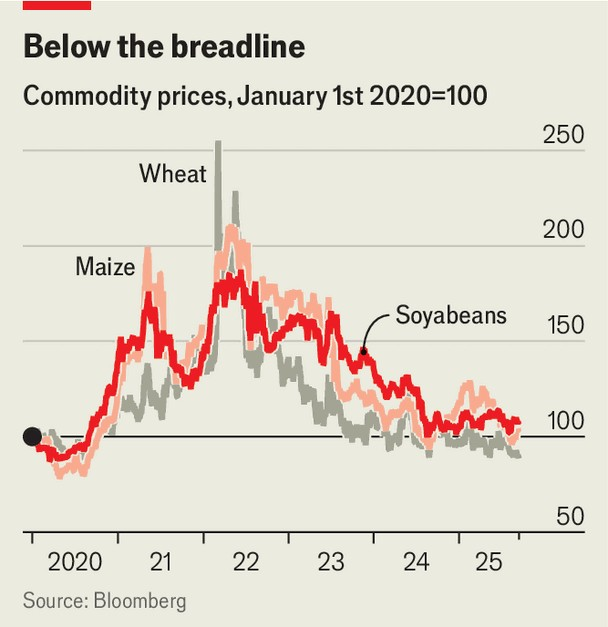

Finance & economics | Food markets
How grain has gone from famine to feast
Prices are close to a five-year low
September 11th 2025

THREE YEARS ago, calamity loomed. Russia’s war in Ukraine pitted two big grain exporters against each other. Breadbaskets elsewhere faced brutal droughts. Wheat prices hit records; maize and soyabeans also surged. Then, within weeks, they fell, and have carried on sliding since. They are now close to five-year lows.

It is not obvious what prompted traders to go from panicked to placid. As the war in Ukraine continues to rage, the country’s farmers are hurting. Its wheat exports, once the world’s fifth largest, are set to shrink by 25-30% this season. Elsewhere, climate change is damaging output and American tariffs are disrupting trade. Indicators that usually worry investors, such as wheat stocks, have been flashing red for years. Why, then, are markets so calm?

Part of the answer is that global production has been strong. Owing to benign weather, Russia, the world’s largest wheat exporter, has enjoyed a run of excellent crops. Australia, the second largest, has also posted two whopping recent harvests. Even Europe has outperformed.

There are similar bounties elsewhere. America is due to produce record volumes of maize this season. Brazil, with which it competes to be the top maize exporter, may also hit new highs. That is pushing down the price of other crops used as animal feed, including wheat and soyabeans.

At the same time, demand for grain is weak. In a bid to support its farms, China has slashed imports of maize from 23m tonnes in 2023-24 to 4m tonnes this season. Other importers, notably in the Middle East, have also sought to assist domestic farming and food processing.

The underlying dynamics of the market have changed, too. Importers have grown more comfortable relying on lower stocks. The rise of big grain suppliers, such as Russia, makes them confident that they can count on global trade, says Charles Hart of Rabobank, a Dutch lender. Such confidence is bolstered by memories of the swift resolution of the grain crunch in 2022, when things looked truly perilous.

Admittedly, trade wars are complicating the picture. China, which by August last year had booked 13m tonnes of American soyabeans for autumn shipments, has yet to reserve any for this crop year. The weaker dollar, a product of President Donald Trump’s erratic economic policies, has made American maize cheaper for other importers, meaning it is flying off the shelves. All this is distorting regional prices, but not denting overall trade volumes.

In fact, Mr Trump’s policies may well be dampening near-term prices. Wary of presidential surprises, American farmers are “front-loading” their exports, which is “more something you see in Russia”, notes Mike Verdin of CRM AgriCommodities, a consultancy. Uncertainty and high interest rates have also pushed investment funds away from commodities and into other assets. Those that remain are betting grain prices will fall. Having hit a record in May, net short positions on Chicago wheat contracts remain high.

Could there be a sting in the tail? With prices below production costs, farmers may plant less. As the global population grows larger and richer, demand is on the rise: the world devours 28% more maize and 38% more soyabeans than it did just ten years ago. Wheat stocks among the world’s biggest exporters, relative to global consumption, are heading towards their lowest since 2007-08, when there was a serious food crunch. One bad drought could be enough for prices to shoot up, says Joe Glauber of IFPRI, a think-tank. Importers should enjoy the feast while it lasts. ■

For more expert analysis of the biggest stories in economics, finance and markets, sign up to Money Talks, our weekly subscriber-only newsletter.

This article was downloaded by zlibrary from https://www.economist.com//finance-and-economics/2025/09/11/how-grain-has-gone- from-famine-to-feast