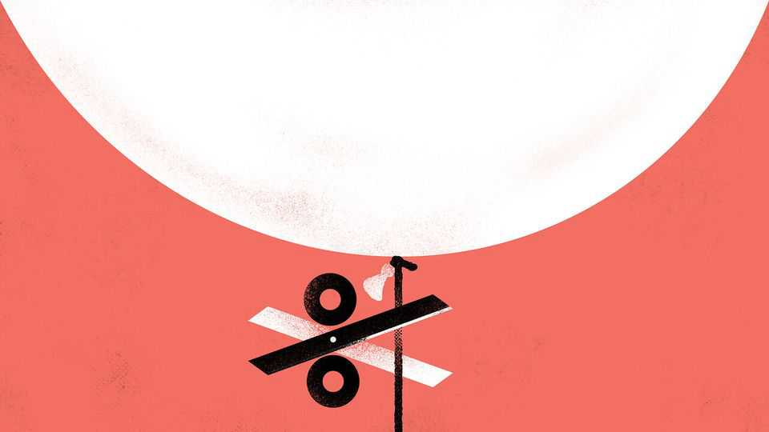

Finance & economics | Buttonwood
Why American bondholders are jumpy about inflation
The Federal Reserve prepares to cut interest rates in tricky circumstances
September 11th 2025

For the first time since Donald Trump returned to the White House, it seems that the Federal Reserve will do what he wants. “Jerome ‘too late’ Powell must now lower the rate,” wrote the president on August 12th after the latest release of consumer-price data, in his umpteenth variation on this theme. Ten days later Mr Powell, the Fed’s chair, hinted strongly to an annual gathering of central bankers at Jackson Hole, Wyoming, that an interest-rate cut was indeed coming. Now traders think one is a racing certainty when the monetary-policy committee next meets on September 16th and 17th. The only debate is whether the Fed’s rate, currently between 4.25% and 4.5%, will fall by 0.25 percentage points or 0.5.

That does not mean America’s central bankers are bending to Mr Trump’s will. Disappointing data published on September 5th underlined Mr Powell’s central theme at Jackson Hole: job creation is slowing and Congress tasks the Fed with fostering both full employment and stable prices. The trouble is that these two goals are now in conflict. Even as officials prepare rate cuts to support the labour market, inflation remains above target and shows worrying signs of becoming entrenched. The risk is that cheaper money will allow it to get out of hand once more, destabilising markets.

American “core” consumer prices, excluding volatile food and energy, rose by 3.1% in the year to July. New figures were due to be released soon after this column was published, but analysts expected the rate to have been maintained in August, meaning that it would not have fallen since March. Core prices in the “personal consumption expenditures” index—the Fed’s preferred inflation measure—have been rising faster than the central bank’s target, of 2% a year, since early 2021. Consumers themselves think inflation will soon be running even hotter, at 4.8% over the coming year and 3.5% over the long run, according to the University of Michigan’s monthly survey.

Shareholders are hardly panicking; instead, they have been bidding stock prices to new records week after week. Look elsewhere, though, and more jumpiness is on display. The price of gold, a classic hedge against inflation and general chaos, has also soared, to an all-time high of over $3,600 per troy ounce. Bondholders, especially of long-dated government debt, have been jittery for months. Among fund managers responding to Bank of America’s latest monthly survey, 47% rank either “inflation prevents Fed cuts” or “disorderly rise in bond yields” as the biggest tail risk threatening markets.

These two worries are linked. Any rise in America’s vast fiscal deficit, which is already 7% of GDP, risks fuelling inflation. In the near term, this worry might prevent the Fed from cutting rates as much as it would like in order to support the labour market, pushing up bond yields. If, however, officials decided to prioritise employment and cut rates anyway, they would risk entrenching high inflation, eroding the real value of bonds’ coupons and principal repayments. Bondholders fear this scenario could unfold for another reason, too. America’s debt burden is so big that letting inflation rip is one of the few options available to tame its real value. The worse such

fears become, the higher the odds of a disorderly rise in bond yields, with lenders demanding much more compensation for their risk.

This helps explain why, staggeringly, over half the fund managers surveyed by Bank of America think the Fed’s next chair will resort to quantitative easing or “yield-curve control” to ease the debt burden. These measures involve large-scale bond purchases using newly created reserves, suppressing yields. Plenty of rich-world central banks—including the Fed and the Bank of Japan—have done so when interest rates were near zero, to encourage growth and inflation when both were lacking. Doing so when inflation is high, with the aim of keeping borrowing costs artificially low, would risk prices spiralling out of control.

You can find such speculation outlandish and still worry about its consequences. Markets create their own reality: inflation expectations can become self-fulfilling; so can a common belief that the bond market might crack. Traders who think others’ fears might spark a sell-off will try to get ahead of the curve. If the herd follows, the sell-off begins. The same dynamic applies to fears that Mr Trump will eventually succeed in curbing the Fed’s independence. However investors view the prospect of cheaper money for now, their causes for concern over the long run are mounting. ■

Subscribers to The Economist can sign up to our Opinion newsletter, which brings together the best of our leaders, columns, guest essays and reader correspondence.

This article was downloaded by zlibrary from https://www.economist.com//finance-and-economics/2025/09/10/why-american- bondholders-are-jumpy-about-inflation