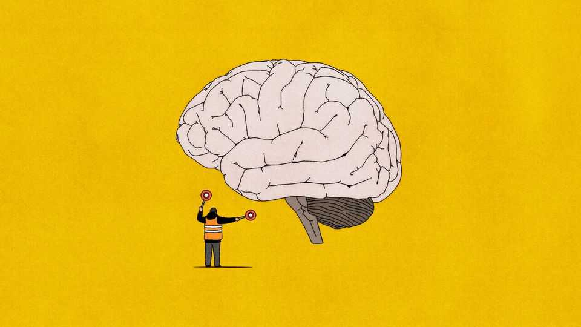

Finance & economics | Free exchange
Can you make it to the end of this column?
Understanding the new economics of attention
September 11th 2025

They call it brainrot. Inane short-form videos just stimulating enough to keep you watching and scrolling, in a zombie-like manner, through whatever the algorithm presents next; not quite dull enough for you to tear your monetisable eyeballs away from the screen. Viewers are ambivalent. Such content offers a way to switch off. It also offers a way to waste hours of your life. Economists may soon start to think of brainrot as a means of theft. Increasingly, the discipline is modelling attention as a resource, alongside land, labour and capital. Attention is scarce and rivalrous in the field’s jargon; time spent on brainrot cannot be spent on something else. Focus, being vital to most forms of work, aids production and can be consumed in

leisure. Getting the most out of, say, reading a newspaper column requires your full attention, which can be hard to provide if your phone is nearby.

Treating attention as a scarce resource helps bridge some of the gap between traditional models of Homo economicus—a rational optimiser seeking to maximise satisfaction of their preferences—and the figure who emerges from the experiments of behavioural economics, who is pulled away from rational thinking by any number of biases. Why do consumers consistently fall for “left-digit bias”, for instance, meaning they are far more likely to buy something for $2.99 than $3.00 while not distinguishing between items that cost $2.99 and $2.98?

Well, attention is scarce, which means that people rely on shortcuts and $2 is less than $3. Why bother to read the rest of the price? In 2003 Christopher Sims of Princeton University, later awarded a Nobel prize in economics, developed what he called a “rational inattention” model, in which optimising agents can process only so much information at a time. Such a model explains the smooth (rather than instant) adjustment of various macroeconomic variables, including interest rates and prices, to new information, he suggested. People sensibly devote just a portion of their limited attention to learning about market-moving news.

There are antecedents to this approach. Herbert Simon, who won both the Turing award for artificial intelligence in 1975 and the Nobel prize in economics in 1978, coined the term “bounded rationality”. Instead of an all- knowing optimiser, economics should model people as “satisficing”, he argued, choosing options that are simply good enough, rather than perfect, given the limits of their informational environment. “What information consumes is rather obvious: it consumes the attention of its recipients,” he wrote. “A wealth of information creates a poverty of attention and the need to allocate that attention efficiently.” Endless information distributed through smartphones creates such a world. And as Simon pointed out, unlimited wants and scarce resources are the definition of an economic problem.

Yet there are some concerns about treating attention as a resource that can be allocated along the lines of labour and capital. What counts as attention? A recent review by George Loewenstein of Carnegie Mellon University and Zachary Wojtowicz of the Massachusetts Institute of Technology defines it

as the selective allocation of a scarce, rivalrous mental resource to an information-processing task. Attentional resources include working memory, selective concentration and visual focus. As Messrs Loewenstein and Wojtowicz point out, “pay attention” could either mean “look at this” or “stop daydreaming”, and following either command would mean similar, but subtly different, actions. Aggregating all of them into a single category, “attention”, comes with its own problems, as economics has discovered when putting diverse means of production into the single bucket of “capital”.

Moreover, although attention can be steered in one direction or another, it is often involuntary. Economic models of how it is allocated therefore divide roughly into two categories: top-down and bottom-up. The top-down model is a more typical economic paradigm, in which the agent chooses the best use of a scarce resource. Once you have learned how to do it, driving is dull, so why not make a phone call at the same time? The bottom-up model points out that the environment itself directs a person’s attention—the ping from the phone as a new message arrives, for instance, or a child running out into the road. Messrs Loewenstein and Wojtowicz take this a little further, suggesting that emotional states can themselves direct attention: pain is hard to ignore, boredom is unpleasant and hunger makes it difficult to focus on anything but food. Such an understanding could draw economists into new territory. Normally they shy away from caring too much about the inner life of Homo economicus.

Resisting brainrot is hard. Simon used the two blades of a pair of scissors to illustrate his concept of bounded rationality. Decisions come from a combination of the individual’s own limitations and the informational environment in which they operate. Asking which blade of the scissors did the cutting is a mistake, since it is always both. Willpower alone is unlikely to defeat perfectly tuned distraction machines with algorithms that constantly adjust to maximise user engagement. The environment is hostile.

That should concern economists, for if attention is a resource, it is not one covered by property rights. Cunning design might be able to take it from us, and do so with no hope of restitution. The spread of smartphones and social media has created a world in which it is very easy to steal. Can anything return attention to its owners? Social norms might help: libraries, for instance, have long insisted on silence in order to preserve focus. In time,

regulation might, too. For the moment, however, the best hope is to take matters into your own hands and, when you are trying to read a column, put your phone far, far away. ■

Subscribers to The Economist can sign up to our Opinion newsletter, which brings together the best of our leaders, columns, guest essays and reader correspondence.

This article was downloaded by zlibrary from https://www.economist.com//finance-and-economics/2025/09/11/can-you-make-it-to-the- end-of-this-column

Science & technology

A dangerous new class of synthetic opioid is spreading NASA has found a Martian rock with what may be signs of life How to build table-top fusion reactors Do hangover supplements work?