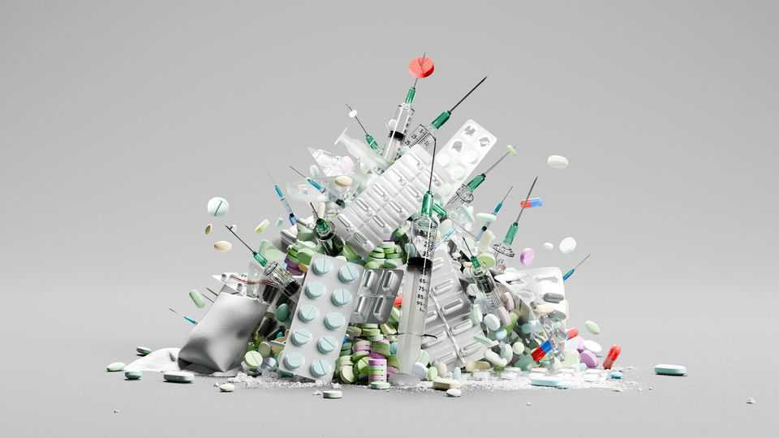
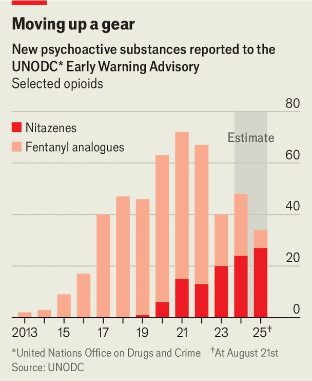

Science & technology | High risk
A dangerous new class of synthetic opioid is spreading
Some nitazenes are far more potent than fentanyl
September 11th 2025

On a morning in November 2023 Eamon Keenan, a psychiatrist who runs addiction services at Ireland’s state-funded health-care provider, received a worrying phone call. “People in homeless accommodation and hospitals are collapsing,” he recalls being told. It was the start of a bleak few weeks. In Dublin and Cork, the country’s biggest cities, 77 people would end up overdosing. The initial suspect was dodgy heroin, but laboratory analysis revealed a dangerous new class of drugs—nitazenes. Since then, these have been detected everywhere from Freetown in Sierra Leone to Sydney in Australia.

Nitazenes are opioids, a family of chemicals that includes morphine and heroin as well as the much stronger fentanyl, which causes tens of thousands of deaths in America every year. Although measures of their potency vary, scientists estimate that nitazenes can be hundreds of times stronger than heroin, with some thought to be dozens of times stronger than fentanyl. But whereas heroin and fentanyl have long histories as medical analgesics and have therefore been extensively studied, hardly any research exists on nitazenes. With nitazene use rising around the world, and in particular in Australia and Europe, scientists are scrambling to gather data on how dangerous these new drugs are and who is at risk. The emerging picture is grim.

Like fentanyl, nitazenes are molecules that do not occur in nature and must be fully synthesised from precursor chemicals in laboratories. All derive from a chemical structure called 2-benzyl-benzimidazole, a small set of connected rings made up of atoms of carbon, hydrogen and nitrogen. The first nitazenes were made in the 1950s as potential painkillers by researchers at Chemische Industrie Basel, an erstwhile Swiss company, but problems with these chemicals soon became apparent.

Their therapeutic window—pharmacology-speak for the dosage range that has the desired effect without unacceptable levels of side-effects—was very narrow, raising the risk of accidental overdose. For instance, the Swiss chemists reported that whereas 200 milligrams of morphine per kilogram of bodyweight (mg/kg) was enough to kill half of a test population of mice, the most potent original nitazene required only 1 mg/kg to achieve the same effect. (The number for heroin is somewhere in between.) Nitazenes were consequently never approved for medical or veterinary use and soon faded into oblivion.

In 2019, however, toxicologists conducting routine surveillance of the European drug market turned up one nitazene, isotonitazene, being sold directly to users on a dark corner of the internet. Since then isotonitazene (as well as some of its chemical cousins) have been found in America, Australia, Brazil, Canada and most of Europe as well as in countries across west Africa. Data on deaths are scarce because detection is not yet routine, but Britain’s National Crime Agency believes at least 333 deaths in Britain in 2024 were linked to nitazenes. The spread of the drugs shows no sign of stopping: according to the UN, more countries and regions report finding new nitazenes each year than report new versions of fentanyl (see chart).

Many scientists studying nitazenes believe the explosion in recent years is a supply-side reaction to increased restrictions on other drugs. In the mid- 2010s America boosted its attempts to crack down on new fentanyl analogues and their precursors, and persuaded other countries to do the same; China, which is home to producers and exporters of both fentanyl and nitazenes, banned all analogues of fentanyl in early 2019, causing domestic production to plummet. In 2021 the Taliban seized control of Afghanistan, then the world’s top producer of opium (it has since fallen behind Myanmar), and outlawed the drug’s production. As opium is needed to make heroin, illicit drug producers in Europe are thought to have turned to nitazenes amid fears of an imminent drop in supply.

Whatever the reason, their appearance is bad news. Once nitazenes get into the brain, they bind to gateways on the surface of neurons known as mu receptors. When activated, these can suppress the body’s pain signals. Nitazenes are more effective at activating these receptors than heroin and, in some cases, fentanyl. This means a smaller dose is needed to induce the strong analgesia and euphoria many users crave. But activation of the mu receptors can also lead to slowed breathing and, in the case of overdoses, cardiac arrest.

Another worrying feature of nitazenes is the compounds they degrade into once inside the body, known as metabolites. Marthe Vandeputte, a toxicologist at the University of Ghent, published a study in ACS Chemical Neuroscience in 2021 showing that isotonitazene breaks down into another, yet more potent, nitazene. In other words, as the original drug disappears, a stronger one (albeit in a lower concentration) takes over, potentially prolonging the effects. This seems to set at least some nitazenes apart from heroin and fentanyl.

That, in turn, has big implications for how first-responders and doctors should treat an overdose. The normal procedure is to give a standard dose of naloxone, an emergency antidote that works by kicking opioids off the mu receptors and restoring normal breathing. But if nitazenes degrade into powerful metabolites that persist even after the original drug has gone, more naloxone may be needed than for a heroin overdose. This is a drug that “challenges how we have treated these overdoses for the past 50 years”, says Arne Kristian Skulberg, an anaesthetist with the air-ambulance department at Oslo University Hospital, and part of the team that developed the naloxone nasal spray sold in Britain.

The potency of nitazenes makes them attractive to smugglers because the same number of customers can be served with smaller amounts—which are easier and cheaper to distribute—for the same price. But it also puts users at higher risk of overdosing, especially if they are taking it unknowingly. The batch found in Ireland in 2023, for example, although sold as “Chinese heroin”, contained nitazene but no heroin, which led some users to inadvertently take too much. Nitazenes have also been found in tablets advertised as oxycodone, another opioid. In 2024 pills sold as MDMA, also

known as ecstasy, during a music festival in Sydney caused several hospital admissions. (They were later found to contain nitazenes and no MDMA.)

Even tiny amounts of nitazene present in drugs such as cocaine and ecstasy —easily done if they are produced in the same lab—could endanger people with no built-up tolerance to opioids. Such cases have been reported, says Dr Skulberg, “with young people ordering a pill online to check it out, taking it in their room and being found dead by their parents”.

All this has prompted governments around the world to ban individual nitazenes. The ease with which their chemical structure can be manipulated, however, means drug producers simply need to tweak a few lab procedures to create an entirely new product of similar potency not subject to the ban. As a result, the authorities have changed their tactics. In January the British government used a generic definition of nitazenes, as compounds derived from the core structure of 2-benzyl-benzimidazole, to categorise all nitazenes as class A drugs, the most severe criminal classification, in the hope of capturing and banning future variations. China implemented a nitazene ban using a similar generic definition in June.

But even if the bans have the desired effects on nitazenes, they will not prevent new synthetic opioids from springing up and replacing them further down the line. That prospect worries researchers like Dr Vandeputte. “We really don’t know what’s going to be next.” ■

Curious about the world? To enjoy our mind-expanding science coverage, sign up to Simply Science, our weekly subscriber-only newsletter.

This article was downloaded by zlibrary from https://www.economist.com//science-and-technology/2025/09/09/a-dangerous-new-class- of-synthetic-opioid-is-spreading