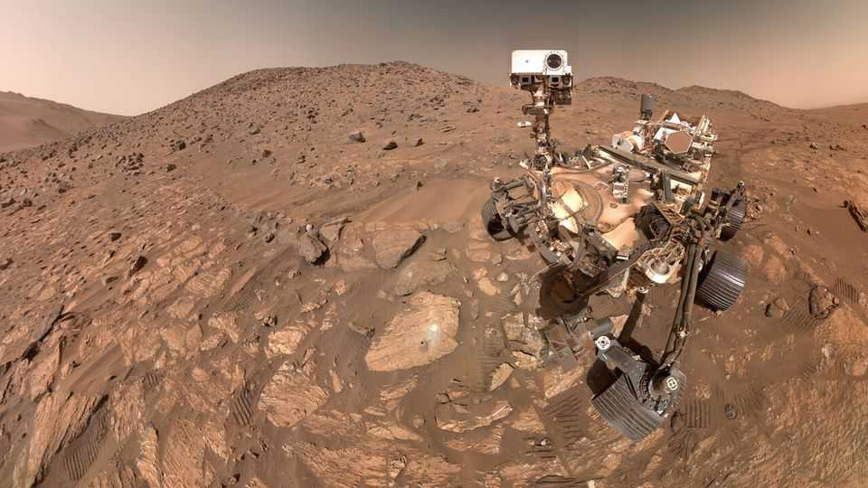
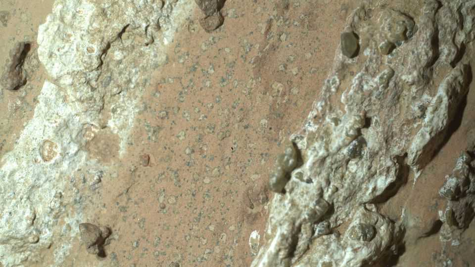

Science & technology | So near and yet so far
NASA has found a Martian rock with what may be signs of life
Bringing it to Earth for further study will be complicated
September 11th 2025

As “The Martian”, Sir Ridley Scott’s film of Andy Weir’s novel, reaches its climax the world watches attempts to save Mark Watney, a NASA astronaut stranded on Mars, with bated breath. All of humankind, it seems, is united in its concern for a single life; crowds in America, Europe and China pay rapt attention to news coverage of the efforts to bring him home. The subtext to a press conference NASA held on September 10th was oddly similar. It was about a paper in Nature, a journal, describing a “potential biosignature” in a Martian rock sample. It “very well could be the clearest sign of life that we’ve ever found on Mars”, according to Sean Duffy, NASA’s acting administrator (and also the secretary of transport). Its initial

analysis complete, the sample has been sealed into a titanium canister to await future study by better instruments. Unfortunately, those instruments are on Earth, and the swaddled sample is on Mars.

So bring it home, every scientific instinct cries. Alas, America has no way of doing so. Having sent a rover, Perseverance, to Mars for the purpose of choosing and preparing samples for later study on Earth, it has now cancelled the missions needed to get those samples back.

To rescue something stuck on Mars, as “The Martian” showed back in 2015, is hard. You have to get it into a Mars ascent vehicle, launch that vehicle into orbit and then transfer the cargo to a spacecraft that can get back to Earth. In the case of Perseverance, you also have to get such a Mars-to-orbit rocket to Mars along with a system for loading it with the carefully curated samples. But the difficulty could not justify the price tag of $11bn attached to NASA’s plans when the axe swung. The agency has only itself to blame.

The stranded sample comes from a valley which feeds into Jezero crater, where Perseverance landed four and a half years ago. About 20km from the landing site it came to some distinctive rocks at the side of the valley which the scientists called the Bright Trail formation. One particular rock caught the scientists’ eye: “Cheyava Falls”. The sample they took from it, the 25th

of 30 taken so far, was called “Sapphire Canyon”. (The picturesque names will be familiar to hikers of the Grand Canyon, a group in which geologists studying Mars are over-represented.)

The rock they drilled into was a mudstone, a sediment so fine-grained that Perseverance’s instruments could not make out individual particles within it. They could, though, say something about its chemistry: it contained organic molecules.

Organic molecules do not necessarily come from living things—the term just means molecules which contain atoms of carbon and either hydrogen or nitrogen. And organic molecules found on Mars do not have to have formed there; the comet-dust that falls to the Martian surface is rich in them. Still, there is no life without organic molecules, and as they are scarce on Mars they would have been enough to make the rock interesting.

There was more. The mudstone’s surface was marked with tiny dark dots and larger (but still small) dark-rimmed circles dubbed “leopard spots”. The way these features were spread through the rock showed that they were not pre-existing objects which had fallen into the soft sediments it was made from. They were features which had grown within the rock.

These spots and dots contained minerals that appear to have been reduced— that is, to have gone through reactions which added electrons to them. This is an effect which, on Earth, bacteria could produce; lots of bacteria have metabolisms which pull electrons out of organic matter by using them to reduce something inorganic. If you saw regular patches of this peculiar sort of chemistry in sediments containing organic matter on Earth it would be natural to assume they had a biological origin. That makes them excitingly suggestive on Mars.

There are non-biological processes that could have similar chemical effects. Those which have been studied, though, need moderately high temperatures, and the sediments do not seem to ever have been cooked in such a way. Joel Hurowitz of the State University of New York, Stonybrook, the lead author of the paper in Nature, points out that labs on Earth could look for ways of achieving the same effects without either biology or high temperatures.

If they were to succeed, Sapphire Canyon might fail the Knoll criterion, an astrobiological dictum named after Andrew Knoll, a palaeontologist at Harvard, which says that to be evidence of life, an observation has to not just be explicable by biology; it has to be inexplicable without it. But if alternative explanations do not appear, excitement will mount—and so will the pressure to bring the rock back. Rocketlab, a rocket maker and launch provider, says it could do so much more cheaply than NASA if new money could be found.

And then there is the Chinese National Space Administration (CNSA), which has a Mars-sample-return mission of its own planned. In “The Martian” the CNSA helps with Watney’s rescue; were humankind united around science, perhaps a way could be found for them to help out now. That said, the idea was implausibly idealistic even ten years ago. At the press conference Mr Duffy repeated that there is a new space race under way. It’s unlikely America’s main competitor will help it out rather than simply run on past. ■

Curious about the world? To enjoy our mind-expanding science coverage, sign up to Simply Science, our weekly subscriber-only newsletter.

This article was downloaded by zlibrary from https://www.economist.com//science-and-technology/2025/09/10/nasa-has-found-a- martian-rock-with-what-may-be-signs-of-life