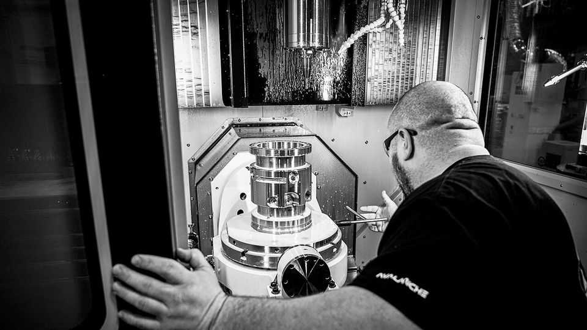

Science & technology | Soft power
How to build table-top fusion reactors
An American startup is revisiting a 60-year-old idea
September 11th 2025

There is a widespread misapprehension that controlling nuclear fusion is hard. In fact so long as you are not hoping to use the process to produce electricity, controlling fusion is easy. Indeed, it is possible to build a fusion reactor on a bench top. The details were worked out in 1964 by Philo Farnsworth, better known as the inventor of electronic television. The basic design is so simple that Farnsworth fusors, as they are known, can be built by hobbyists. Even their inventor, though, could not coax them into generating power. Brian Riordan and Robin Langtry hope to do better. In 2021 they left Blue Origin, Jeff Bezos’s rocket firm, to launch Avalanche Energy in Tukwila, a

suburb of Seattle. Their plan is to create, by 2029, a power-generating reactor to fit in a barrel.

Farnsworth’s design involves two concentric, spherical metal grids placed inside a vacuum chamber. These act as electrodes. The inner one (the cathode) is negatively charged with respect to the outer one (the anode). Inject deuterium (a heavy isotope of hydrogen that has a neutron as well as a proton in its nucleus) into this device and its atoms will be stripped of their electrons (a process called ionisation) by collisions with other electrons that have been released from the cathode. The ionised nuclei, being positively charged, will then be attracted inwards to the cathode while the negatively charged electrons are attracted to the anode.

If the voltage between the electrodes is sufficient, an ionised nucleus will be travelling fast enough when it reaches the middle to fuse with another such if it hits one. The result is either a helium-3 nucleus (consisting of two protons and a neutron), together with a spare neutron, or a tritium nucleus (consisting of a proton and two neutrons) and a proton. Both reactions release energy in the form of heat.

If no collision occurs, then the nucleus will sail on through, slow down as it approaches the anode, reverse course and then retrace its path, yo-yoing inside the vacuum chamber awaiting a collision. Increasing the chance of fusion means raising the density of nuclei in the apparatus as well as the length of time they travel fast enough to fuse—factors limited by mutual electrical repulsion between the nuclei and also by collisions between nuclei and cathode. Messrs Riordan and Langtry think they have found a way to overcome both.

Their device, which they call an Orbitron, adopts the same basic idea as Farnsworth’s, but changes his geometry and adds a magnetic field. An Orbitron’s vacuum chamber and anode are cylindrical, while its cathode is a rod running along the device’s axis. This arrangement causes the ionised nuclei to spiral around the cathode, meaning they rarely collide with it. The magnetic field, meanwhile, forces the free electrons to circle similarly, rather than fleeing to the anode. Arranged thus, the negative charges of the circling electrons balance the positive charges of the circling nuclei, meaning those nuclei can get much closer to each other. All of which allows an Orbitron to support a far higher density of nuclei than a fusor can, and to simultaneously sustain it for longer, thereby increasing the amount of fusion.

Trials of this arrangement with deuterium have worked, as demonstrated by their successful generation of neutrons. Making electricity, though, will require more. Instead of pure deuterium, commercial reactors will need to use a deuterium-tritium mix, as this is capable of producing a hundred times as many successful collisions for a given density of nuclei. Unfortunately, tritium is radioactive and therefore dangerous to handle. It is also rare in nature, so it has to be manufactured—a process that requires a nuclear reactor. Deuterium, by contrast, can be extracted by electrolysis from heavy water.

There is also the little matter of turning the Orbitron’s heat into electricity. That will be done, at least initially, by raising steam to drive a small generator.

Last, there is the question of who would be interested in buying such a miniature power plant. Here, Mr Riordan is bullish (a state of mind which, it must be said, is frequently displayed by fusion entrepreneurs). Though individual units would have an output of only around 15kW, a battery of them that produced 1MW or more would fit in a shipping container. This, he suggests, might be useful for powering robot ships and submarines, providing electricity to isolated Arctic bases, and for certain military applications.

A more esoteric use might be powering spacecraft. Existing craft destined for other planets use nuclear batteries—low-wattage devices that rely on heat from radioactive decay. An Orbitron fusion reactor would be much more powerful. Fusion may or may not do well on Earth. But it could be just the thing on Mars. ■

Curious about the world? To enjoy our mind-expanding science coverage, sign up to Simply Science, our weekly subscriber-only newsletter.

This article was downloaded by zlibrary from https://www.economist.com//science-and-technology/2025/09/10/how-to-build-table- top-fusion-reactors