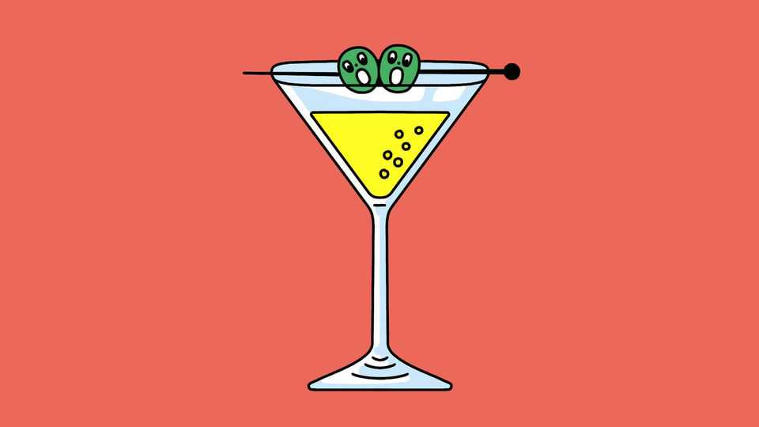

Science & technology | Well informed
Do hangover supplements work?
The science is plausible, but the evidence is thin
September 11th 2025

BEING HUNG over is unpleasant. According to a study published in Alcohol and Alcoholism in 2012, around 80% of people feeling the after- effects of the night before experience difficulty concentrating, headaches and nausea. An unlucky 39% report balance problems, and 29% experience muscle pain. Small wonder, then, that a cottage industry of supplements exists to help people avoid the experience. With brand names such as DrinkDefendly, Myrkl and de-liver-ance, they promise a world of consequence-free drinking. Many of the products are advertised on social media, sold directly to consumers and manufactured by unknown companies with small public profiles. Although there is some evidence they may work, says David Nutt, a

neuropsychopharmacologist at Imperial College London, more robust studies are needed before any can be recommended.

Hangovers are complicated. Some symptoms, including fatigue, are brought on by the negative effects alcohol has on sleep. Others, such as headaches and dry mouths, are made worse by the dehydration that results from alcohol’s suppression of vasopressin, a hormone that regulates kidney function.

But many of the more severe consequences are caused by the toxic effects of the drink itself. Whether you imbibe grape or grain, aged or fresh, neat or mixed, you will mainly experience the intoxication of ethanol. And although the human body is capable of metabolising the stuff, it does so in a slow and uncomfortable manner. First, an enzyme called alcohol dehydrogenase (ADH) breaks down the compound into acetaldehyde, which can dilate blood vessels in the head, producing headaches, and irritate the lining of the stomach, leading to nausea. These pass when another enzyme, acetaldehyde dehydrogenase (ALDH), in turn breaks down acetaldehyde into less harmful chemicals.

Most hangover supplements, therefore, claim to help ADH and ALDH do their jobs a little faster. DrinkDefendly, for instance, contains dihydromyricetin, a plant extract that is supposed to boost the activity of ADH. Supporting evidence is pretty thin: a review paper published in Addiction, a journal, in 2022 reported that dihydromyricetin produced a statistically significant reduction in hangover severity, but a different study showed the extract had no meaningful effect on ethanol metabolism.

Pre-Alcohol, another supplement, tries something else. Made by ZBiotics, an American startup, it contains a strain of beneficial bacteria that have been genetically engineered to produce ALDH. The idea is that, if allowed to settle in the lower gut, these bacteria could help break down acetaldehyde in that part of the body and thereby limit some of a hangover’s unpleasant digestive symptoms. Although research conducted by ZBiotics and published in PLoS One in 2024 showed the bacteria performing well in simulated gut conditions, real-world evidence is lacking.

Even if further trials justify the marketing claims, such supplements can do only so much. Chemicals structurally similar to ethanol, collectively known as congeners, are also present in alcoholic drinks in small amounts, and may have their own harmful effects. When methanol breaks down, for example, formaldehyde and formic acid are produced—even tiny quantities of which cause systemic poisoning, adding to the unpleasantness of a hangover. Boringly, for a headache-free route to being headache-free, drink a little less. ■

Curious about the world? To enjoy our mind-expanding science coverage, sign up to Simply Science, our weekly subscriber-only newsletter.

This article was downloaded by zlibrary from https://www.economist.com//science-and-technology/2025/09/05/do-hangover- supplements-work

Culture

Dan Brown offers another silly mash-up of fact and fiction Gout Gout, a 17-year-old sprinter, may be athletics’ new mega-star America’s constitution is too hard to change Why female pop stars are lambasting mediocre men The ironic ubiquity of William Morris’s prints Meet the real lord of “Downton Abbey”