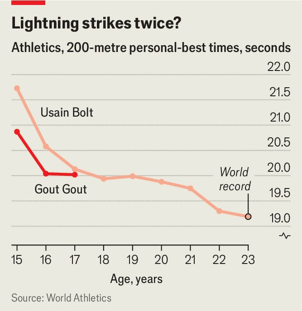

Culture | The fastest kid on Earth
Gout Gout, a 17-year-old sprinter, may be athletics’ new mega-star
He is faster over 200 metres than Usain Bolt was at the same age
September 11th 2025

Armand “Mondo” Duplantis, a Swedish pole vaulter, has broken the world record three times this year, reaching 6.29 metres. In July Beatrice Chebet, a Kenyan athlete, became the fastest woman to ever run five kilometres (she did so in 13 minutes and 58 seconds). Noah Lyles, the defending Olympic 100-metre champion, is running into form. These stars will chase more records and glory at the World Athletics Championships, which begin on September 13th in Tokyo. But all eyes will be on a 17-year-old wunderkind called Gout Gout. The Australian sprinter is making his senior competitive debut in Tokyo.

Mr Gout is already familiar to athletics aficionados, who have been stunned by videos of his races in local and regional tournaments. Last year Mr Gout covered 200 metres in just 20.04 seconds, making him the fastest 16-year- old in history and the fastest Australian over that distance. (He broke a national record that had stood for 56 years.) In July this year he bettered that benchmark again, bringing his time down to 20.02 seconds. All sporting prodigies burst onto the scene, but few have done so with such velocity.

Mr Gout combines speed with a distinctive, upright running style. The teenager seems to leap rather than sprint across the track. He has an unusually long and strong Achilles tendon, his team says, which gives him the elasticity to stride over metres. “You see him run and you just know there’s something special,” asserts James Templeton, Mr Gout’s manager.

How special, exactly? Mr Gout is already being compared to Usain Bolt, the winner of eight Olympic gold medals and the holder of world records in both the 100 and 200 metres. The Jamaican star, who retired in 2017, has said that Mr Gout “looks like a young me”. Judging from the numbers, though, Mr Gout is already ahead. At 16, Mr Bolt’s fastest time over 200 metres was a tenth of a second slower than Mr Gout’s (see chart).

Mr Gout’s entourage is keen to temper expectations. The athlete continues to balance school and training, which is partly why he will skip the 100-metre race and run only the 200 metres at the World Championships. Interviews with the media have been carefully managed. (The Economist was denied one.) The goal in Tokyo is to make the final, but also to have fun, says Mr Templeton. The real target is the Olympic Games in Los Angeles in 2028. Four years after that, an even more tantalising prospect awaits: the Olympics in Brisbane, Mr Gout’s home town. He will be 24 then—close to the age when sprinters reach their peak and around the same age that Mr Bolt was when he set his records.

Those may be long-term goals, but the pressure and scrutiny have already begun. Adidas, a sportswear firm, has swooped in to sign Mr Gout on a multi-million-dollar deal. More than 10,000 people flocked to a small meet in Melbourne in March to watch him run a 200-metre race. It was the biggest crowd for a one-day event in more than 20 years. So far Mr Gout has shrugged off the attention. He still lives at home—where he shares a room with his brother—and drives a Hyundai i30 rather than a flashy sports car.

Mr Gout’s success has brought out the worst in some of his compatriots. In Australia, as elsewhere, immigration is a contentious subject. (In August Bob Katter, a politician also from Queensland, went viral for threatening to

punch a journalist who brought up Mr Katter’s own Lebanese heritage.) Mr Gout’s parents migrated from South Sudan to Brisbane in 2005 and the athlete was born two years later. Mr Gout has received racist comments online; some have erroneously suggested he is not really Australian. Yet to most sports-mad Aussies, he is already a hero. Mr Gout speaks with an undeniable Queensland twang and has displayed perhaps the most Australian trait of all: winning.

His arrival on the global stage is good for athletics, too. The sport is struggling for relevance and attention outside the Olympics. To fix that, investors have been pouring money into new events with glitzy formats. A new star will surely boost those efforts: few things invigorate a sport and excite fans as much as the breakout of a young marvel. Mr Gout, like Mr Bolt before him, may end up running the show. ■

For more on the latest books, films, TV shows, albums and controversies, sign up to Plot Twist, our weekly subscriber-only newsletter

This article was downloaded by zlibrary from https://www.economist.com//culture/2025/09/11/gout-gout-a-17-year-old-sprinter-may- be-athletics-new-mega-star