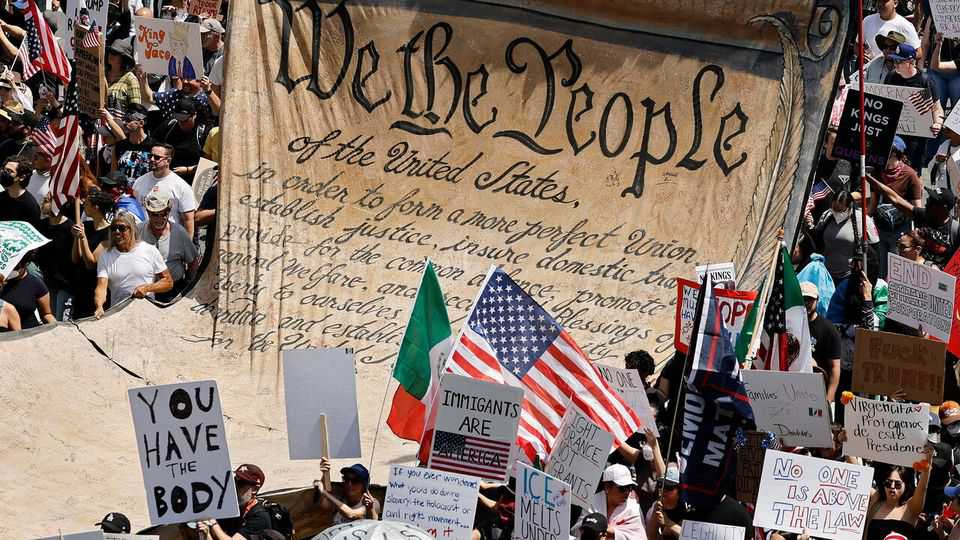

Culture | Government and lawmaking
America’s constitution is too hard to change
The Founding Fathers would be appalled
September 11th 2025

Donald Trump’s administration has imprisoned immigrants for their political opinions and killed alleged drug smugglers without trial. The president has asserted: “I have the right to do anything I want to do.” One thing he has not tried is to amend the constitution. Perhaps he recognises the long odds: almost 12,000 amendments have been proposed since the constitution replaced the Articles of Confederation in 1789 and only 27—less than 0.25%—have been ratified. In “We the People”, Jill Lepore, a professor at Harvard and a writer for the New Yorker, argues that America’s constitution has become an anachronism because it is, contrary to the founders’ wishes, too hard to change. Thomas Jefferson favoured constitutional conventions to remake the document every

19 years. In a letter to James Madison, he doubted that “One generation of men has a right to bind another.”

Madison feared the destabilising potential of frequent conventions, so offered a different solution: Article V, which allows the constitution to be amended with the approval of two-thirds of both houses of Congress and three-quarters of the states. That hurdle was surmountable in the 1780s, but it has given America “one of the lowest amendment rates in the world”, Professor Lepore notes.

The “sleeping giant” of Article V has sprung to life during periods of war and upheaval—most notably to abolish slavery and expand rights after the civil war—but has remained largely dormant otherwise. No amendments were ratified between 1804 and 1865 or 1870 and 1913. It was last meaningfully amended in 1971, when the voting age was lowered to 18.

The demise of what Professor Lepore calls a “philosophy of amendment” leaves America stuck with the electoral college, a relic that has made presidents of five popular-vote losers. It freezes life tenure for federal judges, an American oddity that entrenches and politicises the judiciary. And it means no fix for Wyomingites enjoying 68 times more influence in the Senate than Californians.

Professor Lepore laments these encrustations, adding that “the prospects for halting or reversing climate change are dim” without a re-energised Article V. Yet “We the People” does not reckon with the equally profound dangers of too much slack in the constitutional fabric. Brazil’s constitution has been jolted by more than 130 amendments since 1988, bringing bloated budgets and a loss of public confidence. Mexico’s 737 amendments in a century have engendered similar peril.

Germany’s constitution, with some 60 amendments since 1949, may be an example of the sweet spot St Thomas Aquinas was thinking of 750 years ago when he wrote that the costs of disruption must be balanced against the potential “benefit to be derived” from a change in law.

As amending their constitution has become functionally impossible, Americans have turned to courts to reinterpret it. This makes the document

contingent on the whims of whoever occupies the nine seats on America’s highest court. Both liberals and conservatives have had their moment. Under Earl Warren, the chief justice in the 1950s and 60s, the Supreme Court issued decisions expanding civil liberties. More recently, “originalism”—the interpretive method favoured by today’s right-wing supermajority but not, Professor Lepore argues, by America’s founders—has mobilised a conservative counter-revolution.

Americans may one day “learn again to amend”, Professor Lepore writes, or even devise an entirely new document. Yet the book sidesteps how that might happen. And it lacks guidelines for what should replace a constitution that, despite its increasing crustiness, has given America the flexibility to transform itself from 13 states to 50, from a slave-owning society to a free one, from a continental to a global power. “We the People” is not a road map for repair. But it offers an arresting chronicle of Americans striving—if sometimes failing—to remake their republic. ■

For more on the latest books, films, TV shows, albums and controversies, sign up to Plot Twist, our weekly subscriber-only newsletter

This article was downloaded by zlibrary from https://www.economist.com//culture/2025/09/11/americas-constitution-is-too-hard-to- change