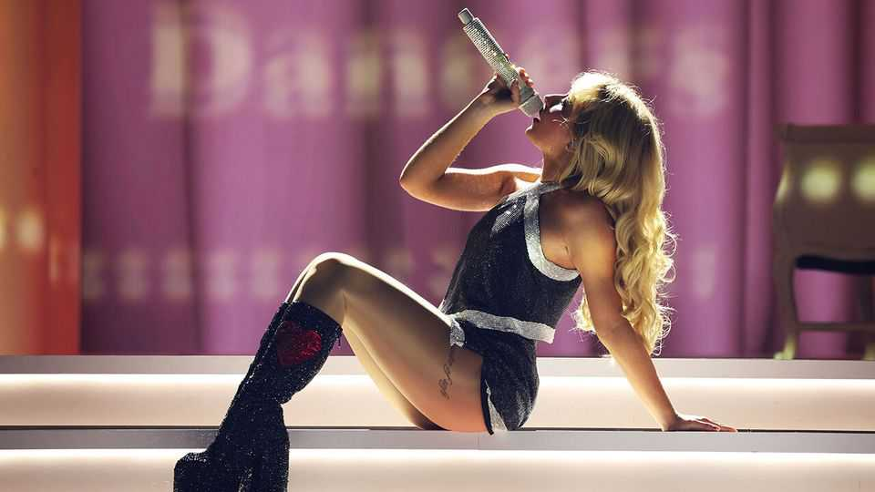

Culture | Lad-loathing lyrics
Why female pop stars are lambasting mediocre men
The trend may reflect the growing gulf between young men and women
September 11th 2025

Judging by her lyrics, Sabrina Carpenter has mixed feelings towards the opposite sex. She finds her paramours attractive, exciting—and disappointing. In “Manchild”, the lead single on her new album, she complains her lover is “stupid”, “slow” and “useless”. She asks, mocking a caveman, “Why so sexy if so dumb? / And how survive the Earth so long?” “Manchild” is not the only track on the record to lambast mediocre men: time and again Ms Carpenter takes aim at blokes who can barely “do the dishes” or “assemble a chair from IKEA”. The American pop star suggests her beaux are dumb, as when, in “Sugar Talking”, she says: “You’re having these epiphanies, big word for a real small mind.” Some do not understand

basic grammar. In “Slim Pickins”, a hit from last year, she complains about a man who “doesn’t even know the difference between there, their and they are”.

A number of young female pop stars are combining catchy melodies with grumbles about sub-par men. Chappell Roan, an American singer- songwriter, laments in “Super Graphic Ultra Modern Girl” that “this man wouldn’t dance” and “didn’t ask a single question”. “If He Wanted To He Would” by Perrie, a British musician, contains the acerbic lyrics: “His sense of vanity got you out here doing charity / He thinks he needs a lover, what he really needs is therapy.” In “Training Season”, a hit song of 2024, Dua Lipa warns her potential suitors that she does not want to “have to teach you how to love me right”. Male listeners might wonder if they are expected to be telepathic.

Charlie Harding of “Switched On Pop”, a podcast, says that these songs reflect the evolution of songwriting. Since the late 1960s—when artists such as Joni Mitchell started writing about personal experiences—lyricists have moved away from universal themes towards confessional storytelling. Female pop stars began belting out anthems about obnoxious, selfish men. Carly Simon, an American singer, offered the brilliantly paradoxical lyric: “You’re so vain, you probably think this song is about you.” Pop stars from Beyoncé to Taylor Swift have crooned about bad boys breaking their hearts. Country singers including Dolly Parton and Carrie Underwood have reflected on infidelity.

Yet this current wave of songs reflects a social shift. Women in the rich world are enjoying more economic power, meaning they can be choosier about their partners. Many are willing to hold out for someone who will do the washing up and put the toilet seat down. According to Pew Research Centre, 35% of American women between the ages of 25 and 54 were single in 2023, up from 29% in 1990. Across many measures, from education to politics, young men and women are drifting apart. Nearly 60% of American university graduates are women. Given that most women prefer not to date or marry down, for many it can be, as Ms Carpenter says, slim pickings.

Men are pushing back, at least musically. In August the top album on the Billboard 200 chart was “I’m the Problem” by Morgan Wallen, an American

country singer. “If I’m so awful,” he sings, “then why’d you stick around this long?” ■

For more on the latest books, films, TV shows, albums and controversies, sign up to Plot Twist, our weekly subscriber-only newsletter

This article was downloaded by zlibrary from https://www.economist.com//culture/2025/09/08/why-female-pop-stars-are-lambasting- mediocre-men