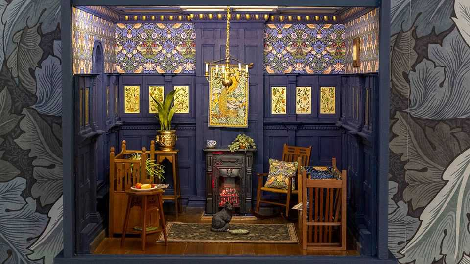

Culture | Strawberry thieves forever
The ironic ubiquity of William Morris’s prints
An exhibition and a new collection point to his enduring appeal
September 11th 2025

COINS, a cat figurine, a radio, a shopping trolley and an upholstered seat from a nuclear submarine. “Morris Mania”, a new exhibition at the William Morris Gallery in London, is an amusing celebration of the English artist’s ubiquitous prints. More than a century after his death, his influence on interior design remains powerful: revenues for Morris & Co, the firm he co- founded in 1861, reached £18m ($23m) in the year ending January 2025. Even if you do not know anything about Morris, you will know his work. You may not own a “Strawberry Thief” mug or a “Golden Lily” rug, but someone in your life probably does. You may have seen his designs on screen, too. Sarah Mead Leonard, an American art historian, runs social- media accounts dedicated to spotting Morris prints on sets. They crop up in

everything from chic period dramas such as “Phantom Thread” to unglamorous competition shows such as “Taskmaster”.

The prevalence of Morris’s prints is rather ironic, given his principles. He was bitterly opposed to mass production. In 1851, aged just 17, he was taken by his parents to the Great Exhibition in London, a showcase of industrial technology and design. The teenager refused to enter.

Morris, influenced by his interest in medieval art and literature, felt that goods should be made by hand with natural dyes such as weld and madder. No medieval artisan could have afforded his products, though: two early commissions were for royal households. The “St James’s” wallpaper was designed for Queen Victoria’s lavish throne room. In 1895 Tsar Nicholas II ordered 300 yards of “Garden Tulip” to redecorate the royal apartments of the Winter Palace in St Petersburg. (Presumably he was unaware that Morris had published an essay the year before entitled “How I Became a Socialist”.)

Claire Vallis, design director of the Sanderson Design Group, which has owned Morris & Co since 1940, says there is something enduringly delightful about Morris’s work: “His symmetry, his repeats, they are just so aesthetically pleasing,” she says. “They flow really well and his designs now have a lot of familiarity.”

That has made them easy to imitate. Among the items on display at “Morris Mania” are nine posters, ostensibly advertising a centenary exhibition at the Victoria and Albert Museum in London in 1934. In reality, however, the posters were generated by artificial intelligence. These pastiches are widely available online, along with other Morris knock-offs. The artist would have despised such counterfeits, not to mention the process by which they were created. He believed in “art made by the people, and for the people, as a happiness to the maker and the user”.

That anyone is bothering to make such copies points to the depth of Morris’s creative legacy. Morris & Co is keen to extend it further: the firm has launched 26 new designs based on incomplete sketches that were part of a trove of documents acquired by the Huntington, a cultural institution, in 1999. Ms Vallis sees these designs—which were finished by artists—as adding to the Morris oeuvre, rather than being a separate collection. If she is right, the designs will appear on furniture and film sets before the year is out. ■

For more on the latest books, films, TV shows, albums and controversies, sign up to Plot Twist, our weekly subscriber-only newsletter

This article was downloaded by zlibrary from https://www.economist.com//culture/2025/09/10/the-ironic-ubiquity-of-william- morriss-prints